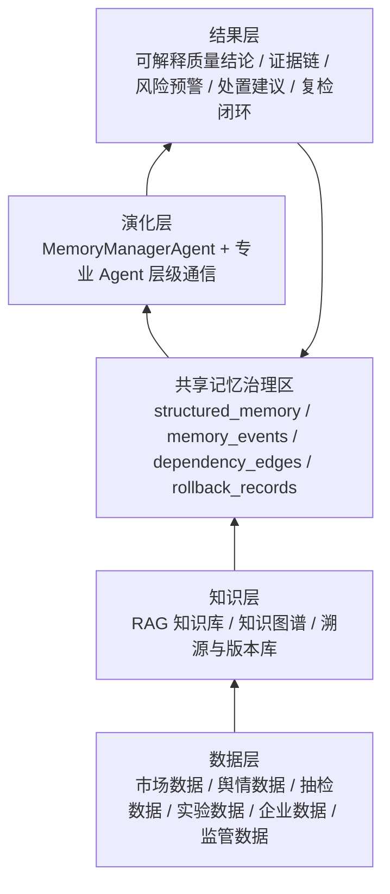
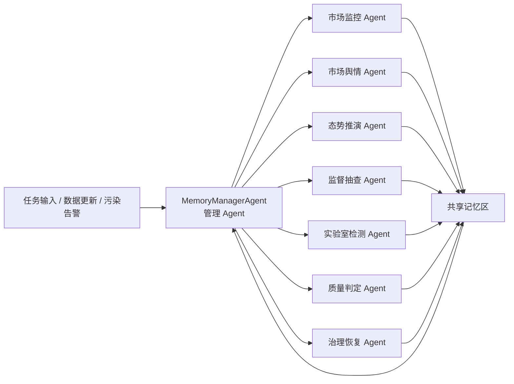
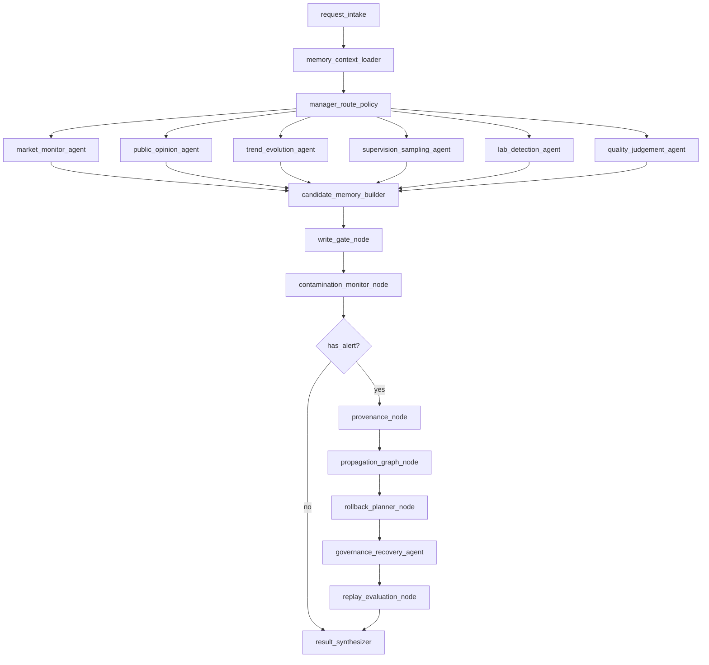

# 共享记忆数据层与层级代理演化层开发文档

文档编号：PIAP-MEM-010  
版本：v1.0.0  
状态：开发基线草案  
适用对象：架构师、后端、Agent 编排、DBA、LLMOps、QA、SRE  
适用范围：PIAP 主项目内的共享记忆数据层、治理闭环和 LangGraph 层级代理演化层  

## 1. 文档定位

本文档用于指导“面向可靠协作的 LLM 多智能体共享记忆溯源与回滚机制”在 PIAP 主项目中的下一阶段开发。它不是 `memory_agent/DEVELOPMENT_PLAN.md` 的替代文件，而是面向主项目正式接入的实施说明。

本次实现路线直接面向 PIAP 主项目数据库和 Agent 编排体系：

- 数据层使用 MySQL + Alembic + SQLAlchemy ORM + Repository + Service。
- 语义召回使用 Qdrant，向量库只保存检索索引和 payload，不承担审计事实源。
- 演化层使用 LangGraph 层级代理结构，以 `MemoryManagerAgent` 作为管理 Agent，协调市场监控、舆情、趋势推演、监督抽查、实验检测、质量判定和治理恢复等专业 Agent。
- 共享记忆不是 LangGraph 裸 State，而是基于 State 的治理包装：每条记忆必须带来源、版本、权限、依赖、门控、回滚和验证信息。

本文档整合以下材料：

- `develop_md/memorystate.md` 中关于“共享记忆 vs LangGraph State”的定位。
- `memory_agent/DEVELOPMENT_PLAN.md` 与 `memory_agent/rule/MEMORY_AGENT_INTEGRATION_RULES.md` 中的原型规则。
- `memory_agent/docx/source_report.docx` 综述报告中的来源追踪、传播子图、局部回滚和恢复验证思想。
- 功能图、角色图、架构图中的四层架构、五类角色和十步治理闭环。
- PIAP 现有统一开发文档、后端架构文档、工作台与角色契约。

## 2. 核心结论

共享记忆的工程载体是 LangGraph 运行中的共享 State 和主项目持久化数据库，但逻辑上它不等于普通 State。普通 State 是数据通信通道，共享记忆是经过治理的长期协作状态资产。

LangGraph 原生能力负责：

- 多 Agent 图编排。
- 节点间共享状态传递。
- Reducer 状态合并。
- Checkpointer 状态快照。
- 子图组合与层级代理通信。

本文新增治理能力负责：

- 判断哪些内容可以从普通事件晋升为候选记忆。
- 为候选记忆补充来源、证据、权限、版本、依赖边和回滚策略。
- 将已提交记忆以可审计方式持久化到 MySQL，并同步写入 Qdrant 索引。
- 在污染告警后重建来源链和传播子图。
- 根据权限、依赖强度和证据强度选择删除、降权、隔离、补丁或分支回滚。
- 通过任务片段重放和指标评估验证恢复效果。

核心闭环固定为：

```text
污染进入 -> 状态记录 -> 写入门控 -> 共享记忆提交 -> 跨 Agent 传播
        -> 污染告警 -> 来源追踪 -> 传播子图 -> 局部回滚
        -> 一致性修复 -> 恢复验证 -> 结果层输出
```

## 3. 总体架构

平台按四层组织：数据层、知识层、演化层、结果层。



### 3.1 数据层

数据层负责接入和保存业务原始数据、Agent 运行事件和共享记忆治理数据。正式实现必须进入主项目：

- ORM：`backend/app/models/`
- Repository：`backend/app/repositories/`
- Service：`backend/app/services/`
- Schema：`backend/app/schemas/`
- API：`backend/app/api/v1/`
- Migration：`backend/migrations/versions/`

数据层主表包括：

- `memory_items`
- `memory_events`
- `memory_dependency_edges`
- `memory_policies`
- `memory_rollbacks`
- `memory_evaluations`

辅助索引包括：

- Qdrant collection：`piap_shared_memory`
- 审计日志：复用 `audit_logs` / `audit_outbox`
- RAG 使用日志：复用或关联 `rag_query_logs`

### 3.2 知识层

知识层负责标准、法规、案例、知识图谱和溯源版本库。共享记忆不能替代知识层。

边界如下：

| 对象 | 职责 | 优先级 |
| --- | --- | --- |
| RAG 知识库 | 标准、法规、案例、检测规范和可引用证据 | 高 |
| 知识图谱 | 企业、产品、批次、渠道、投诉、检测之间的实体关系 | 高 |
| 溯源与版本库 | 记忆来源、事件链、版本链、证据链和回滚记录 | 高 |
| 共享记忆 | 历史经验、偏好、任务过程、风险状态和协作上下文 | 中 |

当共享记忆与 RAG、标准依据、任务输入或人工确认冲突时，必须以 RAG/标准/任务输入/人工确认为准，并把冲突记录为 `memory.conflict_detected`。

### 3.3 演化层

演化层是多 Agent 协同和记忆治理发生的位置。通信结构采用层级代理：



管理 Agent 负责路由、聚合、冲突协调和治理动作，不直接写数据库。所有持久化动作必须通过 `MemoryService`。

专业 Agent 只负责本领域的分析和候选输出，不允许绕过写入门控直接提交共享记忆。

### 3.4 结果层

结果层输出五类内容：

- 可解释质量结论。
- 可追溯证据链。
- 风险预警。
- 监管处置建议。
- 复检、召回、整改闭环。

结果层可以读取共享记忆中的历史经验和风险状态，但必须明确标注为“历史经验”或“上下文提示”，不得伪装为标准依据。

## 4. 角色与权限

角色映射对齐现有 `agent_operator + workspace claims` 契约。

| 产品角色 | PIAP 角色 | 主要权限 | 共享记忆权限 |
| --- | --- | --- | --- |
| 系统管理员 | `admin` | 用户、角色、权限、安全审计、平台配置 | 组织级删除、禁用、审计导出、高风险策略审批 |
| 平台运营 | `agent_operator` | Agent 模板、Prompt、工作流、实验、召回分析 | 管理 `ops` 工作台记忆策略、实验、版本和回滚 |
| 应用开发者 | `agent_operator` | Agent 编排、工具链、RAG 配置、应用发布 | 配置记忆工具和子图，不直接查看跨租户原文 |
| 算法工程师 | `analyst` / `agent_operator` | 数据工程、模型评测、实验追踪、模型部署 | 查看评测指标、实验记忆和回滚效果 |
| 终端用户 | `inspector` / `analyst` | 使用应用、上传文件、查看结果、导出内容 | 在任务上下文中消费授权记忆，不管理全局策略 |

工作台边界：

- `app`：消费记忆，只展示当前任务相关的历史经验、偏好和风险提示。
- `ops`：管理记忆策略、写入门控、召回实验、Agent 版本和回滚动作。
- `governance`：查看污染告警、审计记录、质量风险、合规删除和恢复评估。

权限硬约束：

- 所有记忆必须绑定 `org_id`。
- 用户级记忆必须绑定 `user_id`。
- 任务级记忆必须绑定 `task_id` 或明确 scope。
- RAG 空间级记忆必须绑定 `rag_space_id`。
- 跨租户召回、跨租户回滚和跨租户原文展示全部禁止。
- 跨用户、跨角色、治理侧高风险回滚必须进入人工确认。

## 5. 数据层设计

### 5.1 `memory_items`

`memory_items` 是共享记忆事实源。Qdrant 只保存它的语义索引。

| 字段 | 类型建议 | 说明 |
| --- | --- | --- |
| `id` | `BINARY(16)` | 主键，使用项目 `uuid7()` |
| `memory_id` | `VARCHAR(64)` | 稳定业务 ID，如 `mem_01`，不复用 |
| `org_id` | `BINARY(16)` | 租户隔离 |
| `user_id` | `BINARY(16) NULL` | 用户级记忆边界 |
| `workspace` | `VARCHAR(32)` | `app` / `ops` / `governance` |
| `memory_type` | `VARCHAR(64)` | 记忆类型 |
| `scope_json` | `JSON` | 产品线、任务、RAG 空间、角色等范围 |
| `content_summary` | `TEXT` | 结构化摘要，不保存不必要原文 |
| `content_json` | `JSON` | facts、preferences、warnings、risk_notes |
| `source_event_ids` | `JSON` | 来源事件 ID 列表 |
| `evidence_pointers` | `JSON` | RAG 片段、工具输出、任务输入、人工确认 |
| `version_parent_id` | `VARCHAR(64) NULL` | 父版本记忆 ID |
| `trust_score` | `DECIMAL(5,4)` | 来源可信度、冲突程度、审核状态综合分 |
| `confidence` | `DECIMAL(5,4)` | 写入置信度 |
| `visibility_scope` | `JSON` | 可见租户、用户、角色、任务、产品线 |
| `usage_policy` | `VARCHAR(32)` | 默认 `context_only` |
| `ttl_policy` | `VARCHAR(32)` | `90d` / `never` / `task_only` |
| `privacy_level` | `VARCHAR(32)` | 默认 `tenant_private` |
| `status` | `VARCHAR(32)` | `candidate` / `active` / `isolated` / `disabled` / `deleted` / `expired` |
| `rollback_policy` | `JSON` | 允许的恢复动作和人工确认要求 |
| `created_by` | `BINARY(16) NULL` | 用户、Agent 或系统主体 |
| `created_by_type` | `VARCHAR(32)` | `user` / `agent` / `system` / `admin` |
| `trace_id` | `VARCHAR(128)` | 全链路追踪 ID |
| `created_at` | `DATETIME(3)` | 创建时间 |
| `updated_at` | `DATETIME(3)` | 更新时间 |
| `expires_at` | `DATETIME(3) NULL` | 过期时间 |
| `deleted_at` | `DATETIME(3) NULL` | 软删除时间 |

建议索引：

- `idx_memory_items_org_status`：`org_id, status, updated_at`
- `idx_memory_items_org_type`：`org_id, memory_type, workspace`
- `idx_memory_items_trace`：`org_id, trace_id`
- `idx_memory_items_memory_id`：`org_id, memory_id`
- `idx_memory_items_user`：`org_id, user_id, memory_type`

### 5.2 `memory_events`

`memory_events` 统一记录普通消息、RAG 片段、工具返回、Agent 内部消息、候选记忆、正式提交、读取、回滚和验证。

| 字段 | 类型建议 | 说明 |
| --- | --- | --- |
| `id` | `BINARY(16)` | 主键 |
| `event_id` | `VARCHAR(64)` | 稳定事件 ID |
| `org_id` | `BINARY(16)` | 租户 |
| `user_id` | `BINARY(16) NULL` | 用户 |
| `workspace` | `VARCHAR(32)` | 工作台 |
| `event_type` | `VARCHAR(64)` | 事件类型 |
| `source_kind` | `VARCHAR(64)` | `user` / `web` / `rag` / `tool` / `agent_message` / `human_review` |
| `agent_id` | `VARCHAR(128) NULL` | Agent 标识，如 `market_monitor_agent` |
| `role` | `VARCHAR(64) NULL` | 角色 |
| `task_id` | `BINARY(16) NULL` | 任务 |
| `trace_id` | `VARCHAR(128)` | 链路 ID |
| `memory_id` | `VARCHAR(64) NULL` | 关联记忆 |
| `payload_ref` | `TEXT` | 原始内容引用、哈希、对象存储 URI 或片段指针 |
| `payload_json` | `JSON` | 事件摘要和必要结构化内容 |
| `risk_tags` | `JSON` | 内容污染、来源污染、权限污染、版本污染、传播污染 |
| `parent_event_ids` | `JSON` | 来源链父事件 |
| `created_at` | `DATETIME(3)` | 事件时间 |

固定事件命名：

- `input.received`
- `rag.retrieved`
- `tool.called`
- `agent.message_created`
- `memory.candidate_created`
- `memory.write_created`
- `memory.write_rejected`
- `memory.retrieval_completed`
- `memory.conflict_detected`
- `memory.propagation_graph_created`
- `memory.rollback_planned`
- `memory.rollback_applied`
- `memory.evaluation_completed`
- `memory.degraded`

### 5.3 `memory_dependency_edges`

传播分析不能只靠语义相似度，必须记录显式依赖边。

| 字段 | 类型建议 | 说明 |
| --- | --- | --- |
| `id` | `BINARY(16)` | 主键 |
| `org_id` | `BINARY(16)` | 租户 |
| `source_memory_id` | `VARCHAR(64)` | 上游记忆或状态 |
| `target_memory_id` | `VARCHAR(64)` | 下游记忆或状态 |
| `source_event_id` | `VARCHAR(64) NULL` | 上游事件 |
| `target_event_id` | `VARCHAR(64) NULL` | 下游事件 |
| `edge_type` | `VARCHAR(64)` | 依赖类型 |
| `strength` | `DECIMAL(5,4)` | 依赖强度 |
| `scope_json` | `JSON` | 边适用范围 |
| `metadata_json` | `JSON` | 工具名、节点名、摘要版本等 |
| `created_at` | `DATETIME(3)` | 创建时间 |
| `deleted_at` | `DATETIME(3) NULL` | 软删除 |

固定边类型：

- `derived_from`
- `read_by`
- `used_as_tool_param`
- `cited_as_evidence`
- `version_of`
- `merged_from`
- `conflicts_with`
- `summarized_from`
- `planned_from`
- `rollback_depends_on`

### 5.4 `memory_policies`

`memory_policies` 保存写入门控、检索、回滚和审计策略。

| 字段 | 类型建议 | 说明 |
| --- | --- | --- |
| `id` | `BINARY(16)` | 主键 |
| `org_id` | `BINARY(16)` | 租户 |
| `workspace` | `VARCHAR(32)` | 工作台 |
| `policy_key` | `VARCHAR(128)` | 策略键 |
| `policy_type` | `VARCHAR(64)` | `write_gate` / `retrieval` / `rollback` / `audit` |
| `config_json` | `JSON` | 阈值、规则、动作 |
| `status` | `VARCHAR(32)` | `draft` / `active` / `disabled` |
| `version` | `INT` | 版本 |
| `updated_by` | `BINARY(16) NULL` | 更新人 |
| `created_at` | `DATETIME(3)` | 创建时间 |
| `updated_at` | `DATETIME(3)` | 更新时间 |
| `deleted_at` | `DATETIME(3) NULL` | 软删除 |

### 5.5 `memory_rollbacks`

`memory_rollbacks` 记录污染恢复动作。

| 字段 | 类型建议 | 说明 |
| --- | --- | --- |
| `id` | `BINARY(16)` | 主键 |
| `org_id` | `BINARY(16)` | 租户 |
| `rollback_id` | `VARCHAR(64)` | 稳定回滚 ID |
| `root_memory_id` | `VARCHAR(64)` | 污染根节点 |
| `operator_id` | `BINARY(16)` | 操作人 |
| `workspace` | `VARCHAR(32)` | 工作台 |
| `rollback_action` | `VARCHAR(32)` | `delete` / `degrade` / `isolate` / `patch` / `branch` |
| `target_memory_ids` | `JSON` | 目标记忆集合 |
| `propagation_graph_json` | `JSON` | 传播子图摘要 |
| `before_snapshot_json` | `JSON` | 操作前摘要 |
| `after_snapshot_json` | `JSON` | 操作后摘要 |
| `reason` | `TEXT` | 原因 |
| `require_human_review` | `BOOLEAN` | 是否需要人工审核 |
| `review_status` | `VARCHAR(32)` | `not_required` / `pending` / `approved` / `rejected` |
| `trace_id` | `VARCHAR(128)` | 链路 ID |
| `created_at` | `DATETIME(3)` | 创建时间 |

### 5.6 `memory_evaluations`

`memory_evaluations` 保存恢复验证和实验指标。

| 字段 | 类型建议 | 说明 |
| --- | --- | --- |
| `id` | `BINARY(16)` | 主键 |
| `org_id` | `BINARY(16)` | 租户 |
| `evaluation_id` | `VARCHAR(64)` | 评测 ID |
| `rollback_id` | `VARCHAR(64) NULL` | 关联回滚 |
| `task_id` | `BINARY(16) NULL` | 关联任务 |
| `trace_id` | `VARCHAR(128)` | 链路 ID |
| `scenario` | `VARCHAR(128)` | 污染注入场景 |
| `metrics_json` | `JSON` | 安全性与可用性指标 |
| `replay_result_json` | `JSON` | 任务重放结果 |
| `conclusion` | `TEXT` | 评测结论 |
| `created_at` | `DATETIME(3)` | 创建时间 |

### 5.7 Qdrant payload 规则

Qdrant collection 建议命名为 `piap_shared_memory`。向量点 ID 使用 `memory_id`。

payload 必须包含：

```json
{
  "org_id": "org_01",
  "user_id": "usr_01",
  "workspace": "app",
  "memory_type": "task_episode",
  "status": "active",
  "scope": {
    "task_id": "task_01",
    "product_line": "food",
    "rag_space_id": "rag_01"
  },
  "trust_score": 0.82,
  "confidence": 0.8,
  "expires_at": "2026-08-01T00:00:00"
}
```

查询顺序固定为：

```text
MySQL 权限与状态过滤 -> Qdrant payload filter -> 向量召回 -> MySQL 回表校验 -> 重排 -> 输出 memory_context
```

禁止只依赖 Qdrant 过滤结果作为最终权限判断。

## 6. LangGraph 层级代理通信结构

### 6.1 AgentState

演化层共享状态使用独立字段承载共享记忆治理信息。

```python
from typing import Annotated, TypedDict
from langgraph.graph.message import add_messages

class MemoryAgentState(TypedDict, total=False):
    messages: Annotated[list, add_messages]
    task_context: dict
    agent_outputs: dict[str, dict]
    structured_memory: Annotated[list[dict], memory_reducer]
    memory_context: dict
    memory_events: Annotated[list[dict], event_reducer]
    dependency_edges: Annotated[list[dict], dependency_edge_reducer]
    contamination_alerts: list[dict]
    propagation_graph: dict
    rollback_plan: dict
    evaluation_result: dict
    final_result: dict
```

字段语义：

| 字段 | 说明 |
| --- | --- |
| `messages` | LangGraph 通信消息，不等于共享记忆 |
| `task_context` | 当前任务、产品、企业、RAG 空间、角色上下文 |
| `agent_outputs` | 各专业 Agent 的结构化输出 |
| `structured_memory` | 通过门控后的共享记忆状态对象 |
| `memory_context` | 检索得到的受控上下文 |
| `memory_events` | 读、写、检索、工具、回滚等事件 |
| `dependency_edges` | 显式依赖边 |
| `contamination_alerts` | 污染告警 |
| `propagation_graph` | 传播子图 |
| `rollback_plan` | 候选回滚计划 |
| `evaluation_result` | 恢复后验证结果 |
| `final_result` | 最终输出 |

### 6.2 Reducer

Reducer 不只做列表追加，还要完成结构化提交。

```python
def memory_reducer(left: list[dict], right: list[dict]) -> list[dict]:
    combined = list(left or [])
    existing_ids = {item["memory_id"] for item in combined if item.get("memory_id")}
    for item in right or []:
        if item.get("memory_id") in existing_ids:
            combined = [
                {**old, **item} if old.get("memory_id") == item.get("memory_id") else old
                for old in combined
            ]
        else:
            combined.append(item)
    return combined
```

Reducer 规则：

- 新记忆没有 `memory_id` 时由服务层生成，不在节点中临时拼接。
- 修订必须保留 `version_parent_id`。
- 删除不物理移除 State 条目，而是写入 `status=deleted` 或 `status=isolated`。
- 所有写入、读取、回滚必须同步产生 `memory_events`。

### 6.3 节点拓扑



### 6.4 管理 Agent 职责

`MemoryManagerAgent` 是层级代理中的管理 Agent，职责包括：

- 读取任务上下文和 `memory_context`。
- 判断需要唤起哪些专业 Agent。
- 将专业 Agent 的输出统一为候选记忆或结果证据。
- 检查专业 Agent 输出之间的冲突。
- 触发污染告警和治理分支。
- 调用治理节点生成来源链、传播子图、回滚计划和恢复验证。
- 汇总最终结果层输出。

管理 Agent 禁止：

- 直接写 ORM。
- 直接写 Qdrant。
- 绕过 `MemoryService` 执行删除或回滚。
- 将记忆命中当作质检标准或合规结论。

### 6.5 专业 Agent 职责

| Agent | 输入 | 输出 | 可写记忆类型 |
| --- | --- | --- | --- |
| `MarketMonitorAgent` | 市场价格、销量、渠道数据 | 价格异常、售后反馈、渠道风险 | `inspection_pattern`, `task_episode` |
| `PublicOpinionAgent` | 新闻、社交媒体、投诉举报、论坛评论 | 舆情对象、热点追踪、情绪趋势 | `task_episode`, `governance_memory` |
| `TrendEvolutionAgent` | 市场与舆情风险、历史趋势 | 风险等级、抽检趋势、情景推演 | `inspection_pattern`, `governance_memory` |
| `SupervisionSamplingAgent` | 风险任务、抽样策略 | 抽样计划、现场检查、结果上报 | `task_episode` |
| `LabDetectionAgent` | 样品、检测指标、标准 | 样品检测、数据分析、标准比对 | `task_episode`, `rag_usage_memory` |
| `QualityJudgementAgent` | 全局上下文、检测结论、证据链 | 综合判定、问题归因、处置建议 | `inspection_pattern`, `governance_memory` |
| `GovernanceRecoveryAgent` | 污染图、回滚计划、审计策略 | 删除、降权、隔离、补丁、分支、验证 | `governance_memory`, `agent_ops_memory` |

专业 Agent 的输出先进入 `candidate_memory_builder`，只有通过 `write_gate_node` 才能成为 `memory_items.status=active`。

### 6.6 Checkpointer 与持久化边界

LangGraph Checkpointer 保存运行时状态快照，MySQL 保存可审计共享记忆事实源。二者边界如下：

| 存储 | 保存内容 | 用途 |
| --- | --- | --- |
| LangGraph Checkpointer | 每步图状态快照 | 时间旅行、任务重放、恢复验证 |
| MySQL `memory_items` | 正式共享记忆 | 长期记忆、权限、审计、回滚 |
| MySQL `memory_events` | 事件日志 | 来源链、污染定位、审计 |
| MySQL `memory_dependency_edges` | 显式依赖边 | 传播子图、影响范围估计 |
| Qdrant | 语义向量索引 | 检索召回 |

恢复时不允许只回滚 Checkpointer 快照。必须将 MySQL 元数据、Qdrant 索引、摘要缓存、计划节点、工具结果引用和派生记忆一起处理。

## 7. 功能模块设计

### 7.1 写入门控

服务：`MemoryWriteGateService`

职责：

- 接收候选记忆。
- 检查 `org_id`、`trace_id`、`source`、`scope`。
- 检查敏感信息和权限边界。
- 检查是否与 RAG/标准/任务输入冲突。
- 计算 `trust_score`。
- 决定 `active`、`isolated`、`rejected` 或 `disabled`。
- 写入 `memory_events` 和审计日志。

写入规则：

- 用户明确长期偏好可写入 `user_preference`。
- 任务完成后可写入结构化 `task_episode`。
- 产品线模式可写入 `inspection_pattern`，但涉及标准判定时必须有证据。
- RAG 召回质量统计可写入 `rag_usage_memory`。
- 运维实验结论可写入 `agent_ops_memory`。
- 治理策略记忆必须由管理员或治理流程确认。

拒绝规则：

- 无 `org_id`。
- 无 `trace_id`。
- 无 `source`。
- 无明确 scope。
- 未确认的模型推测。
- 与质检标准冲突且未人工确认。
- 包含敏感个人信息且无业务必要。
- 临时对话中的一次性表达。

### 7.2 受控检索

服务：`MemoryRetrievalService`

检索顺序：

```text
租户过滤 -> workspace 过滤 -> scope 过滤 -> 状态过滤 -> TTL 过滤
        -> Qdrant 语义召回 -> MySQL 回表校验 -> 置信度重排 -> 输出 memory_context
```

响应结构：

```json
{
  "memory_context": {
    "items": [
      {
        "memory_id": "mem_01",
        "memory_type": "task_episode",
        "summary": "历史任务中出现过 RAG 证据与工具返回冲突。",
        "score": 0.78,
        "confidence": 0.82,
        "trust_score": 0.8,
        "source": {
          "task_id": "task_01",
          "trace_id": "trace_01"
        },
        "usage_policy": "context_only",
        "warnings": []
      }
    ],
    "warnings": [],
    "degraded": false
  }
}
```

硬约束：

- `top_k` 默认不超过 5。
- 记忆只作为历史经验或上下文提示。
- 检索结果必须带来源和使用策略。
- 与 RAG 冲突时，降低排序权重并记录 `memory.conflict_detected`。
- 记忆服务异常时返回 `degraded=true`，不能阻断主质检链路。

### 7.3 来源链

服务：`MemoryProvenanceService`

输入：

- `root_memory_id`
- `trace_id`
- `org_id`
- `workspace`

输出：

- 来源事件链。
- 证据指针列表。
- 写入主体。
- 读写轨迹。
- 版本父节点。
- 关联工具调用和 RAG 片段。

来源链查询不依赖 LLM 自我解释，LLM 只能辅助生成摘要。真正依据来自 `memory_events`、`memory_dependency_edges`、`rag_query_logs`、工具调用日志和 Checkpointer 快照。

### 7.4 污染传播子图

服务：`MemoryPropagationService`

传播扩展方向：

- `derived_from`
- `read_by`
- `used_as_tool_param`
- `cited_as_evidence`
- `version_of`
- `merged_from`
- `summarized_from`
- `planned_from`

剪枝条件：

- 租户边界。
- 用户边界。
- workspace。
- scope。
- 任务阶段。
- 依赖强度。
- 版本差分。
- 置信度和信任分。
- 是否跨角色或跨治理边界。

输出分类：

| 分类 | 说明 | 默认动作 |
| --- | --- | --- |
| `direct_contaminated` | 直接包含污染或由污染根节点派生 | 删除或隔离 |
| `indirect_contaminated` | 被污染记忆读取、引用或影响 | 降权、补丁或人工复核 |
| `suspected` | 弱依赖或证据不足 | 降权、观察或审计 |
| `clean_boundary` | 已确认不受影响的边界节点 | 保留 |

### 7.5 局部回滚

服务：`MemoryRollbackService`

支持动作：

| 动作 | 状态变化 | 适用场景 |
| --- | --- | --- |
| `delete` | `active -> deleted` | 证据明确、污染严重、下游依赖少 |
| `degrade` | 降低 `trust_score` 并标记低优先级 | 风险存在但证据不完整 |
| `isolate` | `active -> isolated` | 高风险、待人工审核、跨用户或跨角色 |
| `patch` | 新建修订版本并保留 `version_parent_id` | 内容部分有效，只修正污染字段 |
| `branch` | 生成替代分支并保留原始历史 | 多方案探索或需要保留历史分支 |

回滚必须同步处理：

- `memory_items.status`
- Qdrant 向量点。
- 摘要缓存。
- 计划节点。
- 工具结果引用。
- 派生记忆。
- `memory_dependency_edges`
- `memory_events`
- `audit_logs` / `audit_outbox`

### 7.6 恢复验证

服务：`MemoryEvaluationService`

验证方式：

- 任务片段重放。
- 污染前、污染后、回滚后状态对比。
- 传播图覆盖率评估。
- 协作一致性检查。
- 人工审计确认。

安全性指标：

- `contamination_detection_rate`
- `root_cause_accuracy`
- `propagation_coverage`
- `residual_contamination_rate`
- `unsafe_recall_rate`

可用性指标：

- `recovery_cost`
- `false_delete_cost`
- `task_success_rate`
- `system_overhead_ms`
- `human_review_minutes`
- `collaboration_consistency`

## 8. 后端模块落点

### 8.1 Contract

新增目录：

```text
backend/agent/contracts/memory_contracts.py
```

职责：

- 定义纯 Pydantic contract。
- 不依赖 ORM。
- 不依赖 FastAPI。
- 不依赖 LangGraph 运行时。

核心类型：

- `MemoryWriteRequest`
- `MemorySearchRequest`
- `MemorySearchResponse`
- `MemoryEventPayload`
- `MemoryPropagationRequest`
- `MemoryRollbackRequest`
- `MemoryEvaluationRequest`

### 8.2 ORM

新增：

```text
backend/app/models/memory.py
```

并在：

```text
backend/app/models/__init__.py
```

统一导出模型。

### 8.3 Repository

新增：

```text
backend/app/repositories/memory_repo.py
```

Repository 必须按 `org_id` 注入租户边界，所有查询默认带 `deleted_at IS NULL`。

建议类：

- `MemoryItemRepository`
- `MemoryEventRepository`
- `MemoryDependencyRepository`
- `MemoryPolicyRepository`
- `MemoryRollbackRepository`
- `MemoryEvaluationRepository`

### 8.4 Service

新增：

```text
backend/app/services/memory_service.py
backend/app/services/memory_vector_service.py
backend/app/services/memory_governance_service.py
```

职责划分：

| Service | 职责 |
| --- | --- |
| `MemoryService` | 写入、检索、状态更新、事件记录 |
| `MemoryVectorService` | Qdrant upsert/search/delete 和 payload filter |
| `MemoryGovernanceService` | 来源链、传播图、回滚、恢复验证 |

### 8.5 Tool

新增：

```text
backend/agent/tools/memory_tools.py
```

工具：

- `memory_search`
- `memory_write_candidate`
- `memory_report_conflict`
- `memory_build_propagation_graph`
- `memory_apply_rollback`
- `memory_replay_evaluation`

Tool 只调用 service，不直接操作 ORM 或 Qdrant。

### 8.6 Subgraph

新增：

```text
backend/agent/subgraphs/shared_memory_hierarchy/
  __init__.py
  graph.py
  state.py
  nodes.py
  reducers.py
```

图入口由 `MemoryManagerAgent` 管理。后续可在 `backend/agent/topology_catalog.py` 注册：

- `subgraph_key`: `shared_memory_hierarchy`
- `entry_graph`: `SharedMemoryHierarchyGraph`
- `graph_version`: `v1`

### 8.7 API

新增：

```text
backend/app/api/v1/memory.py
```

并在：

```text
backend/app/api/v1/router.py
```

挂载管理和调试接口。

普通质检链路不要求前端手工写入记忆；任务链路中的记忆读写由 Agent 子图和 service 自动处理。

## 9. API 与服务接口

### 9.1 写入候选记忆

```http
POST /api/v1/memory/candidates
```

```json
{
  "org_id": "org_01",
  "user_id": "usr_01",
  "workspace": "app",
  "source": {
    "kind": "task",
    "task_id": "task_01",
    "trace_id": "trace_01"
  },
  "memory_type": "task_episode",
  "scope": {
    "task_id": "task_01",
    "product_line": "food",
    "rag_space_id": "rag_01"
  },
  "content": {
    "summary": "本次任务中 RAG 片段与工具返回发生冲突。",
    "facts": [],
    "preferences": [],
    "warnings": ["conflict_with_rag"]
  },
  "confidence": 0.82,
  "ttl_policy": "90d",
  "privacy_level": "tenant_private",
  "created_by_type": "agent"
}
```

响应：

```json
{
  "memory_id": "mem_01",
  "status": "isolated",
  "trust_score": 0.42,
  "warnings": ["memory conflicts with RAG evidence"]
}
```

### 9.2 检索记忆

```http
POST /api/v1/memory/search
```

```json
{
  "org_id": "org_01",
  "user_id": "usr_01",
  "workspace": "app",
  "query": "最近类似 RAG 冲突的处理经验",
  "scope_filter": {
    "memory_type": ["task_episode", "rag_usage_memory"],
    "rag_space_id": "rag_01",
    "product_line": "food"
  },
  "top_k": 5
}
```

### 9.3 生成污染传播子图

```http
POST /api/v1/memory/contamination/graph
```

```json
{
  "org_id": "org_01",
  "workspace": "governance",
  "root_memory_id": "mem_01",
  "trace_id": "trace_review_01",
  "max_depth": 4,
  "include_edge_types": ["derived_from", "read_by", "used_as_tool_param", "version_of"]
}
```

### 9.4 执行回滚

```http
POST /api/v1/memory/rollback
```

```json
{
  "org_id": "org_01",
  "workspace": "ops",
  "operator_id": "usr_operator",
  "trace_id": "trace_rollback_01",
  "root_memory_id": "mem_01",
  "rollback_action": "isolate",
  "target_memory_ids": ["mem_01", "mem_02"],
  "reason": "RAG 片段污染导致派生记忆异常",
  "require_human_review": true
}
```

### 9.5 恢复验证

```http
POST /api/v1/memory/evaluation/replay
```

```json
{
  "org_id": "org_01",
  "workspace": "governance",
  "rollback_id": "rb_01",
  "task_id": "task_01",
  "trace_id": "trace_eval_01",
  "scenario": "rag_document_contamination"
}
```

### 9.6 策略配置

```http
PUT /api/v1/memory/policies/{policy_key}
```

```json
{
  "workspace": "ops",
  "policy_type": "write_gate",
  "config": {
    "min_confidence_for_active": 0.75,
    "isolate_on_rag_conflict": true,
    "require_review_for_governance_memory": true,
    "default_top_k": 5
  },
  "status": "active"
}
```

## 10. 开发阶段与验收

### Phase 1：数据层部署

开发范围：

- `backend/app/models/memory.py`
- `backend/app/repositories/memory_repo.py`
- `backend/app/schemas/memory.py`
- `backend/migrations/versions/00xx_memory_governance_tables.py`

验收标准：

- Alembic 可以创建六张记忆治理表。
- 所有表有 `org_id`、时间戳和软删除字段。
- Repository 查询默认按 `org_id` 隔离。
- 能写入 `memory_items`、`memory_events`、`memory_dependency_edges`。
- 能软删除和状态更新，不物理删除审计数据。

### Phase 2：基础服务与 Qdrant

开发范围：

- `backend/app/services/memory_service.py`
- `backend/app/services/memory_vector_service.py`
- `backend/agent/contracts/memory_contracts.py`

验收标准：

- 写入候选记忆时产生事件。
- 通过门控后写入 MySQL 并同步 upsert Qdrant。
- 检索先经过 MySQL 权限过滤，再经过 Qdrant payload filter。
- Qdrant 异常时返回 `memory_context.degraded=true`。
- 与 RAG 冲突时记录 `memory.conflict_detected`。

### Phase 3：LangGraph 层级代理演化层

开发范围：

- `backend/agent/subgraphs/shared_memory_hierarchy/`
- `backend/agent/tools/memory_tools.py`
- `backend/agent/topology_catalog.py`

验收标准：

- `MemoryManagerAgent` 能路由到至少三个专业 Agent。
- 专业 Agent 输出先进入候选记忆构建节点。
- 写入必须经过 `write_gate_node`。
- State 中存在 `structured_memory`、`memory_context`、`memory_events`、`dependency_edges`。
- 节点不直接写 ORM。

### Phase 4：治理闭环

开发范围：

- `MemoryProvenanceService`
- `MemoryPropagationService`
- `MemoryRollbackService`
- `MemoryEvaluationService`

验收标准：

- 能从污染根节点重建来源链。
- 能生成传播子图并分类直接、间接、疑似污染。
- 能执行删除、降权、隔离、补丁、分支五类动作中的至少三类。
- 回滚动作同步处理 MySQL、Qdrant 和事件日志。
- 高风险回滚进入人工确认状态。

### Phase 5：前端与运维展示

开发范围：

- `ops` 工作台记忆策略和指标页。
- 任务详情页历史经验展示。
- RAG 分析页记忆召回和冲突指标。
- `governance` 工作台污染告警、审计和回滚记录。

验收标准：

- UI 清楚区分标准依据、RAG 引用、历史经验、用户偏好和模型推断。
- `agent_operator` 可管理策略和实验。
- `admin` 可审批高风险删除和审计导出。
- `inspector` / `analyst` 只能消费授权记忆。

## 11. 测试计划

### 11.1 数据层测试

| 测试 | 验收 |
| --- | --- |
| 表迁移 | Alembic upgrade head 成功 |
| 租户隔离 | 不同 `org_id` 记忆不能互相查询 |
| 用户隔离 | 用户级记忆不能被同租户其他用户默认召回 |
| 软删除 | `deleted` 记忆不出现在检索结果 |
| 事件完整性 | 写入、拒绝、检索、冲突、回滚都有事件 |

### 11.2 服务测试

| 测试 | 验收 |
| --- | --- |
| 写入门控 | 缺少来源、trace、scope 的内容被拒绝 |
| RAG 冲突 | 与 RAG/标准冲突的记忆不会进入 active |
| Qdrant 降级 | 向量检索失败时主流程继续 |
| TTL | 过期记忆不召回 |
| 审计 | 删除、禁用、策略变更写入审计 |

### 11.3 LangGraph 测试

| 测试 | 验收 |
| --- | --- |
| State 字段 | `structured_memory`、`memory_context`、`memory_events` 正常流转 |
| 管理 Agent 路由 | 按任务类型唤起对应专业 Agent |
| 写入门控节点 | 专业 Agent 不能绕过门控 |
| 污染分支 | 告警后进入 provenance -> propagation -> rollback -> evaluation |
| Checkpointer | 能重放关键任务片段并对比恢复前后状态 |

### 11.4 治理闭环测试

| 测试 | 验收 |
| --- | --- |
| 用户输入污染 | 可定位污染入口和下游读取 |
| RAG 文档污染 | 可识别证据冲突并隔离派生记忆 |
| 工具返回污染 | 可回滚受影响工具参数和派生计划 |
| 内部 Agent 转述污染 | 可沿 `agent.message_created` 和 `derived_from` 扩展 |
| 回滚点污染 | 不只按时间回滚，必须检查版本差分和权限边界 |

### 11.5 指标测试

必须输出：

- 污染检出率。
- 根因定位准确率。
- 传播覆盖率。
- 残留污染率。
- 任务成功率。
- 恢复成本。
- 误删成本。
- 人工审计时间。

## 12. 开发规则

1. 记忆不是事实源，不能替代 RAG、质检标准、任务输入和人工确认。
2. 记忆不能直接拼接到 system prompt，只能以 `memory_context` 结构进入 State 或 tool result。
3. LangGraph 节点不能直接写 ORM、Qdrant 或文件。
4. Tool 不能绕过 service。
5. Qdrant 不能成为唯一事实源。
6. 所有记忆写入必须有 `org_id`、`workspace`、`source`、`trace_id`。
7. 所有回滚必须有审计事件。
8. 所有跨用户、跨角色、治理侧高风险动作必须支持人工确认。
9. 记忆服务异常不能阻断登录、任务创建、质检主链路和 RAG 检索。
10. 字段、事件、API 名称变更必须先更新本文档。

## 13. 最小可演示链路

第一版可演示链路如下：

1. 用户提交带污染风险的任务输入或 RAG 片段。
2. `MemoryManagerAgent` 记录 `input.received` 或 `rag.retrieved`。
3. 专业 Agent 生成候选结论和候选记忆。
4. `write_gate_node` 判断写入、拒绝或隔离。
5. 另一专业 Agent 通过 `memory_search` 召回该记忆。
6. 系统记录 `read_by` 依赖边。
7. 人工或规则触发污染告警。
8. `provenance_node` 重建来源链。
9. `propagation_graph_node` 生成传播子图。
10. `rollback_planner_node` 给出候选回滚集合。
11. `GovernanceRecoveryAgent` 执行隔离或降权。
12. `replay_evaluation_node` 重放任务片段。
13. 结果层输出恢复前后指标和审计记录。

## 14. 命名冻结

以下命名作为本阶段稳定约定：

- `MemoryManagerAgent`
- `MarketMonitorAgent`
- `PublicOpinionAgent`
- `TrendEvolutionAgent`
- `SupervisionSamplingAgent`
- `LabDetectionAgent`
- `QualityJudgementAgent`
- `GovernanceRecoveryAgent`
- `memory_items`
- `memory_events`
- `memory_dependency_edges`
- `memory_policies`
- `memory_rollbacks`
- `memory_evaluations`
- `structured_memory`
- `memory_context`
- `memory_events`
- `dependency_edges`
- `contamination_alerts`
- `rollback_plan`
- `evaluation_result`
- `context_only`
- `tenant_private`

## 15. 与现有原型的关系

`memory_agent` 目录当前已有 contract、SQLite store、写入门控、检索、删除和部分测试，可作为主项目实现的参考资产。正式接入时不直接复制 SQLite 设计，而是按以下方式吸收：

| 原型模块 | 主项目落点 | 处理方式 |
| --- | --- | --- |
| `contracts/*` | `backend/agent/contracts/memory_contracts.py` | 保留字段思想，补充传播、回滚、评测 contract |
| `storage/sqlite_store.py` | `backend/app/models/memory.py` + Repository | 改为 MySQL ORM 和 Alembic |
| `storage/vector_store.py` | `MemoryVectorService` | 替换为 Qdrant HTTP/API 实现 |
| `services/write_gate.py` | `MemoryWriteGateService` | 保留门控规则，接入权限、审计和策略表 |
| `services/retrieval_service.py` | `MemoryRetrievalService` | 保留受控检索顺序，改为 MySQL + Qdrant |
| `services/rollback_service.py` | `MemoryRollbackService` | 从删除扩展为五类回滚动作 |
| 空壳 provenance/propagation/evaluation | `MemoryGovernanceService` | 正式补齐来源链、传播图和恢复验证 |

## 16. 实施优先级

推荐顺序：

1. 冻结 `memory_contracts.py`。
2. 新增 MySQL ORM 和 Alembic 迁移。
3. 实现 Repository。
4. 实现 `MemoryService` 写入、事件、状态和检索基础能力。
5. 接入 Qdrant `MemoryVectorService`。
6. 实现 API 调试接口。
7. 实现 LangGraph 层级代理 State、Reducer 和节点。
8. 接入 `MemoryManagerAgent` 与至少三个专业 Agent。
9. 实现来源链与传播子图。
10. 实现回滚动作和审计。
11. 实现恢复验证。
12. 接入 ops/governance 前端展示。

本顺序保证先把数据层部署好，再让演化层在稳定的状态基础设施上通信和治理。
