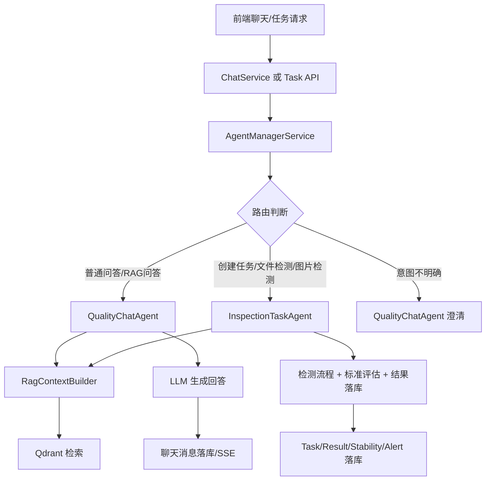
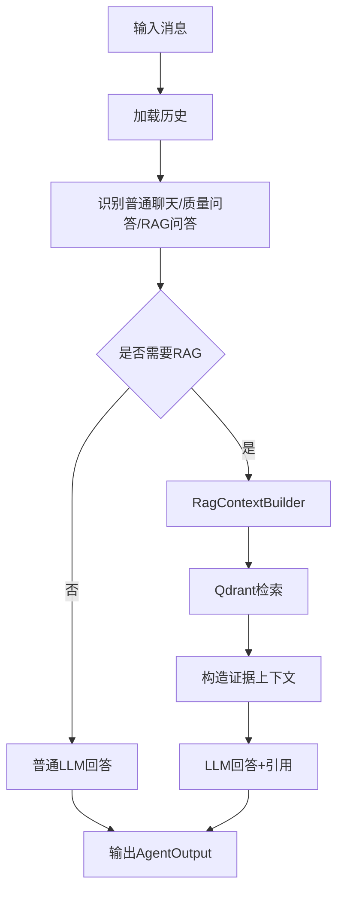
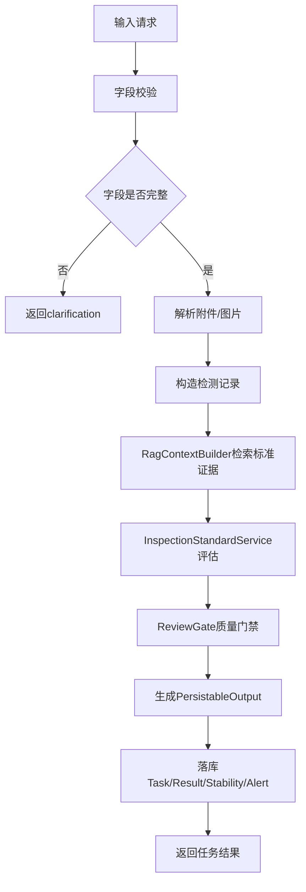

# 聊天 Agent 与任务检测 Agent 拆分实现方案

> 核心目标：把“聊天问答”和“任务检测”从当前混合流程中拆成两个职责清晰的 Agent，并通过 AgentManager 高效分发请求。

***

## 0. 当前代码问题判断

当前项目已经具备拆分基础，但实现方式仍偏“统一大入口内部判断”。

### 0.1 当前链路

```text
ChatService
  ↓
QualityAgentOrchestratorService.run_chat()
  ↓
QualityJudgementSubgraph.run()
  ↓
内部判断：
  - 结构化文件检测 → _run_structured_inspection()
  - 普通 chat → QualityChatGraph
  - 其他 → fallback task_result
```

### 0.2 当前主要问题

1. `QualityAgentOrchestratorService` 固定创建 `QualityJudgementSubgraph`，所有聊天请求都先进入统一质量判定图。
2. `QualityJudgementSubgraph` 同时承担聊天路由、结构化质检、任务兜底，职责过重。
3. `QualityChatGraph` 内部既做普通聊天/RAG 问答，也识别任务创建意图。
4. 结构化文件质检函数 `_run_structured_inspection()` 目前放在 `quality_judgement/graph.py`，不利于独立维护。
5. Agent Ops 里已经注册 `quality_judgement` 和 `quality_chat`，但真正运行时还没有由 Agent 管理层动态调度。
6. 路由逻辑主要靠代码正则和 if/else，后期不方便在管理页面配置。

***

## 1. 推荐目标架构

不要拆成两个完全孤立的服务，推荐采用：

```text
AgentManager / RouterAgent
        ↓
 ┌───────────────┬────────────────────┐
 │               │                    │
QualityChatAgent InspectionTaskAgent  后续更多 Agent
```

### 1.1 职责划分

| 模块                  | 职责                                     | 不应该做什么                                |
| ------------------- | -------------------------------------- | ------------------------------------- |
| AgentManager        | 意图识别、路由分发、权限校验、记录路由结果                  | 不生成最终回答，不做检测计算                        |
| QualityChatAgent    | 普通聊天、质检知识问答、RAG 问答、澄清追问、任务草稿           | 不直接创建正式检测结果，不写 result/stability/alert |
| InspectionTaskAgent | 创建任务、执行质检、结构化文件检测、图片检测、落库结果            | 不负责闲聊，不承担普通知识问答                       |
| Shared Services     | RAG、MinIO、Qdrant、模型、文件解析、任务表、结果表、Trace | 不绑定具体 Agent                           |

***

## 2. 总体流程



***

## 3. AgentManager 路由设计

### 3.1 路由策略

优先使用规则路由，规则不确定时再调用轻量 LLM 分类器。这样比每次都让大模型选择 Agent 更高效。

```text
1. 有明确任务创建词：创建任务 / 发起检测 / 提交质检 / 开始检测
   → InspectionTaskAgent

2. 上传图片并要求检测
   → InspectionTaskAgent

3. 上传 xlsx/csv/json/docx/txt 等结构化或标准文件，且语义是“检测/分析/判定”
   → InspectionTaskAgent

4. 询问标准、缺陷、如何判定、是否合格、RAG 知识库内容
   → QualityChatAgent

5. 普通闲聊、系统能力介绍
   → QualityChatAgent

6. 模糊请求
   → QualityChatAgent 发起澄清
```

### 3.2 路由结果结构

新增契约：

```python
class AgentRouteDecision(BaseModel):
    selected_agent: str              # quality_chat / inspection_task
    intent: str                      # smalltalk / rag_qa / quality_qa / task_create / structured_inspection
    confidence: float
    reason: str
    requires_confirmation: bool = False
    route_source: str = "rule"        # rule / llm / manual
    fallback_agent: str | None = None
```

示例：

```json
{
  "selected_agent": "inspection_task",
  "intent": "structured_inspection",
  "confidence": 0.94,
  "reason": "用户上传了 xlsx 检测记录并询问是否合格",
  "requires_confirmation": false,
  "route_source": "rule"
}
```

### 3.3 不允许静默 fallback

如果 Agent 路由失败，返回明确状态：

```json
{
  "message_type": "agent_route_failed",
  "answer": "当前请求无法分配到可用 Agent，请检查 Agent 是否启用。",
  "route_decision": {
    "selected_agent": null,
    "reason": "inspection_task disabled"
  }
}
```

不要再使用“任务已由统一质量判定智能体接收并提交执行”这种看似成功的兜底文本。

***

## 4. 两个 Agent 的具体实现

## 4.1 QualityChatAgent

### 职责

```text
普通聊天
系统能力介绍
质检知识问答
RAG 文档问答
根据用户对话生成任务草稿
缺字段时澄清追问
```

### 输入

```python
class QualityChatAgentInput(BaseModel):
    request: NormalizedRequest
    route_decision: AgentRouteDecision
    rag_scope: RagScope | None = None
```

### 输出

```python
class QualityChatAgentOutput(AgentOutput):
    message_type: Literal[
        "assistant_text",
        "quality_answer",
        "clarification",
        "task_draft"
    ]
```

### 内部流程



### 保留现有代码

可以保留当前：

```text
backend/agent/subgraphs/quality_chat/graph.py
```

但要做两点收敛：

1. 只保留聊天、RAG 问答、澄清追问。
2. 任务创建逻辑只输出 `task_draft`，不直接正式创建任务。

***

## 4.2 InspectionTaskAgent

### 职责

```text
正式创建检测任务
解析上传文件
图片检测/结构化检测
RAG标准检索
调用 InspectionStandardService
生成 result_card
落库 task/result/stability/alert/token/rag_log
```

### 输入

```python
class InspectionTaskAgentInput(BaseModel):
    request: NormalizedRequest
    route_decision: AgentRouteDecision
    task_draft: dict | None = None
    rag_scope: RagScope | None = None
```

### 输出

```python
class InspectionTaskAgentOutput(AgentOutput):
    message_type: Literal[
        "task_created",
        "task_running",
        "task_result",
        "quality_answer",
        "clarification"
    ]
    persistable_output: PersistableOutput | None
```

### 内部流程



### 迁移现有代码

把当前：

```text
backend/agent/subgraphs/quality_judgement/graph.py
  _run_structured_inspection()
```

迁移到：

```text
backend/agent/subgraphs/inspection_task/graph.py
```

并将 `QualityJudgementSubgraph` 逐渐降级为兼容包装器或废弃。

***

## 5. 与 RAG 目录树方案的结合

RAG 目录树方案中，推荐通过 `rag_scope` 指定检索范围，后端统一从 Qdrant 构建 RAG context。这个设计可以直接作为两个 Agent 的共享能力。

### 5.1 统一 RAG Scope

```python
class RagScope(BaseModel):
    enabled: bool = False
    rag_space_id: str | None = None
    scope_node_ids: list[str] = []
    scope_mode: Literal["space", "subtree", "files"] = "space"
    top_k: int = 8
```

### 5.2 两个 Agent 如何使用 RAG

| 场景                  | 使用方式                          |
| ------------------- | ----------------------------- |
| QualityChatAgent    | 用户问标准、缺陷、工艺、规范时，查询所选 RAG 范围   |
| InspectionTaskAgent | 根据产品编号、标准编号、结构化记录和所选目录，查询检测依据 |
| 空检索                 | 明确提示“当前知识库未找到足够依据”，不能静默改成普通问答 |
| 检索异常                | 返回 `degraded=true` 和错误原因，页面可见 |

### 5.3 统一服务

```text
app/services/rag_context_builder.py
  - normalize_scope()
  - build_retrieval_query()
  - retrieve()
  - build_prompt_context()
  - build_citations()
```

两个 Agent 都只调用这个服务，不各自写一套 RAG。

***

## 6. 后端服务改造方案

### 6.1 新增目录

```text
backend/agent/router/
  agent_manager.py
  route_policy.py
  contracts.py

backend/agent/subgraphs/inspection_task/
  __init__.py
  graph.py
  state.py
  nodes.py

backend/app/services/
  agent_manager_service.py
  rag_context_builder.py
```

### 6.2 修改目录

```text
backend/app/services/quality_agent_orchestrator_service.py
backend/agent/subgraphs/quality_chat/graph.py
backend/agent/subgraphs/quality_judgement/graph.py
backend/agent/topology_catalog.py
backend/app/api/v1/agent_ops.py
backend/app/schemas/agent_ops.py
```

### 6.3 AgentManagerService 伪代码

```python
class AgentManagerService:
    def __init__(self):
        self.chat_agent = QualityChatAgent()
        self.task_agent = InspectionTaskAgent()
        self.route_policy = AgentRoutePolicy()

    async def run(self, payload: dict) -> dict:
        request = NormalizedRequest.model_validate(payload)
        decision = await self.route_policy.decide(request)

        if decision.selected_agent == "quality_chat":
            output = await self.chat_agent.run(request, decision)
        elif decision.selected_agent == "inspection_task":
            output = await self.task_agent.run(request, decision)
        else:
            output = AgentOutput(
                message_type="agent_route_failed",
                answer="当前请求无法分配到可用 Agent。",
                route_decision=decision,
            )

        output.route_decision = decision
        return {"agent_output": output.model_dump()}
```

### 6.4 Orchestrator 改造

当前：

```python
self._graph = QualityJudgementSubgraph()
result = await self._graph.run(request)
```

改成：

```python
self._manager = AgentManagerService()
result = await self._manager.run(request.model_dump())
```

保留 `_persist_chat_result()`，但根据 `selected_agent` 和 `message_type` 区分落库策略。

***

## 7. 数据库与 Agent Ops 改造

### 7.1 Agent 注册

在 `topology_catalog.py` 中新增：

```python
{
    "name": "Inspection Task Agent",
    "description": "负责正式质检任务创建、文件/图片检测、结果落库。",
    "workflow_binding": "inspection_task_v1",
    "subgraph_key": "inspection_task",
    "entry_graph": "InspectionTaskGraph",
    "supports_start_stop": True,
    "graph_version": "v1",
    "is_active": True,
},
{
    "name": "Agent Manager",
    "description": "统一入口路由，负责将请求分发给聊天或检测 Agent。",
    "workflow_binding": "agent_manager_v1",
    "subgraph_key": "agent_manager",
    "entry_graph": "AgentManagerService",
    "supports_start_stop": True,
    "graph_version": "v1",
    "is_active": True,
}
```

### 7.2 路由表

如果当前 `intent_routes` 已可用，优先复用；否则新增或扩展字段：

```sql
CREATE TABLE agent_route_rules (
  id BINARY(16) PRIMARY KEY,
  org_id BINARY(16) NOT NULL,
  intent_name VARCHAR(64) NOT NULL,
  selected_agent VARCHAR(64) NOT NULL,
  priority INT NOT NULL DEFAULT 100,
  enabled BOOLEAN NOT NULL DEFAULT TRUE,

  match_type VARCHAR(32) NOT NULL, -- keyword / regex / attachment / llm
  match_config JSON NOT NULL,
  requires_confirmation BOOLEAN NOT NULL DEFAULT FALSE,

  created_at DATETIME(3) NOT NULL DEFAULT CURRENT_TIMESTAMP(3),
  updated_at DATETIME(3) NOT NULL DEFAULT CURRENT_TIMESTAMP(3) ON UPDATE CURRENT_TIMESTAMP(3),
  deleted_at DATETIME(3) NULL,

  INDEX idx_agent_route_rules_org (org_id, enabled, priority)
);
```

示例规则：

```json
{
  "intent_name": "task_create",
  "selected_agent": "inspection_task",
  "priority": 10,
  "match_type": "regex",
  "match_config": {
    "patterns": ["创建.*任务", "发起.*检测", "提交.*质检", "开始检测"]
  }
}
```

### 7.3 路由审计表

新增路由日志，方便后期评估 Manager 是否分配正确：

```sql
CREATE TABLE agent_route_logs (
  id BINARY(16) PRIMARY KEY,
  org_id BINARY(16) NOT NULL,
  user_id BINARY(16) NULL,
  session_id BINARY(16) NULL,
  request_id VARCHAR(64) NOT NULL,

  selected_agent VARCHAR(64) NOT NULL,
  intent_name VARCHAR(64) NOT NULL,
  confidence DECIMAL(5,4) NOT NULL DEFAULT 0,
  route_source VARCHAR(32) NOT NULL,
  reason TEXT NULL,

  created_at DATETIME(3) NOT NULL DEFAULT CURRENT_TIMESTAMP(3),

  INDEX idx_agent_route_logs_session (org_id, session_id, created_at),
  INDEX idx_agent_route_logs_agent (org_id, selected_agent, created_at)
);
```

***

## 8. 前端改造方案

### 8.1 聊天页面

保留一个聊天入口，但展示 Agent 执行信息：

```text
用户输入
↓
页面显示：
  当前执行 Agent：QualityChatAgent / InspectionTaskAgent
  意图：RAG 问答 / 创建任务 / 文件检测
  RAG 范围：机械/模具标准
  状态：检索中 / 检测中 / 已完成
```

### 8.2 任务页面

任务列表和任务详情继续保留，但任务结果来源应标记：

```text
created_by_agent = inspection_task
route_decision.intent = structured_inspection
trace_id = ...
rag_scope = ...
```

### 8.3 Agent 管理页面

新增或改造：

```text
Agent 列表
  - AgentManager
  - QualityChatAgent
  - InspectionTaskAgent

路由规则
  - 意图名称
  - 匹配规则
  - 目标 Agent
  - 优先级
  - 是否启用
  - 是否需要确认

路由日志
  - 用户问题
  - 命中规则
  - 分配 Agent
  - 置信度
  - 最终结果
```

***

## 9. API 设计

### 9.1 统一执行 API

```http
POST /api/v1/agent/route
```

请求：

```json
{
  "session_id": "xxx",
  "message": "帮我检测这个 xlsx 文件是否合格",
  "attachments": [],
  "rag_scope": {
    "enabled": true,
    "rag_space_id": "space_id",
    "scope_node_ids": ["node_id"],
    "scope_mode": "subtree"
  }
}
```

返回：

```json
{
  "route_decision": {
    "selected_agent": "inspection_task",
    "intent": "structured_inspection",
    "confidence": 0.94,
    "reason": "上传结构化检测文件并请求判定"
  },
  "agent_output": {
    "message_type": "task_result",
    "answer": "检测完成...",
    "result_card": {},
    "rag_summary": {},
    "citations": []
  }
}
```

### 9.2 兼容旧聊天 API

旧接口不删除：

```text
POST /api/v1/chat/sessions/{session_id}/messages
```

内部改成调用 AgentManager，前端暂时无感。

### 9.3 单 Agent 调试 API

用于开发和 Agent Ops：

```http
POST /api/v1/agent/debug/quality-chat
POST /api/v1/agent/debug/inspection-task
POST /api/v1/agent/debug/route
```

这些接口只给管理员/算法工程师使用。

***

## 10. 状态与错误处理

### 10.1 明确状态

所有 AgentOutput 都必须包含：

```json
{
  "agent_name": "inspection_task",
  "intent": "structured_inspection",
  "status": "running|completed|failed|degraded",
  "degraded": false,
  "degrade_reason": null
}
```

### 10.2 禁止静默降级

以下场景必须显式提示：

| 场景                      | 显示方式                          |
| ----------------------- | ----------------------------- |
| InspectionTaskAgent 未启用 | 返回 `agent_disabled`           |
| RAG 启用但 Qdrant 异常       | 返回 `rag_degraded`             |
| embedding 模型未配置         | 返回 `embedding_model_missing`  |
| 文件上传成功但索引 worker 不可用    | 返回 `index_worker_unavailable` |
| 路由置信度过低                 | QualityChatAgent 追问确认         |
| 任务检测缺字段                 | 返回 clarification，不创建任务        |

***

## 11. 与 RAG 目录树方案的同步落地

建议把 RAG 和 Agent 拆分放在同一条主线里，但分阶段合并。

### Phase A：Agent 拆分最小闭环

```text
新增 AgentManagerService
新增 InspectionTaskAgent 包装器
QualityChatGraph 作为 QualityChatAgent 保留
旧聊天 API 走 AgentManager
```

### Phase B：RAG Scope 进入两个 Agent

```text
ChatStore 发送 rag_scope
AgentManager 透传 rag_scope
QualityChatAgent 和 InspectionTaskAgent 都调用 RagContextBuilder
```

### Phase C：RAG 目录树上线

```text
rag_nodes / rag_documents / rag_chunks / MinIO / Qdrant 统一索引
聊天页面可选择 RAG 空间或目录节点
任务检测可绑定目录范围
```

### Phase D：Agent Ops 接管路由

```text
路由规则入库
Agent 管理页面启停 Agent
路由日志可视化
支持手动调整规则优先级
```

***

## 12. 代码改动清单

### 12.1 新增文件

```text
backend/agent/router/contracts.py
backend/agent/router/route_policy.py
backend/agent/router/agent_manager.py

backend/agent/subgraphs/inspection_task/__init__.py
backend/agent/subgraphs/inspection_task/graph.py
backend/agent/subgraphs/inspection_task/state.py
backend/agent/subgraphs/inspection_task/nodes.py

backend/app/services/agent_manager_service.py
backend/app/services/rag_context_builder.py

backend/app/models/agent_route_log.py
backend/app/repositories/agent_route_log_repo.py
backend/alembic/versions/xxxx_agent_manager_route_logs.py
```

### 12.2 修改文件

```text
backend/app/services/quality_agent_orchestrator_service.py
backend/agent/subgraphs/quality_judgement/graph.py
backend/agent/subgraphs/quality_chat/graph.py
backend/agent/topology_catalog.py
backend/app/api/v1/router.py
backend/app/api/v1/agent_ops.py
backend/app/schemas/agent_ops.py
frontend/src/stores/chat.store.ts
frontend/src/types/chat.types.ts
frontend/src/views/ChatView.vue
frontend/src/views/ops/AgentManagementView.vue
```

### 12.3 逐步废弃

```text
QualityJudgementSubgraph 内部路由逻辑
quality_judgement/graph.py 中的 _run_structured_inspection()
非文件非聊天 fallback task_result
QualityChatGraph 中直接正式创建任务的逻辑
```

***

## 13. 推荐实现优先级

| 优先级 | 内容                                              | 原因                  |
| --- | ----------------------------------------------- | ------------------- |
| P0  | AgentManagerService + 路由结果结构                    | 先把职责边界立起来           |
| P0  | InspectionTaskAgent 从 QualityJudgement 拆出       | 解决代码混乱核心问题          |
| P0  | 旧聊天 API 兼容 AgentManager                         | 前端不用立即大改            |
| P1  | RagContextBuilder 共享化                           | 防止两个 Agent 各写一套 RAG |
| P1  | 路由日志表                                           | 方便调试 Agent 分配是否正确   |
| P1  | Agent Ops 增加 AgentManager / InspectionTaskAgent | 管理页面和运行逻辑统一         |
| P2  | 路由规则数据库化                                        | 后期可动态配置             |
| P2  | 前端显示当前 Agent 和意图                                | 增强可解释性              |
| P3  | LLM 路由分类器                                       | 只作为规则无法判断时的补充       |

***

## 14. 最小可落地版本

第一版不要做太大，建议只完成：

```text
1. 新增 AgentManagerService
2. 新增 InspectionTaskAgent，把 _run_structured_inspection 迁过去
3. QualityChatGraph 作为 QualityChatAgent 保留
4. QualityAgentOrchestratorService 改为调用 AgentManager
5. 输出 route_decision 到 chat message payload
6. 失败和降级状态显式展示
```

第一版完成后，你的系统就会从：

```text
所有请求 → QualityJudgementSubgraph 内部混合判断
```

变成：

```text
所有请求 → AgentManager → QualityChatAgent / InspectionTaskAgent
```

这已经能明显降低后续开发复杂度。

***

## 15. 最终建议

最优方案不是“聊天功能和任务检测功能完全分开做两个独立系统”，而是：

> 保留一个统一入口，让 AgentManager 负责分配；把 QualityChatGraph 固化为 QualityChatAgent；把结构化质检、图片质检和任务落库抽成 InspectionTaskAgent；RAG、MinIO、Qdrant、模型、文件解析、任务服务全部做成共享服务。

这样既能利用当前项目已有的 Chat、Agent Ops、RAG、任务表结构，又能把功能边界切清楚，后续扩展市场监测、舆情、实验室检测等 Agent 时也能沿用同一套管理方式。

\## QualityJudgementSubgraph 迁移与废弃策略\
\
新的 QualityChatAgent 和 InspectionTaskAgent 是 AgentManager 管理下的两个业务子图。AgentManager 只负责路由，不直接执行业务。\
\
当前 QualityJudgementSubgraph 是旧版统一质量判定入口，它内部同时负责：\
\- chat 请求转发到 QualityChatGraph\
\- 文件/文本结构化检测转发到 \_run\_structured\_inspection()\
\- 非 chat 请求返回 task\_result fallback\
\
后续不建议继续把它作为核心入口。迁移策略如下：\
\
1\. 第一阶段：保留 QualityJudgementSubgraph，避免旧接口和 Agent Ops 配置失效。\
2\. 第二阶段：QualityAgentOrchestratorService 改为调用 AgentManagerService。\
3\. 第三阶段：把 QualityChatGraph 固化为 QualityChatAgent。\
4\. 第四阶段：把 \_run\_structured\_inspection() 迁移到 InspectionTaskAgent。\
5\. 第五阶段：QualityJudgementSubgraph 改成 legacy wrapper，内部只转调 AgentManager。\
6\. 第六阶段：等前端、任务流、Agent Ops、日志都稳定后，将 QualityJudgementSubgraph 标记为 deprecated，最后删除。\
\
最终目标：\
\
旧：\
ChatService → QualityAgentOrchestratorService → QualityJudgementSubgraph → 内部混合判断\
\
新：\
ChatService → QualityAgentOrchestratorService → AgentManager → QualityChatAgent / InspectionTaskAgent
