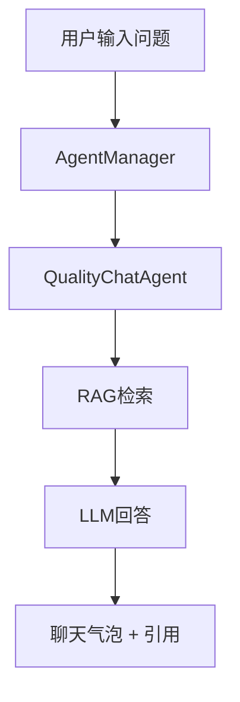
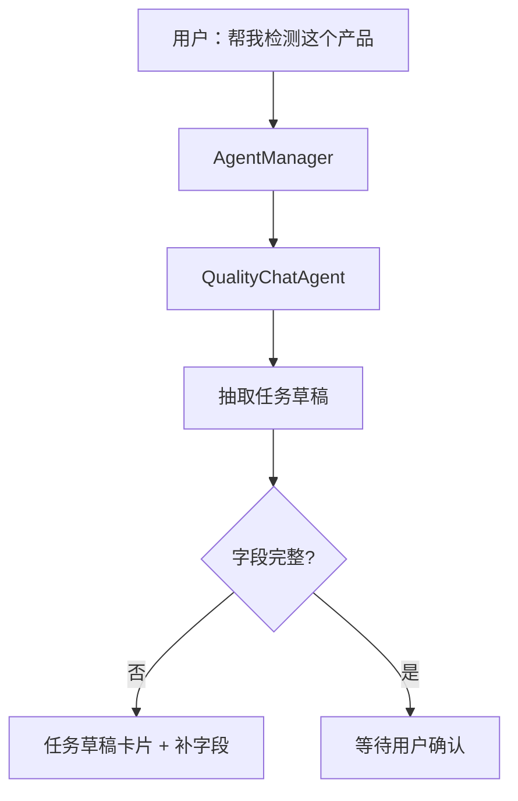
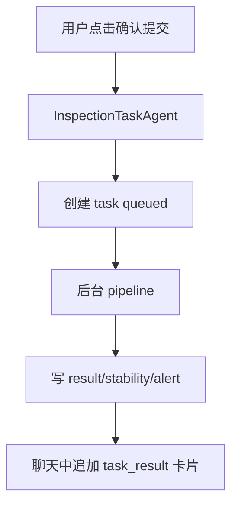

# 聊天页刷新、任务检测卡住、报告结果异常的修复方案

> 参照《聊天 Agent 与任务检测 Agent 拆分实现方案》的主线继续推进：保留统一聊天入口，但把 **QualityChatAgent 的聊天问答** 和 **InspectionTaskAgent 的正式任务检测** 在后端落库边界、前端展示边界、任务状态边界上彻底切开。

---

## 0. 当前现象与核心判断

### 0.1 聊天页面刷新后内容和状态变化

表现：

```text
刷新前：前端临时消息 / SSE 流式消息 / 当前 RAG 选择仍在页面上
刷新后：重新从数据库拉最终消息，显示变成固定样式
```

当前原因：

1. 前端发送消息时先插入临时 user/assistant 消息。
2. 后端返回真实 message id 后替换临时消息。
3. SSE 不稳定时，前端 fallback polling 重新拉数据库消息。
4. 页面刷新后只显示数据库最终消息，不再显示临时状态。
5. `initForChatPage()` 初始化时主动执行 `clearSelectedRagSpace()`，刷新后当前 RAG 选择被清空。

需要修复：

```text
刷新后不应丢失当前 RAG 选择；
历史消息中的 RAG 标签和当前选择状态要区分；
前端临时消息、SSE 消息、数据库最终消息要统一合并策略。
```

---

### 0.2 聊天问答被错误生成任务和报告

表现：

```text
用户只是问聊天/RAG问题
系统却生成 task
任务列表出现：
  product_id = chat_quality
  spec_code = CHAT-QUALITY-QA
  status = DONE
并且出现“查看分析结果 / 查看稳定性评估”
```

核心原因：

当前 `QualityAgentOrchestratorService._should_materialize_chat_output()` 逻辑过宽：

```python
def _should_materialize_chat_output(self, output: AgentOutput) -> bool:
    return str(output.message_type or "") == "quality_answer"
```

这会导致：

```text
QualityChatAgent 的 RAG/质量问答
  → message_type = quality_answer
  → 被自动物化为 task/result/stability
  → 如果没有产品编号/标准编号，就走 legacy 默认：
     product_id = chat_quality
     spec_code = CHAT-QUALITY-QA
```

这是当前项目中最需要优先修的边界错误。

---

### 0.3 任务检测页面卡在 PENDING / running

表现：

```text
页面顶部显示 PENDING
实时流显示 run - 任务已提交执行（celery）（running）
后续没有 planner / vision / knowledge / reasoning / finalizer 事件
```

可能原因：

1. 前端启动任务后只往本地 timeline 插入 running 事件，没有立即刷新 task 详情。
2. 后端 `launch_task_execution()` 只返回 `mode/job_id`，但没有把 execution job 状态写回 task metadata。
3. Celery worker 可能接收了任务，但 worker 实际执行异常或没有运行到 `run_inspection_pipeline()`。
4. 当前任务实时流是内存 broker，刷新或跨进程时历史事件不可可靠恢复。
5. 任务详情页只根据 `task.status` 判断是否显示结果按钮，没有确认 result/stability 是否真实存在。

---

### 0.4 聊天界面同时承载聊天和任务检测，但边界不清

当前页面已经能：

```text
普通聊天
选择 RAG 空间
上传附件
从聊天中提交任务
查看任务卡片
```

但问题是：

```text
聊天问答和任务检测混在一个消息类型里；
任务检测入口不够明显；
任务检测结果和普通质量问答结果共用 quality_answer；
前端没有明确展示“当前由哪个 Agent 执行”。
```

---

## 1. 总体修复目标

最终目标：

```text
Chat 页面保留统一入口
        ↓
AgentManager 负责路由
        ↓
QualityChatAgent：只负责聊天/RAG问答/任务草稿
InspectionTaskAgent：只负责正式任务检测/结果落库
```

核心原则：

| 原则 | 说明 |
|---|---|
| 聊天不落任务 | 普通聊天、RAG 问答、标准解释不能自动生成 task/result/stability |
| 任务检测才落库 | 只有 InspectionTaskAgent 的正式检测结果可以写 task/result/stability/alert |
| 状态必须可见 | queued/running/done/failed/degraded 都要前端可见 |
| 刷新后可恢复 | 聊天消息、任务状态、任务事件、RAG 选择都应能从持久状态恢复 |
| 报告按钮真实 | 只有 result/stability 真实存在时才显示分析报告和稳定性报告按钮 |

---

## 2. 后端 P0 修复：切断聊天问答自动物化任务

### 2.1 修改位置

```text
backend/app/services/quality_agent_orchestrator_service.py
```

### 2.2 当前错误逻辑

```python
def _should_materialize_chat_output(self, output: AgentOutput) -> bool:
    return str(output.message_type or "") == "quality_answer"
```

### 2.3 推荐改法

```python
def _should_materialize_chat_output(self, output: AgentOutput) -> bool:
    route = ""
    if output.route_decision:
        route = str(output.route_decision.selected_subgraph or "")

    persistable = output.persistable_output
    has_structured_output = bool(
        persistable
        and persistable.task
        and persistable.result
        and persistable.stability
    )

    # 只有 InspectionTaskAgent 的正式检测输出才能物化为 task/result/stability
    return route == "inspection_task" and has_structured_output
```

### 2.4 更严格的 message_type 约束

| 场景 | selected_subgraph | message_type | 是否写 task/result/stability |
|---|---|---|---|
| 普通聊天 | quality_chat | assistant_text | 否 |
| RAG 问答 | quality_chat | rag_answer 或 quality_answer | 否 |
| 任务草稿 | quality_chat | task_action | 否 |
| 缺字段澄清 | quality_chat / inspection_task | clarification / task_action | 否 |
| 正式任务创建 | inspection_task | task_created / task_running | 只写 task |
| 正式检测结果 | inspection_task | task_result | 是 |
| 结构化文件检测结果 | inspection_task | task_result | 是 |
| 系统异常 | 任意 | error | 否 |

推荐把 InspectionTaskAgent 当前正式检测结果从：

```python
message_type="quality_answer"
```

调整为：

```python
message_type="task_result"
```

如果只是要求补字段，则返回：

```python
message_type="task_action"
action_state="awaiting_clarification"
```

---

## 3. 后端 P0 修复：禁止开发阶段静默 fallback 到旧 QualityJudgementSubgraph

### 3.1 当前问题

AgentManager 失败时会自动 fallback 到 legacy `QualityJudgementSubgraph`。这会掩盖新 Agent 的错误，让页面看起来“有结果”，但实际走了旧逻辑。

### 3.2 推荐改法

增加配置：

```text
PIAP_ENABLE_LEGACY_AGENT_FALLBACK=false
```

代码逻辑：

```python
try:
    router_output = await self._agent_manager.run_chat(payload)
except Exception as exc:
    if not settings.enable_legacy_agent_fallback:
        raise RuntimeError(f"AgentManager failed: {exc}") from exc

    logger.exception("AgentManager failed, falling back to legacy QualityJudgementSubgraph")
    result = await self._graph.run(request)
```

开发阶段建议：

```text
PIAP_ENABLE_LEGACY_AGENT_FALLBACK=false
```

生产灰度阶段可以临时：

```text
PIAP_ENABLE_LEGACY_AGENT_FALLBACK=true
```

但前端必须显示：

```text
当前回答由 Legacy QualityJudgementSubgraph 兜底生成
```

---

## 4. 后端 P0 修复：清理 chat_quality / CHAT-QUALITY-QA 伪任务

### 4.1 为什么要清理

这些任务不是用户真实创建的检测任务，而是聊天问答误物化造成的。

典型特征：

```text
product_id = chat_quality
spec_code = CHAT-QUALITY-QA
meta_data.source = chat_quality_answer
source_graph = quality_judgement
```

### 4.2 建议处理

第一步：隐藏或归档。

```sql
UPDATE inspection_tasks
SET status = 'archived'
WHERE product_id = 'chat_quality'
   OR spec_code = 'CHAT-QUALITY-QA';
```

如果暂时没有 `archived` 状态，可以先在任务列表过滤：

```sql
WHERE NOT (
  product_id = 'chat_quality'
  OR spec_code = 'CHAT-QUALITY-QA'
)
```

第二步：迁移为聊天日志，不再作为任务显示。

第三步：确认无用后删除相关 result/stability/alert。

---

## 5. 后端 P1 修复：任务执行状态持久化

### 5.1 当前问题

当前任务实时流基于内存 broker。服务重启、刷新、跨进程、Celery worker 与 API 不同进程时，事件不可可靠恢复。

### 5.2 新增任务执行事件表

```sql
CREATE TABLE task_execution_events (
  id BINARY(16) PRIMARY KEY,
  org_id BINARY(16) NOT NULL,
  task_id BINARY(16) NOT NULL,

  event_type VARCHAR(64) NOT NULL,
  stage VARCHAR(64) NULL,
  status VARCHAR(32) NULL,
  message TEXT NULL,
  payload_json JSON NULL,

  created_at DATETIME(3) NOT NULL DEFAULT CURRENT_TIMESTAMP(3),

  INDEX idx_task_execution_events_task (org_id, task_id, created_at)
);
```

### 5.3 emit 同时写 DB 和 SSE

在 `run_inspection_pipeline()` 里统一封装：

```python
async def emit(event: dict) -> None:
    event.setdefault("ts", datetime.utcnow().isoformat())

    await task_execution_event_repo.create(
        org_id=org_id,
        task_id=task_id,
        event_type=str(event.get("type") or "event"),
        stage=event.get("stage"),
        status=event.get("status"),
        message=event.get("message"),
        payload_json=event,
    )

    await stream_broker.publish(task_id, event)
```

### 5.4 任务详情页初始化时先加载历史事件

新增 API：

```http
GET /api/v1/tasks/{task_id}/events
```

前端流程：

```text
进入任务详情页
  → fetchTask(taskId)
  → fetchTaskEvents(taskId)
  → subscribeTaskStream(taskId)
```

这样刷新后也能看到完整 timeline。

---

## 6. 后端 P1 修复：任务状态从 pending/running 扩展为 queued/running/done/failed

### 6.1 推荐状态

| 状态 | 含义 |
|---|---|
| pending | 已创建，尚未提交执行 |
| queued | 已提交 Celery/后台队列，等待 worker |
| running | worker 已开始执行 pipeline |
| done | 执行完成，并已生成 result/stability |
| failed | 执行失败 |
| reviewing | 需要人工复核 |
| archived | 历史伪任务或已归档任务 |

### 6.2 启动任务时写 execution metadata

```python
await task_repo.update_status(org_id, task_id, "queued")
await task_repo.patch_metadata(
    org_id,
    task_id,
    {
        "execution": {
            "mode": launch["mode"],
            "job_id": launch["job_id"],
            "queued_at": now,
        }
    },
)
```

worker 开始执行时：

```python
await task_repo.update_status(org_id, task_id, "running")
task.meta_data["execution"]["started_at"] = now
```

worker 完成时：

```python
await task_repo.update_status(org_id, task_id, "done")
task.meta_data["execution"]["finished_at"] = now
```

失败时：

```python
await task_repo.update_status(org_id, task_id, "failed")
task.meta_data["execution"]["error"] = str(exc)
```

---

## 7. 后端 P1 修复：报告按钮必须基于真实 result/stability

### 7.1 当前问题

任务详情页只根据任务状态显示：

```text
done / failed / reviewing → 查看分析结果 / 查看稳定性评估
```

但 task.status 不等于 result/stability 一定存在。

### 7.2 推荐 TaskResponse 扩展字段

```python
class TaskResponse(BaseModel):
    ...
    has_result: bool = False
    has_stability: bool = False
    result_id: str | None = None
    stability_id: str | None = None
    execution: dict[str, Any] | None = None
```

### 7.3 后端 get_task 聚合

`TaskService.get_task()` 或 API 层增加聚合查询：

```text
task
+ result_repo.get_by_task(task_id)
+ stability_repo.get_by_task(task_id)
```

返回：

```json
{
  "status": "done",
  "has_result": true,
  "has_stability": true,
  "result_id": "...",
  "stability_id": "..."
}
```

### 7.4 前端按钮显示规则

```vue
<el-button v-if="taskStore.current?.has_result" type="success" plain>
  查看分析结果
</el-button>

<el-button v-if="taskStore.current?.has_stability" type="warning" plain>
  查看稳定性评估
</el-button>
```

如果状态 done 但没有结果：

```text
任务已完成，但结果记录缺失，请重新生成报告或查看执行日志。
```

---

## 8. 前端 P0 修复：刷新聊天页不清空 RAG 选择

### 8.1 当前问题

`initForChatPage()` 中主动调用：

```ts
clearSelectedRagSpace();
```

导致刷新页面后 RAG 选择被清掉。

### 8.2 推荐改法

删除 `clearSelectedRagSpace()`，保留 `sessionStorage` 中的 RAG 选择。

```ts
async function initForChatPage() {
  if (initPromise.value) {
    await initPromise.value;
    return;
  }

  initPromise.value = (async () => {
    await fetchSessions();

    try {
      await fetchRagSpaces();
    } catch {
      // RAG metadata initialization should not block ordinary chat usage.
    }

    const savedSessionId = getSavedSession();
    if (savedSessionId && sessions.value.some((x) => x.id === savedSessionId)) {
      await selectSession(savedSessionId);
      return;
    }

    if (sessions.value.length > 0) {
      await selectSession(sessions.value[0].id);
      return;
    }

    await createNewSession();
  })();

  try {
    await initPromise.value;
  } finally {
    initPromise.value = null;
  }
}
```

---

## 9. 前端 P1 修复：任务启动后立即刷新状态

### 9.1 当前问题

`startPipeline()` 中启动任务后只 push 本地事件，没有刷新任务详情。

### 9.2 推荐改法

```ts
async function startPipeline() {
  try {
    running.value = true;
    const result = await taskStore.runTask(taskId);

    if (taskStore.current) {
      taskStore.current.status = result.status || "queued";
    }

    pushEvent({
      type: "run",
      message: `任务已提交执行（${result.mode}）`,
      status: result.status || "queued",
      ts: new Date().toISOString(),
    });

    await taskStore.fetchTask(taskId);
  } catch (error: any) {
    running.value = false;
    ElMessage.error(error?.response?.data?.message || "启动任务失败");
  }
}
```

### 9.3 SSE ready 不应被当成业务事件

```ts
function pushEvent(event: TaskStreamEvent) {
  if (event.type === "ready" || event.message === "stream_connected") {
    return;
  }
  ...
}
```

---

## 10. 前端体验方案：一个聊天入口 + 模式切换 + 任务卡片

### 10.1 不建议只加两个突兀按钮

不推荐把聊天和任务检测完全拆成两个互不相干的页面。这样会割裂用户流程，尤其是用户在聊天里上传文件、选择 RAG、再发起检测时。

推荐：

```text
一个聊天页
顶部轻量模式切换：
[智能问答] [任务检测]
```

### 10.2 顶部工具栏设计

```text
┌──────────────────────────────────────────────────────┐
│ 模式：[智能问答] [任务检测]   RAG：[食品标准库 v]     │
└──────────────────────────────────────────────────────┘
```

| 模式 | 行为 |
|---|---|
| 智能问答 | 默认走 QualityChatAgent，适合普通聊天、RAG 问答、标准解释 |
| 任务检测 | 默认 `route_hints.force_agent = inspection_task`，适合创建/执行检测任务 |
| 自动识别 | 用户不选模式时由 AgentManager 判断 |

### 10.3 任务检测模式输入区

进入任务检测模式后，在输入框上方显示轻量任务表单：

```text
任务检测模式
产品编号 [____]  检测标准 [____]  图片/文件 [上传]  [开始检测]
```

如果用户直接发自然语言：

```text
帮我检测这个螺丝是否合格
```

系统自动生成任务草稿卡片：

```text
检测任务草稿
产品编号：未填写
检测标准：SCREW-A-2026-V1
附件：1 张图片

[补充信息] [确认提交]
```

### 10.4 聊天气泡中显示 Agent 信息

每条 assistant 消息底部显示：

```text
Agent：QualityChatAgent
意图：rag_qa
RAG：食品
引用：3
```

任务检测消息显示：

```text
Agent：InspectionTaskAgent
状态：running
阶段：vision / knowledge / reasoning
任务 ID：...
```

---

## 11. 聊天页同时支持聊天和任务检测的推荐流程

### 11.1 普通 RAG 问答



落库：

```text
chat_messages only
不写 inspection_tasks
不写 results
不写 stability
```

### 11.2 从聊天创建任务草稿



落库：

```text
chat_messages only
不创建正式 task
```

### 11.3 用户确认后正式提交检测



落库：

```text
inspection_tasks
inspection_results
stability_reports
alerts
chat_messages task_result summary
```

---

## 12. 后端接口建议

### 12.1 保留旧聊天接口

```http
POST /api/v1/chat/sessions/{session_id}/messages
```

扩展请求：

```json
{
  "message": "帮我检测这个产品",
  "ext": {
    "ui_mode": "inspection",
    "route_hints": {
      "force_agent": "inspection_task"
    },
    "rag_scope": {
      "enabled": true,
      "rag_space_id": "...",
      "scope_node_ids": []
    }
  }
}
```

### 12.2 新增任务草稿确认接口

```http
POST /api/v1/chat/sessions/{session_id}/task-drafts/{draft_id}/submit
```

作用：

```text
把聊天中的任务草稿正式提交给 InspectionTaskAgent。
```

这样可以避免 QualityChatGraph 直接创建任务。

### 12.3 新增任务事件接口

```http
GET /api/v1/tasks/{task_id}/events
```

作用：

```text
刷新任务详情页时恢复历史 timeline。
```

---

## 13. 数据库改动清单

### 13.1 新增 task_execution_events

见第 5 节。

### 13.2 扩展 inspection_tasks

```sql
ALTER TABLE inspection_tasks
  ADD COLUMN execution_status VARCHAR(32) NULL,
  ADD COLUMN execution_job_id VARCHAR(128) NULL,
  ADD COLUMN execution_mode VARCHAR(32) NULL,
  ADD COLUMN queued_at DATETIME(3) NULL,
  ADD COLUMN started_at DATETIME(3) NULL,
  ADD COLUMN finished_at DATETIME(3) NULL,
  ADD COLUMN last_event_at DATETIME(3) NULL;
```

如果不想改太多列，可先放入 `meta_data.execution`，但长期建议拆列，方便筛选卡住任务。

### 13.3 扩展 TaskResponse，不一定改表

```text
has_result
has_stability
result_id
stability_id
```

这些可由查询聚合得到。

---

## 14. 代码改动清单

### 14.1 后端必须改

```text
backend/app/services/quality_agent_orchestrator_service.py
  - _should_materialize_chat_output()
  - AgentManager fallback 策略
  - _build_response_payload() 增加 agent_name / intent / status

backend/agent/subgraphs/inspection_task/graph.py
  - 正式检测输出 message_type 改成 task_result
  - 缺字段输出 task_action / clarification
  - persistable_output 只给正式检测结果

backend/agent/subgraphs/quality_chat/graph.py
  - 不再直接正式创建任务
  - task_create 只生成 task_draft
  - RAG 问答不要携带可物化的 PersistableOutput

backend/app/services/task_execution_service.py
  - launch_task_execution 写 queued 状态和 execution metadata

backend/app/services/inspection_pipeline_service.py
  - emit 同步写 task_execution_events
  - started/done/failed 更新 execution metadata

backend/app/api/v1/tasks.py
  - get_task 返回 has_result / has_stability
  - 新增 GET /tasks/{task_id}/events
```

### 14.2 前端必须改

```text
frontend/src/stores/chat.store.ts
  - initForChatPage 删除 clearSelectedRagSpace()
  - sendMessage 增加 ui_mode / route_hints / rag_scope
  - normalizeMessage 保留 route_decision / source_graph / agent_name

frontend/src/views/ChatView.vue
  - 顶部增加 智能问答 / 任务检测 模式切换
  - 消息卡片显示 Agent / intent / RAG / status
  - 任务草稿卡片和检测结果卡片分开显示

frontend/src/stores/task.store.ts
  - fetchTaskEvents()
  - runTask 后刷新 current
  - subscribeTaskStream 过滤 ready 事件

frontend/src/views/TaskDetailView.vue
  - 启动任务后立即 fetchTask()
  - 初始化加载历史 task_execution_events
  - 按 has_result / has_stability 显示报告按钮
  - 显示 queued/running/done/failed 的清晰状态说明
```

---

## 15. 推荐落地优先级

| 优先级 | 任务 | 目标 |
|---|---|---|
| P0 | 禁止 QualityChatAgent 自动物化 task | 立即阻止 chat_quality 伪任务继续产生 |
| P0 | 禁止开发阶段 legacy fallback | 新 Agent 出错要暴露，不要悄悄跑旧逻辑 |
| P0 | InspectionTaskAgent 输出 task_result | 清晰区分聊天结果和检测结果 |
| P1 | 刷新聊天页不清空 RAG | 解决刷新后 RAG 状态混乱 |
| P1 | 任务启动后刷新状态 | 解决 PENDING/running 矛盾 |
| P1 | task_execution_events 持久化 | 解决任务流刷新丢失和卡住难排查 |
| P1 | 报告按钮基于 has_result/has_stability | 防止伪任务和空报告入口 |
| P2 | 聊天页模式切换与任务卡片优化 | 提升用户体验 |
| P2 | 清理历史 chat_quality 伪任务 | 修复已有脏数据 |
| P3 | Agent Ops 动态路由规则 | 后续增强可配置性 |

---

## 16. 最小可落地版本

第一版只做这些：

```text
1. _should_materialize_chat_output 改成只允许 inspection_task 落库。
2. InspectionTaskAgent 正式结果改 message_type = task_result。
3. initForChatPage 删除 clearSelectedRagSpace。
4. TaskDetailView.startPipeline 启动后立即 fetchTask。
5. TaskResponse 增加 has_result / has_stability，前端按这两个字段显示报告按钮。
6. legacy fallback 加开关，开发环境默认关闭。
```

这 6 个改完，就能解决当前最明显的几个问题：

```text
聊天问答不再变成 chat_quality 任务；
刷新后 RAG 选择不再无故消失；
任务 PENDING/running 状态不再明显矛盾；
伪任务不再显示分析报告/稳定性评估按钮；
AgentManager 出错能被开发者看到。
```

---

## 17. 最终建议

不要把聊天页拆成两个完全独立页面。最佳方案是：

```text
一个聊天页
+ 顶部轻量模式切换
+ AgentManager 自动路由
+ QualityChatAgent 负责聊天/RAG/草稿
+ InspectionTaskAgent 负责正式检测/落库
+ 任务卡片在聊天流中展示进度和结果
```

但后端必须先切清楚：

```text
聊天消息归聊天；
任务检测归任务；
只有 InspectionTaskAgent 才能写 task/result/stability。
```

只有这个边界先修好，前端再做美化才不会继续把普通问答变成伪任务，也不会再出现报告结果来源不清的问题。
