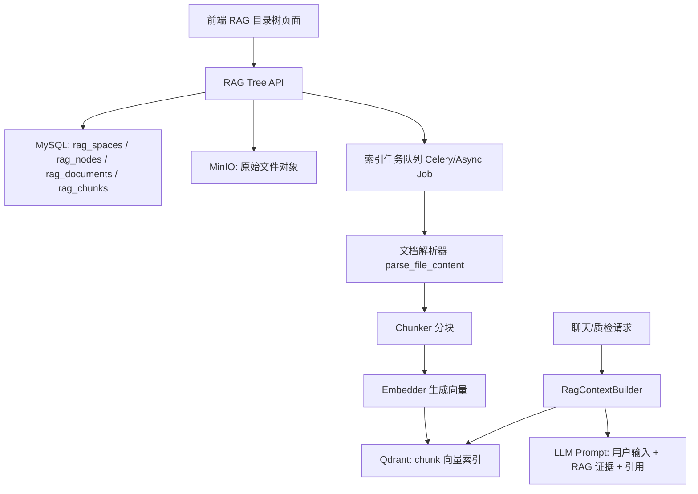
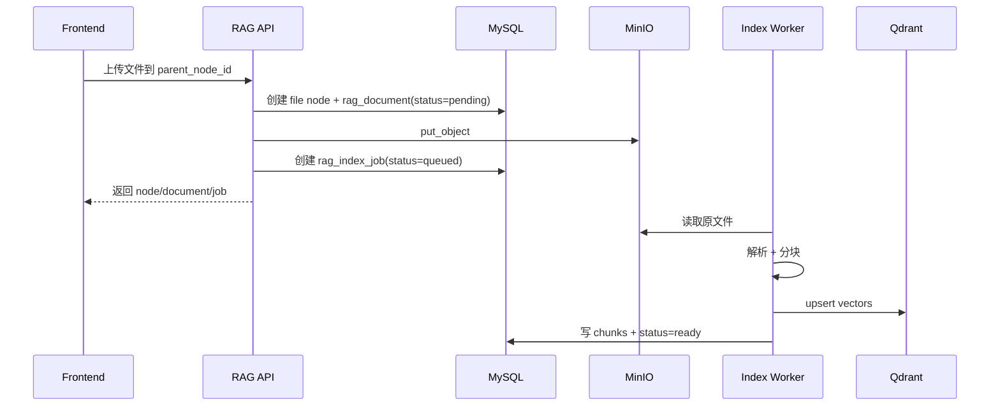
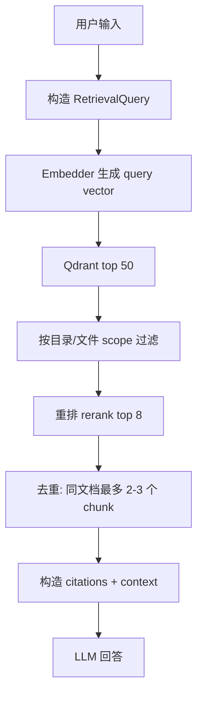

# RAG 空间目录树改造方案：多级分类 + MinIO 文件存储 + Qdrant 检索

## 0. 当前代码结论

当前 `tgg` 分支的 RAG 能力已经有基础，但与目标页面差距较大：

1. 前端 `RagSpaceView.vue` 当前是“空间列表 + 文档列表”两栏，不是目录树；创建时提示“一个文档会创建成一个独立空间”。
2. 前端 API 只有 `list / create / uploadDocuments / deleteDocument`，没有创建文件夹、大类、移动节点、删除空间/文件夹等接口。
3. 后端 `RagSpaceService.upload_documents()` 限制“每个 RAG 空间只允许上传一个文档”，并且如果已有文档会拒绝上传。
4. 数据库只有 `rag_spaces` 和 `rag_space_files`，没有 `parent_id / path / node_type`，无法表达多级文件夹结构。
5. 当前文件实际走 `FileStorageService` 本地目录保存，不是 MinIO；虽然配置里有 S3/MinIO 字段，但没有真正使用。
6. 当前 RAG 有两套检索：一套是 `KnowledgeIndexer + Qdrant`，另一套 `RagRetrievalService` 是读取本地文件后做关键词 overlap；建议统一成 Qdrant 检索。

---

## 1. 目标效果

页面展示一个类似文件管理器的知识库目录树：

```text
RAG 空间：质检知识库
├─ 机械
│  ├─ 模具标准
│  │  ├─ 注塑外观标准库.pdf
│  │  └─ 模具验收规范.docx
│  ├─ 螺丝标准
│  │  └─ 螺丝缺陷判定.xlsx
│  └─ 设备维护
├─ 电子产品
│  ├─ 电路板检测规范.docx
│  └─ 充电器标准
└─ 食品
   ├─ 标签规范
   └─ 微生物检测标准.pdf
```

用户可以：

- 新增大类，例如“机械 / 食品 / 电子产品”。
- 在任意大类或文件夹下新增子文件夹。
- 在任意文件夹下上传多个文件。
- 删除大类、文件夹、文件；删除文件夹时可级联删除其子节点。
- 查看文件索引状态：上传中、解析中、索引中、ready、failed。
- 在聊天或质检任务中选择“整个 RAG 空间 / 某个大类 / 某个文件夹 / 若干文件”作为检索范围。

---

## 2. 推荐总体架构



推荐原则：

- **MySQL 是元数据事实源**：目录树、文件状态、索引任务、权限、删除状态都在 MySQL。
- **MinIO 是原始文件存储**：PDF/DOCX/XLSX/图片等原文件只放 MinIO。
- **Qdrant 是语义检索索引**：只存 chunk 文本、向量和过滤 payload，不作为唯一事实源。
- **检索时不再读取 MinIO 文件**：检索直接查 Qdrant，MinIO 只用于下载、预览、重新解析/重建索引。
- **目录层级过滤靠 ancestor_ids**：Qdrant payload 中保存所有祖先节点 ID，用于高效按大类/文件夹过滤。

---

## 3. 前端页面设计

### 3.1 页面布局

推荐把当前 `RagSpaceView.vue` 改成“文件管理器式页面”。

```text
┌─────────────────────────────────────────────────────────────┐
│ RAG 空间管理系统                [新建空间] [上传] [刷新]     │
│ 当前空间：质检知识库              目录总数 4 文档总数 32      │
├──────────────────────────────┬──────────────────────────────┤
│ 左侧：知识库目录树             │ 右侧：节点详情/文件列表       │
│                              │                              │
│ ▾ 机械                       │ 名称：模具标准                │
│   ▾ 模具标准                 │ 路径：/机械/模具标准          │
│      📄 注塑外观标准库.pdf    │ 文档数：12                    │
│      📄 模具验收规范.docx     │                              │
│   ▸ 螺丝标准                 │ [上传文件] [新增子文件夹]     │
│ ▾ 电子产品                   │                              │
│ ▸ 食品                       │ 文件列表：                    │
│                              │  文件名 状态 大小 更新时间    │
└──────────────────────────────┴──────────────────────────────┘
```

### 3.2 交互设计

左侧树：

- 节点类型：
  - `category`：大类，图标用文件夹，颜色更突出。
  - `folder`：普通文件夹。
  - `file`：文件。
- 支持展开/收起。
- 支持懒加载：点击展开节点时再请求其 children。
- 支持右键或更多菜单：
  - 大类：新增子文件夹、上传文件、重命名、删除。
  - 文件夹：新增子文件夹、上传文件、重命名、删除。
  - 文件：预览、下载、重建索引、删除。
- 删除文件夹/大类时弹窗提示：会删除所有子文件夹、文件、Qdrant 索引和 MinIO 对象。

右侧详情：

- 选中大类/文件夹：显示路径、子文件夹数量、文件数量、最近更新时间、上传按钮。
- 选中文件：显示文件名、大小、MIME、MinIO object_key、解析状态、索引状态、chunk 数量、失败原因、下载/重建索引按钮。

顶部：

- 空间选择器：选择当前 RAG 空间。
- 新建空间：例如“质检知识库 / 企业标准库”。
- 新建大类：在根节点下创建 category。
- 全局搜索：按文件名或目录名搜索树节点。
- 统计：目录数、文档数、已索引 chunk 数、失败文件数。

### 3.3 前端组件拆分

建议不要把所有逻辑继续堆在 `RagSpaceView.vue` 中。

```text
frontend/src/views/RagSpaceView.vue
frontend/src/components/rag/RagSpaceSelector.vue
frontend/src/components/rag/RagTreePanel.vue
frontend/src/components/rag/RagNodeActions.vue
frontend/src/components/rag/RagUploadDialog.vue
frontend/src/components/rag/RagNodeDetail.vue
frontend/src/components/rag/RagDeleteConfirm.vue
frontend/src/api/rag-space.api.ts
frontend/src/types/rag-space.types.ts
frontend/src/stores/rag-space.store.ts
```

### 3.4 前端类型设计

```ts
export type RagNodeType = "category" | "folder" | "file";

export interface RagNode {
  id: string;
  rag_space_id: string;
  parent_id?: string | null;
  node_type: RagNodeType;
  name: string;
  full_path: string;
  depth: number;
  sort_order: number;
  status: "ready" | "indexing" | "failed" | "deleting";
  children_count: number;
  file_count: number;
  document?: RagDocument | null;
  created_at?: string | null;
  updated_at?: string | null;
}

export interface RagDocument {
  id: string;
  node_id: string;
  file_name: string;
  content_type?: string | null;
  object_key: string;
  size_bytes: number;
  checksum_sha256: string;
  parse_status: "pending" | "parsing" | "parsed" | "failed";
  index_status: "pending" | "indexing" | "ready" | "failed";
  chunk_count: number;
  error_message?: string | null;
}
```

---

## 4. 后端 API 设计

保留当前 `/v1/rag-spaces`，但新增目录树 API。

### 4.1 空间 API

| 方法 | 路径 | 用途 |
|---|---|---|
| GET | `/v1/rag-spaces` | 列出空间 |
| POST | `/v1/rag-spaces` | 创建空间 |
| PATCH | `/v1/rag-spaces/{space_id}` | 修改空间名称/描述 |
| DELETE | `/v1/rag-spaces/{space_id}` | 删除空间，级联删除目录、文件、Qdrant 点 |

### 4.2 树节点 API

| 方法 | 路径 | 用途 |
|---|---|---|
| GET | `/v1/rag-spaces/{space_id}/nodes?parent_id=&depth=1` | 获取某个节点下的 children |
| GET | `/v1/rag-spaces/{space_id}/tree` | 获取完整树，适合小数据量 |
| POST | `/v1/rag-spaces/{space_id}/nodes` | 创建大类/文件夹 |
| PATCH | `/v1/rag-spaces/{space_id}/nodes/{node_id}` | 重命名、移动、排序 |
| DELETE | `/v1/rag-spaces/{space_id}/nodes/{node_id}?cascade=true` | 删除大类/文件夹/文件 |

创建节点请求：

```json
{
  "parent_id": null,
  "node_type": "category",
  "name": "机械"
}
```

创建子文件夹请求：

```json
{
  "parent_id": "机械节点ID",
  "node_type": "folder",
  "name": "模具标准"
}
```

### 4.3 文件 API

| 方法 | 路径 | 用途 |
|---|---|---|
| POST | `/v1/rag-spaces/{space_id}/nodes/{parent_id}/documents` | 上传文件到指定目录 |
| GET | `/v1/rag-spaces/{space_id}/documents/{document_id}` | 查看文件详情 |
| GET | `/v1/rag-spaces/{space_id}/documents/{document_id}/download-url` | 获取 MinIO 预签名下载 URL |
| POST | `/v1/rag-spaces/{space_id}/documents/{document_id}/reindex` | 重建索引 |
| DELETE | `/v1/rag-spaces/{space_id}/documents/{document_id}` | 删除文件和索引 |

上传返回：

```json
{
  "node": {
    "id": "file_node_id",
    "node_type": "file",
    "name": "注塑外观标准库.pdf",
    "full_path": "/机械/模具标准/注塑外观标准库.pdf",
    "status": "indexing"
  },
  "document": {
    "id": "document_id",
    "object_key": "rag/org/space/document_id/hash.pdf",
    "parse_status": "pending",
    "index_status": "pending"
  },
  "job_id": "index_job_id"
}
```

### 4.4 检索 API

调试和聊天共用：

```http
POST /v1/rag-spaces/search
```

```json
{
  "rag_space_id": "space_id",
  "query": "注塑件外观划痕如何判定",
  "scope_node_ids": ["机械节点ID", "模具标准节点ID"],
  "top_k": 8,
  "mode": "hybrid"
}
```

返回：

```json
{
  "hits": [
    {
      "chunk_id": "chunk_id",
      "document_id": "doc_id",
      "node_id": "file_node_id",
      "title": "注塑外观标准库.pdf",
      "full_path": "/机械/模具标准/注塑外观标准库.pdf",
      "quote": "划痕长度超过 ... 判定为不合格",
      "score": 0.87,
      "citation": {
        "source": "注塑外观标准库.pdf",
        "page": 3,
        "chunk_index": 12
      }
    }
  ],
  "degraded": false,
  "retrieval_meta": {
    "vector_top_k": 50,
    "rerank_top_k": 8,
    "filter": {
      "rag_space_id": "space_id",
      "scope_node_ids": ["..."]
    }
  }
}
```

---

## 5. 数据库表结构设计

### 5.1 保留并扩展 `rag_spaces`

当前表可以保留，作为一个可选择的知识空间。

新增字段建议：

```sql
ALTER TABLE rag_spaces
  ADD COLUMN visibility_scope JSON NULL,
  ADD COLUMN root_node_id BINARY(16) NULL,
  ADD COLUMN category_count INT NOT NULL DEFAULT 0,
  ADD COLUMN folder_count INT NOT NULL DEFAULT 0,
  ADD COLUMN document_count INT NOT NULL DEFAULT 0,
  ADD COLUMN chunk_count INT NOT NULL DEFAULT 0,
  ADD COLUMN index_status VARCHAR(32) NOT NULL DEFAULT 'ready';
```

### 5.2 新增 `rag_nodes`

用于表达目录树。大类、文件夹、文件都放在这张表。

```sql
CREATE TABLE rag_nodes (
  id BINARY(16) PRIMARY KEY,
  org_id BINARY(16) NOT NULL,
  rag_space_id BINARY(16) NOT NULL,
  parent_id BINARY(16) NULL,

  node_type VARCHAR(32) NOT NULL, -- category/folder/file
  name VARCHAR(255) NOT NULL,
  path_key VARCHAR(255) NOT NULL,
  full_path TEXT NOT NULL,
  ancestor_ids JSON NULL,

  depth INT NOT NULL DEFAULT 0,
  sort_order INT NOT NULL DEFAULT 0,
  status VARCHAR(32) NOT NULL DEFAULT 'ready',

  children_count INT NOT NULL DEFAULT 0,
  file_count INT NOT NULL DEFAULT 0,
  chunk_count INT NOT NULL DEFAULT 0,

  created_by BINARY(16) NULL,
  created_at DATETIME(3) NOT NULL DEFAULT CURRENT_TIMESTAMP(3),
  updated_at DATETIME(3) NOT NULL DEFAULT CURRENT_TIMESTAMP(3) ON UPDATE CURRENT_TIMESTAMP(3),
  deleted_at DATETIME(3) NULL,

  INDEX idx_rag_nodes_parent (org_id, rag_space_id, parent_id, deleted_at),
  INDEX idx_rag_nodes_space_type (org_id, rag_space_id, node_type, deleted_at),
  INDEX idx_rag_nodes_status (org_id, rag_space_id, status),
  UNIQUE KEY uk_rag_sibling_name (org_id, rag_space_id, parent_id, name, deleted_at)
);
```

说明：

- `parent_id = NULL` 表示根下大类。
- `node_type = category` 只允许出现在根层或管理员指定层。
- `node_type = file` 必须有对应 `rag_documents`。
- `ancestor_ids` 存所有祖先节点 ID，方便前端和 Qdrant 过滤。
- `full_path` 用于展示和引用，不建议用它做高频过滤。

### 5.3 新增 `rag_documents`

存文件元数据，不直接存文件内容。

```sql
CREATE TABLE rag_documents (
  id BINARY(16) PRIMARY KEY,
  org_id BINARY(16) NOT NULL,
  rag_space_id BINARY(16) NOT NULL,
  node_id BINARY(16) NOT NULL,

  file_name VARCHAR(255) NOT NULL,
  content_type VARCHAR(120) NULL,
  size_bytes BIGINT NOT NULL DEFAULT 0,
  checksum_sha256 CHAR(64) NOT NULL,

  storage_backend VARCHAR(32) NOT NULL DEFAULT 'minio',
  bucket VARCHAR(128) NOT NULL,
  object_key TEXT NOT NULL,
  file_url TEXT NULL,

  parse_status VARCHAR(32) NOT NULL DEFAULT 'pending',
  index_status VARCHAR(32) NOT NULL DEFAULT 'pending',
  chunk_count INT NOT NULL DEFAULT 0,
  error_message TEXT NULL,

  version INT NOT NULL DEFAULT 1,
  uploaded_by BINARY(16) NULL,
  created_at DATETIME(3) NOT NULL DEFAULT CURRENT_TIMESTAMP(3),
  updated_at DATETIME(3) NOT NULL DEFAULT CURRENT_TIMESTAMP(3) ON UPDATE CURRENT_TIMESTAMP(3),
  deleted_at DATETIME(3) NULL,

  INDEX idx_rag_docs_node (org_id, rag_space_id, node_id, deleted_at),
  INDEX idx_rag_docs_status (org_id, rag_space_id, parse_status, index_status),
  INDEX idx_rag_docs_checksum (org_id, checksum_sha256)
);
```

### 5.4 新增 `rag_document_chunks`

用于追踪 Qdrant chunk 与源文件关系。

```sql
CREATE TABLE rag_document_chunks (
  id BINARY(16) PRIMARY KEY,
  org_id BINARY(16) NOT NULL,
  rag_space_id BINARY(16) NOT NULL,
  document_id BINARY(16) NOT NULL,
  node_id BINARY(16) NOT NULL,

  chunk_index INT NOT NULL,
  text_preview TEXT NULL,
  token_count INT NOT NULL DEFAULT 0,
  char_start INT NULL,
  char_end INT NULL,
  page_no INT NULL,

  qdrant_collection VARCHAR(128) NOT NULL,
  qdrant_point_id VARCHAR(128) NOT NULL,
  checksum_sha256 CHAR(64) NULL,
  status VARCHAR(32) NOT NULL DEFAULT 'ready',

  metadata_json JSON NULL,
  created_at DATETIME(3) NOT NULL DEFAULT CURRENT_TIMESTAMP(3),
  deleted_at DATETIME(3) NULL,

  INDEX idx_rag_chunks_doc (org_id, rag_space_id, document_id, deleted_at),
  INDEX idx_rag_chunks_node (org_id, rag_space_id, node_id, deleted_at),
  UNIQUE KEY uk_qdrant_point (qdrant_collection, qdrant_point_id)
);
```

### 5.5 新增 `rag_index_jobs`

用于异步解析和索引状态展示。

```sql
CREATE TABLE rag_index_jobs (
  id BINARY(16) PRIMARY KEY,
  org_id BINARY(16) NOT NULL,
  rag_space_id BINARY(16) NOT NULL,
  document_id BINARY(16) NOT NULL,

  job_type VARCHAR(32) NOT NULL, -- index/reindex/delete
  status VARCHAR(32) NOT NULL DEFAULT 'queued',
  progress INT NOT NULL DEFAULT 0,
  error_message TEXT NULL,
  attempt_count INT NOT NULL DEFAULT 0,

  created_by BINARY(16) NULL,
  started_at DATETIME(3) NULL,
  finished_at DATETIME(3) NULL,
  created_at DATETIME(3) NOT NULL DEFAULT CURRENT_TIMESTAMP(3),
  updated_at DATETIME(3) NOT NULL DEFAULT CURRENT_TIMESTAMP(3) ON UPDATE CURRENT_TIMESTAMP(3),

  INDEX idx_rag_jobs_doc (org_id, rag_space_id, document_id),
  INDEX idx_rag_jobs_status (status, created_at)
);
```

---

## 6. MinIO 存储设计

### 6.1 替换当前本地 FileStorageService

当前 `FileStorageService` 应改造成统一接口：

```python
class ObjectStorageService:
    async def put_bytes(self, *, object_key: str, data: bytes, content_type: str) -> StoredObject: ...
    async def delete_object(self, object_key: str) -> None: ...
    async def get_bytes(self, object_key: str) -> bytes: ...
    async def presigned_get_url(self, object_key: str, expires_sec: int = 3600) -> str: ...
```

实现：

```text
app/services/storage/base.py
app/services/storage/minio_storage.py
app/services/storage/local_storage.py   # dev only
```

推荐使用 S3 兼容客户端，例如 `boto3`：

```txt
requirements.txt 新增：
boto3>=1.34.0
```

### 6.2 Object Key 规范

```text
rag/{org_id}/{rag_space_id}/{document_id}/{checksum_sha256[:16]}_{safe_file_name}
```

示例：

```text
rag/01HX.../01HY.../01HZ.../a3f9120cc56d9a11_注塑外观标准库.pdf
```

好处：方便按 org/space 清理、文件名可读、checksum 可去重、document_id 保证唯一。

### 6.3 文件上传流程



---

## 7. Qdrant 索引设计

### 7.1 Collection

建议统一使用：

```text
piap_rag_chunks
```

不建议每个空间一个 collection。原因：collection 太多不利于维护；通过 payload filter 可以隔离 org、space、目录范围；便于统一建 payload index。

### 7.2 Qdrant Point

每个 chunk 一个 point。

```json
{
  "id": "chunk_uuid",
  "vector": [0.01, 0.02],
  "payload": {
    "org_id": "org_id",
    "user_id": "uploaded_by",
    "rag_space_id": "space_id",
    "node_id": "file_node_id",
    "document_id": "document_id",
    "ancestor_ids": ["机械节点ID", "模具标准节点ID"],

    "node_type": "file",
    "file_name": "注塑外观标准库.pdf",
    "full_path": "/机械/模具标准/注塑外观标准库.pdf",
    "content_type": "application/pdf",

    "chunk_id": "chunk_id",
    "chunk_index": 12,
    "page_no": 3,
    "text": "划痕长度超过 ... 判定为不合格",
    "source": "注塑外观标准库.pdf",

    "status": "ready",
    "created_at": "2026-05-16T..."
  }
}
```

### 7.3 过滤方式

检索整个空间：

```json
{
  "must": [
    {"key": "org_id", "match": {"value": "org_id"}},
    {"key": "rag_space_id", "match": {"value": "space_id"}},
    {"key": "status", "match": {"value": "ready"}}
  ]
}
```

检索某个大类/文件夹：

```json
{
  "must": [
    {"key": "org_id", "match": {"value": "org_id"}},
    {"key": "rag_space_id", "match": {"value": "space_id"}},
    {"key": "status", "match": {"value": "ready"}},
    {"key": "ancestor_ids", "match": {"value": "模具标准节点ID"}}
  ]
}
```

检索某几个文件：

```json
{
  "must": [
    {"key": "org_id", "match": {"value": "org_id"}},
    {"key": "rag_space_id", "match": {"value": "space_id"}},
    {"key": "status", "match": {"value": "ready"}}
  ],
  "should": [
    {"key": "document_id", "match": {"value": "doc1"}},
    {"key": "document_id", "match": {"value": "doc2"}}
  ]
}
```

---

## 8. RAG 如何与用户输入结合

### 8.1 聊天请求中的 RAG 选择

当前前端发送聊天时只传：

```json
{
  "selected_rag_space_id": "...",
  "selected_rag_space_name": "..."
}
```

建议扩展为：

```json
{
  "rag_scope": {
    "rag_space_id": "space_id",
    "scope_node_ids": ["机械节点ID", "模具标准节点ID"],
    "scope_mode": "subtree",
    "enabled": true
  }
}
```

兼容旧字段：

- 如果有 `rag_scope`，优先使用。
- 如果没有 `rag_scope` 但有 `selected_rag_space_id`，检索整个空间。
- 如果都没有，不使用 RAG。

### 8.2 查询构造

用户输入不能直接裸查，建议构造 `RetrievalQuery`：

```python
retrieval_query = "\n".join([
    user_query,
    f"产品编号: {product_id}" if product_id else "",
    f"检验标准: {spec_code}" if spec_code else "",
    f"产品类别: {product_family}" if product_family else "",
    f"当前目录范围: {'/'.join(selected_node_names)}" if selected_node_names else "",
    f"最近对话摘要: {conversation_summary}" if conversation_summary else "",
])
```

注意：

- 聊天问答：使用用户问题 + 最近对话摘要 + 所选目录名。
- 结构化质检：使用用户问题 + 产品编号 + 标准编号 + 结构化记录摘要。
- 不要把所有历史消息都塞进检索 query，最多取最近 3~6 条或摘要。

### 8.3 检索流程



### 8.4 Prompt 组合

```text
System:
你是质检知识问答助手。必须优先依据 RAG 证据回答。
如果证据不足，明确说明“当前知识库未找到足够依据”，不能编造标准条款。

User:
用户问题：
{user_query}

已选 RAG 范围：
{rag_space_name} / {selected_path}

检索证据：
[1] 文件：注塑外观标准库.pdf，路径：/机械/模具标准，页码：3
片段：划痕长度超过 5mm 判定为不合格...

[2] 文件：模具验收规范.docx，路径：/机械/模具标准
片段：外观缺陷需按照 AQL ...

请回答，并在关键结论后标注引用编号。
```

### 8.5 空检索处理

如果用户明确启用 RAG 但没有命中：

```json
{
  "answer": "当前选定知识库范围内没有检索到足够依据。建议扩大检索范围或上传相关标准文件。",
  "rag_summary": {
    "enabled": true,
    "hit_count": 0,
    "scope": "/机械/模具标准",
    "degraded": false
  }
}
```

不要静默变成普通问答。否则用户会以为回答来自知识库。

---

## 9. 后端服务改造

### 9.1 新服务拆分

```text
app/services/rag_tree_service.py
  - create_space()
  - create_node()
  - list_children()
  - move_node()
  - rename_node()
  - delete_node_cascade()

app/services/rag_document_service.py
  - upload_document()
  - delete_document()
  - reindex_document()
  - get_download_url()

app/services/rag_indexing_service.py
  - parse_document()
  - chunk_document()
  - embed_chunks()
  - upsert_qdrant()
  - delete_qdrant_by_document()
  - delete_qdrant_by_subtree()

app/services/rag_retrieval_service.py
  - search_qdrant()
  - rerank()
  - build_context()
```

### 9.2 当前 `RagSpaceService` 的修改点

需要删除或改造这些逻辑：

```python
if len(files) != 1:
    raise ValidationError("每个 RAG 空间只允许上传一个文档")

if existing_rows:
    raise ValidationError("每个 RAG 空间只允许保留一个文档，请先删除原文档")
```

改成：

```python
async def upload_documents(self, *, rag_space_id: str, parent_node_id: str, files: list[UploadFile]):
    # 允许多文件
    # 每个文件创建一个 file node + rag_document + index_job
```

### 9.3 删除逻辑

删除文件：

```text
soft delete rag_nodes(file)
soft delete rag_documents
soft delete rag_document_chunks
delete MinIO object
delete Qdrant points by document_id
recalculate parent counts
```

删除文件夹/大类：

```text
查出 subtree node_ids
查出所有 documents
批量 soft delete nodes/documents/chunks
批量 delete MinIO objects
Qdrant delete filter: ancestor_ids match deleted folder node_id OR node_id in deleted file nodes
recalculate ancestors counts
```

### 9.4 索引任务

建议使用 Celery worker。如果没有 worker，不建议静默本地后台执行，至少 RAG 页面要显示：

```text
索引服务不可用：文件已上传，但暂未进入知识检索。
```

---

## 10. 迁移策略

### 第一步：兼容旧数据

创建新表后，把旧 `rag_space_files` 迁移为新目录结构：

```text
每个 rag_space 创建一个默认大类：未分类
每条 rag_space_files 创建：
  rag_nodes(node_type='file', parent_id=未分类节点)
  rag_documents(node_id=file_node_id, object_key=从 file_url 转换或重新上传)
```

如果旧文件实际在本地目录：

- 开发环境可以继续读取本地并迁移到 MinIO。
- 迁移后更新 `object_key` 和 `storage_backend='minio'`。
- 迁移完成后禁止继续写本地。

### 第二步：保留旧 API 一段时间

旧接口：

```text
GET /v1/rag-spaces/{id}/documents
POST /v1/rag-spaces/{id}/documents
DELETE /v1/rag-spaces/{id}/documents/{file_id}
```

兼容处理：

- `listDocuments` 返回该空间下所有 file nodes。
- `uploadDocuments` 默认上传到根目录或“未分类”目录。
- `deleteDocument` 映射到删除对应 file node。

### 第三步：前端切换到 tree API

当前 `RagSpaceView.vue` 可逐步替换：

1. 先加 `RagTreePanel`，旧“文档列表”保留。
2. 再把上传目标从“空间”变成“当前选中目录”。
3. 最后删除“一个文档一个空间”的创建逻辑。

---

## 11. 推荐落地顺序

### Phase 1：最小可用树结构

- 新增 `rag_nodes`、`rag_documents`。
- 新增树 API。
- 前端展示目录树，可新增/删除大类、文件夹。
- 文件仍可先用旧索引流程。

### Phase 2：MinIO 正式接入

- 新增 `ObjectStorageService`。
- 所有 RAG 文件和聊天附件走 MinIO。
- 增加下载预签名 URL。
- 迁移旧本地文件。

### Phase 3：Qdrant chunk 索引统一

- 新增 chunker。
- 每个 chunk 一个 Qdrant point。
- 删除 `RagRetrievalService` 中读取本地文件关键词 overlap 的实现。
- 统一聊天和结构化质检的 RAG 检索。

### Phase 4：RAG 与聊天/质检深度结合

- 前端聊天支持选择 RAG scope。
- 后端 `NormalizedRequest.ext` 支持 `rag_scope`。
- `QualityChatGraph.knowledge` 和结构化质检统一调用 `RagContextBuilder`。
- 回答必须显示引用来源、文件路径和页码/片段。

---

## 12. 关键代码改动清单

### 前端

```text
修改：
frontend/src/views/RagSpaceView.vue
frontend/src/api/rag-space.api.ts
frontend/src/types/rag-space.types.ts
frontend/src/stores/chat.store.ts

新增：
frontend/src/stores/rag-space.store.ts
frontend/src/components/rag/RagTreePanel.vue
frontend/src/components/rag/RagUploadDialog.vue
frontend/src/components/rag/RagNodeDetail.vue
frontend/src/components/rag/RagNodeActions.vue
```

### 后端

```text
修改：
backend/app/api/v1/rag_spaces.py
backend/app/services/rag_space_service.py
backend/app/services/rag_retrieval_service.py
backend/agent/subgraphs/quality_chat/graph.py
backend/agent/subgraphs/quality_judgement/graph.py
backend/app/core/config.py
backend/requirements.txt

新增：
backend/app/models/rag_node.py
backend/app/models/rag_document.py
backend/app/repositories/rag_node_repo.py
backend/app/repositories/rag_document_repo.py
backend/app/schemas/rag_tree.py
backend/app/services/rag_tree_service.py
backend/app/services/rag_document_service.py
backend/app/services/rag_indexing_service.py
backend/app/services/storage/minio_storage.py
backend/worker/tasks/rag_index_task.py
backend/alembic/versions/xxxx_rag_tree_nodes_documents_chunks.py
```

---

## 13. 高效率设计要点

1. **树懒加载**：前端每次只加载当前展开节点的 children，避免一次性返回整个大树。
2. **MySQL 邻接表 + ancestor_ids**：MySQL 用 parent_id 管树，Qdrant 用 ancestor_ids 做范围过滤。
3. **异步索引**：上传文件后立即返回，后台解析/向量化，前端轮询 job status。
4. **批量 embedding**：同一文件 chunks 批量请求 embedding，减少网络开销。
5. **批量 Qdrant upsert/delete**：上传和删除都批处理。
6. **checksum 去重**：同一空间重复上传相同文件时提示“已存在”，或创建新版本。
7. **检索不读 MinIO**：搜索只查 Qdrant，避免大文件 IO。
8. **源文件只用于预览/下载/重建索引**。
9. **删除先软删再异步清理**：避免用户等很久；清理失败可重试。
10. **状态必须可见**：indexing/failed/degraded 都在页面显示，不要静默降级。

---

## 14. 最终建议

对当前项目，最合适的路线是：

> 保留 `rag_spaces` 作为“知识空间”，在空间内部新增 `rag_nodes` 目录树；文件原文存 MinIO；文件分块向量存 Qdrant；聊天和质检请求通过 `rag_scope` 指定检索范围；后端统一使用 Qdrant 构建 RAG context，再注入 LLM prompt。

这样既能兼容当前已有的“选择 RAG 空间聊天”逻辑，也能实现你图中这种“机械 / 电子产品 / 食品”多级知识库目录树效果。
