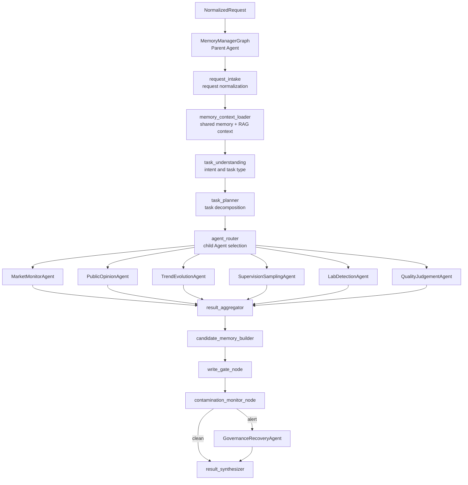
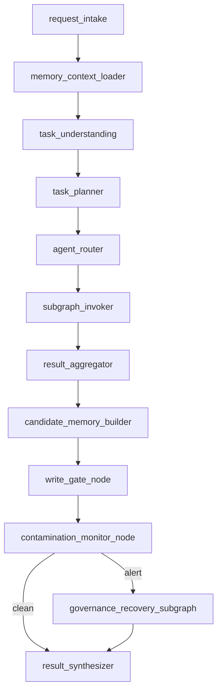
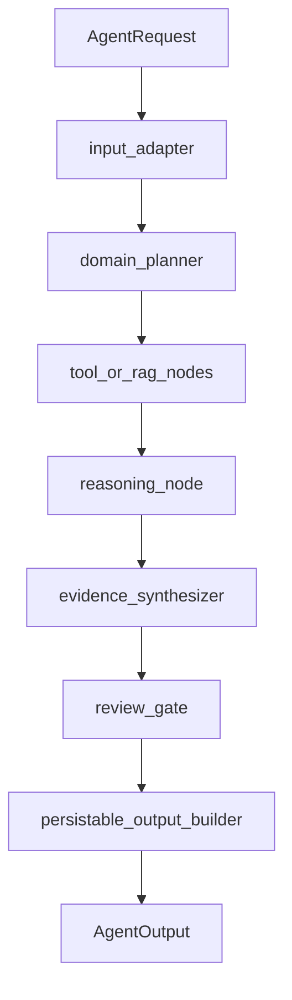
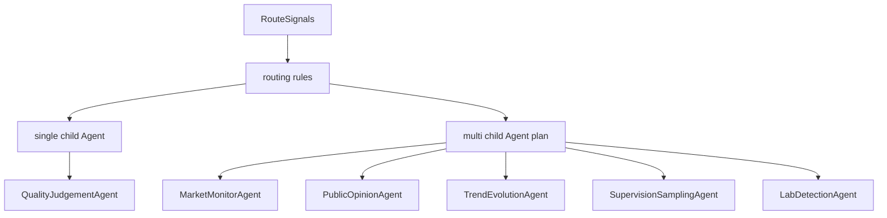
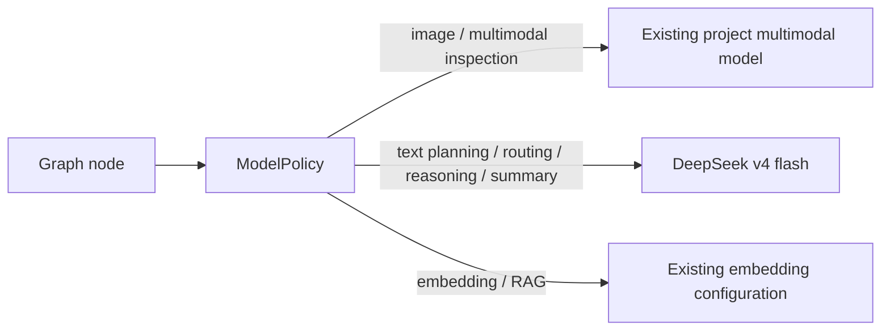
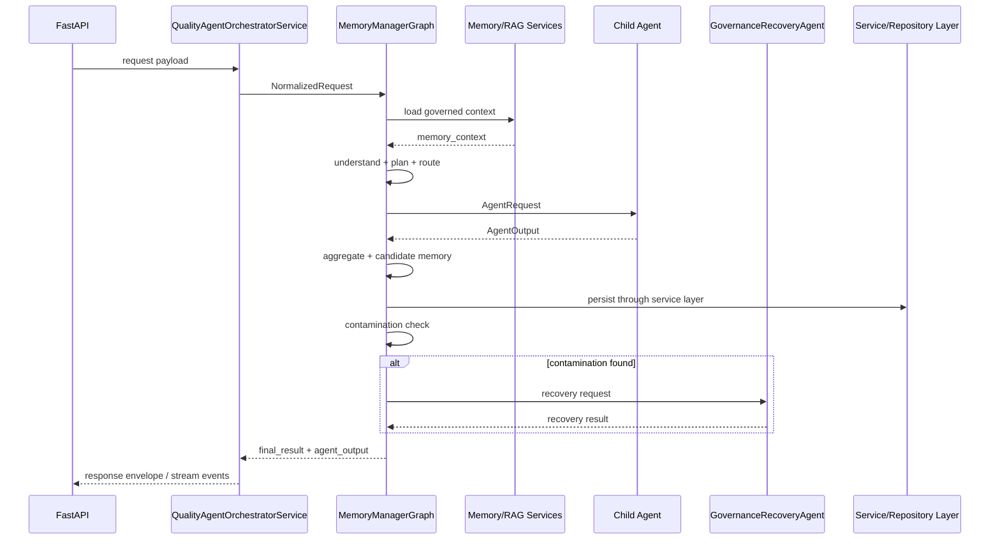

# Multi-Agent LangGraph Architecture Design

**Date**: 2026-05-11
**Status**: Draft for review
**Scope**: Architecture design and implementation scheme
**Source Docs**: `docs/agent_docx/PIAP_AGENT_FUNCTION_v1_0_0.docx`, `docs/agent_docx/PIAP_ROLE_v1_0_0.docx`, `docs/agent_docx/PIAP_FRONT_BACKEND_UNIFIED_DETAILED_DESIGN_v1_0_0.docx`

## 1. Goal

Build the project agent runtime around a real parent-graph and child-agent architecture:

- `MemoryManagerGraph` is the parent Agent and the single orchestration entry.
- Each professional subgraph is an Agent with its own internal nodes.
- The parent Agent understands the request, loads shared memory, plans the work, decomposes tasks, dispatches to child Agents, aggregates outputs, gates memory writes, detects contamination, and triggers governance recovery.
- Multimodal inspection tasks keep using the existing project multimodal model configuration.
- Text, planning, routing, reasoning, analysis, and summarization tasks use DeepSeek v4 flash through environment-based configuration.
- API keys are never hardcoded in code, docs, tests, fixtures, or seed data.

This design turns the DOCX architecture baseline into an implementable runtime structure while preserving the existing FastAPI, Service/Repository, LangGraph, RAG, tool, and quality-agent code boundaries.

## 2. Current State And Gaps

The repository already contains parts of the desired architecture, but they are not fully connected.

Current relevant pieces:

- `backend/agent/graphs/memory_manager/graph.py` defines a `StateGraph` for `MemoryManagerGraph`, including request intake, memory loading, professional-agent placeholders, memory write gating, contamination monitoring, and governance recovery nodes.
- `backend/agent/subgraphs/quality_chat/graph.py` defines a real `StateGraph` for chat-based quality inspection.
- `backend/agent/subgraphs/quality_judgement/graph.py` wraps chat and file/text quality paths, but it is a Python routing wrapper rather than a LangGraph subgraph.
- `backend/agent/graph/inspection_graph.py` is an older sequential pipeline, not a LangGraph graph.
- `backend/app/services/quality_agent_orchestrator_service.py` expects `MemoryManagerGraph().run(request)`, but the current `MemoryManagerGraph` class only exposes `compile()` and `builder`.
- Professional Agents such as market monitoring, public opinion, trend evolution, supervision sampling, and lab detection are registered conceptually but remain placeholder nodes.

Required closure:

- Add a real `MemoryManagerGraph.run()` orchestration contract.
- Replace placeholder professional-agent nodes with child-subgraph invocation nodes.
- Normalize all child Agents behind one request/output contract.
- Make `QualityJudgementAgent` the first fully connected child Agent.
- Absorb or retire the old `InspectionGraph` path through `LabDetectionAgent` or `QualityJudgementAgent`.
- Align runtime topology, Agent Ops topology, tests, and documentation.

## 3. Target Runtime Architecture



The parent graph owns cross-Agent coordination. Child Agents never call each other directly. They only receive parent-issued `AgentRequest` objects and return structured `AgentOutput` objects.

## 4. Agent Inventory

| Agent | Graph role | Runtime status | Main responsibility | Model class |
|---|---|---:|---|---|
| `MemoryManagerGraph` | Parent Agent | Required | Understand, plan, decompose, route, aggregate, memory gate, contamination trigger | Text model |
| `MarketMonitorAgent` | Child Agent | Phase 3 skeleton | Market price, sales, channel, after-sales anomaly detection | Text model |
| `PublicOpinionAgent` | Child Agent | Phase 3 skeleton | News, complaint, social, forum opinion clustering and risk extraction | Text model |
| `TrendEvolutionAgent` | Child Agent | Phase 3 skeleton | Cross-source risk fusion, trend prediction, scenario evolution | Text model |
| `SupervisionSamplingAgent` | Child Agent | Phase 3 skeleton | Sampling plan, sample list, field records, sampling result upload | Text model |
| `LabDetectionAgent` | Child Agent | Phase 3 skeleton, Phase 4 logic | Sample detection, metric parsing, standard comparison, lab conclusion | Multimodal + text |
| `QualityJudgementAgent` | Child Agent | Phase 2 first real integration | Evidence fusion, quality verdict, attribution, risk warning, disposal advice | Multimodal + text |
| `GovernanceRecoveryAgent` | Governance child graph | Phase 4 | Provenance, propagation graph, rollback plan, recovery, replay evaluation | Text model |

## 5. Parent Graph Responsibilities

`MemoryManagerGraph` owns the following nodes and decisions:



Node requirements:

- `request_intake`: convert API/service payloads into `NormalizedRequest`, attach trace IDs, workspace, role, capabilities, attachments, selected RAG space, and model preferences.
- `memory_context_loader`: retrieve governed shared memory and RAG context. It must mark memory confidence, source, scope, and warning status.
- `task_understanding`: classify intent, business domain, evidence type, input modality, missing information, and likely child Agents.
- `task_planner`: produce an ordered or parallel execution plan. It may split one user request into multiple child-agent tasks.
- `agent_router`: map plan steps to child Agents and fallback Agents.
- `subgraph_invoker`: call child Agents through a uniform interface.
- `result_aggregator`: merge child outputs, resolve conflicts, preserve citations, and expose uncertainty.
- `candidate_memory_builder`: extract reusable candidates from child outputs.
- `write_gate_node`: validate candidate memory source, scope, permission, confidence, and contamination risk before persistence.
- `contamination_monitor_node`: inspect memory events, dependency edges, low-trust outputs, and conflicts.
- `governance_recovery_subgraph`: run recovery only when contamination or conflict signals require it.
- `result_synthesizer`: return the final response envelope and persistable output summary.

## 6. Child Agent Shape

Each child Agent is a subgraph with multiple internal nodes. The exact internal nodes can vary by domain, but all child Agents follow the same outer contract.



Required child-agent rules:

- A child Agent does not directly write ORM rows, Qdrant vectors, or memory tables.
- A child Agent returns `PersistableOutput` and `MemoryCandidate` data for the parent or service layer to persist.
- A child Agent must expose evidence, citations, confidence, warnings, and model metadata.
- A child Agent may run tools, RAG, file parsers, vision detection, or external APIs, but tool results must be represented in the output trace.
- A child Agent must be independently testable with fake model clients and fake tools.

## 7. Unified Contracts

The architecture should converge existing contracts rather than create parallel shapes.

### 7.1 AgentRequest

`AgentRequest` is the child-Agent input derived from `NormalizedRequest`.

Fields:

- `request_id`
- `workflow_run_id`
- `parent_trace_id`
- `org_id`
- `user_id`
- `workspace`
- `plan_tier`
- `capabilities`
- `request_kind`
- `query`
- `attachments`
- `image_urls`
- `product_id`
- `spec_code`
- `selected_rag_space`
- `memory_context`
- `route_hints`
- `task_context`
- `model_policy`

### 7.2 AgentOutput

`AgentOutput` remains the common output shape and should be extended only where needed.

Required fields:

- `message_type`
- `answer`
- `summary`
- `action_state`
- `quality`
- `citations`
- `result_card`
- `route_decision`
- `persistable_output`
- `memory_candidates`
- `warnings`
- `raw_state`
- `model_usage`
- `trace`

### 7.3 MemoryCandidate

Child Agents can suggest memory, but only the parent graph can gate it.

Required fields:

- `memory_id`
- `memory_type`
- `source_agent`
- `source_trace_id`
- `source_evidence`
- `scope`
- `content`
- `confidence`
- `trust_policy`
- `dependency_refs`
- `permission_scope`
- `status = candidate`

## 8. Routing Semantics

The parent graph should support both single-Agent and multi-Agent execution.



Initial routing baseline:

| Signal | Preferred Agent |
|---|---|
| Chat quality question | `QualityJudgementAgent` through `QualityChatGraph` path |
| Product images or visual defects | `QualityJudgementAgent`, with multimodal tool/model usage |
| Structured TXT/DOCX/XLSX/CSV/JSON quality record | `QualityJudgementAgent` structured inspection path |
| Lab metric table or inspection report | `LabDetectionAgent`, then `QualityJudgementAgent` |
| Market price/sales/channel anomaly | `MarketMonitorAgent`, optionally `TrendEvolutionAgent` |
| News, complaints, social media, forum content | `PublicOpinionAgent`, optionally `TrendEvolutionAgent` |
| Risk trend or scenario prediction request | `TrendEvolutionAgent` |
| Sampling plan request | `SupervisionSamplingAgent` |
| Contamination, conflict, rollback, low-trust memory | `GovernanceRecoveryAgent` |

Fallback rule:

- If no specialized Agent is ready, route to `QualityJudgementAgent` with a structured warning that the specialized Agent is not yet active.
- If `MemoryManagerGraph` fails before child dispatch, the service layer may call `QualityJudgementAgent` directly as a temporary safety fallback during migration.

## 9. Model Policy

Model selection is a graph-level policy, not a hardcoded node detail.



Required configuration:

- `DEEPSEEK_API_KEY`
- `DEEPSEEK_BASE_URL`
- `DEEPSEEK_MODEL_ID`
- Existing multimodal provider settings remain unchanged.
- Existing embedding/RAG provider settings remain unchanged.

Security requirements:

- Do not hardcode API keys.
- Do not commit `.env` values.
- Do not include live API keys in tests, seed data, docs, frontend bundles, or logs.
- If a key was pasted into chat or committed anywhere, rotate it before production use.
- Logs may include provider name, model ID, token usage, and trace ID, but not secrets.

Model defaults:

| Node type | Default provider |
|---|---|
| Parent planning/routing/aggregation | DeepSeek v4 flash |
| Child text reasoning | DeepSeek v4 flash |
| Quality judgement text reasoning | DeepSeek v4 flash |
| Vision defect detection | Existing multimodal model |
| File parsing | Local parser first, DeepSeek only for semantic extraction |
| RAG embedding | Existing embedding model |
| Governance recovery reasoning | DeepSeek v4 flash |

## 10. Directory And Module Plan

Target backend layout:

```text
backend/agent/
  contracts/
    quality_contracts.py
    memory_contracts.py
    agent_runtime_contracts.py
  graphs/
    memory_manager/
      graph.py
      state.py
      nodes.py
      reducers.py
      policy.py
  subgraphs/
    market_monitor/
      graph.py
      state.py
    public_opinion/
      graph.py
      state.py
    trend_evolution/
      graph.py
      state.py
    supervision_sampling/
      graph.py
      state.py
    lab_detection/
      graph.py
      state.py
    quality_judgement/
      graph.py
      state.py
      product_adapters.py
    governance_recovery/
      graph.py
      state.py
  llm/
    gateway.py
    model_selector.py
    client.py
```

Existing code should be reused where possible:

- Keep `QualityChatGraph` behavior and migrate it under or behind `QualityJudgementAgent`.
- Keep quality product adapters for screw, food, and electronics.
- Reuse existing tools in `backend/agent/tools/`.
- Reuse `MemoryService`, `MemoryGovernanceService`, and vector retrieval services.
- Reuse existing Service/Repository persistence boundaries.

## 11. Data Flow



## 12. Implementation Scheme

### Phase 0: Contracts And Configuration

Deliverables:

- Add or refine `AgentRequest`, `AgentOutput`, `MemoryCandidate`, `ModelPolicy`, and child-agent registry contracts.
- Add DeepSeek configuration fields to settings.
- Ensure model selection can distinguish text, multimodal, embedding, and tool-only nodes.
- Add tests for config loading without live secrets.

Exit criteria:

- Contracts import cleanly.
- No live API key appears in the repository.
- Model policy unit tests pass.

### Phase 1: Parent Graph Runtime

Deliverables:

- Implement `MemoryManagerGraph.run(request)`.
- Convert `NormalizedRequest` into `MemoryAgentState`.
- Add real task understanding, planning, routing, child invocation, aggregation, and final response shape.
- Keep existing memory governance nodes but wire them after real child outputs.

Exit criteria:

- `QualityAgentOrchestratorService.run_chat()` can call `MemoryManagerGraph.run()`.
- Parent graph can run with a fake child Agent.
- Contamination branch can still route to governance recovery.

### Phase 2: QualityJudgementAgent First Integration

Deliverables:

- Make `QualityJudgementAgent` the first real child Agent invoked by the parent.
- Preserve existing `QualityChatGraph` behavior.
- Preserve structured file/text inspection behavior.
- Route image/multimodal paths to existing multimodal configuration.
- Route text reasoning through DeepSeek model policy.

Exit criteria:

- Existing chat flow tests pass.
- Existing quality judgement tests pass or are updated to the new parent-child route.
- Parent graph can return a quality answer through the child Agent.

### Phase 3: Professional Agent Skeletons

Deliverables:

- Add runnable skeleton subgraphs for market monitoring, public opinion, trend evolution, supervision sampling, and lab detection.
- Each skeleton accepts `AgentRequest`, emits `AgentOutput`, and includes at least input adapter, planner, reasoning placeholder, evidence synthesizer, review gate, and output builder.
- Register each Agent in topology and Agent Ops.

Exit criteria:

- Each skeleton has unit tests.
- Parent graph can dispatch to each skeleton with deterministic fake outputs.
- Agent Ops topology reflects runtime topology.

### Phase 4: Memory Governance And Recovery Closure

Deliverables:

- Convert child outputs into `MemoryCandidate` records.
- Gate memory writes through source, scope, confidence, permission, trust, and dependency checks.
- Use dependency edges for contamination propagation.
- Promote governance recovery to a child graph shape while preserving existing provenance, propagation, rollback, recovery, and replay nodes.

Exit criteria:

- Candidate memory cannot be read as trusted memory before gate approval.
- Contamination test triggers governance branch.
- Rollback/recovery events are traceable.

### Phase 5: Legacy Pipeline Absorption

Deliverables:

- Decide whether `InspectionGraph` logic belongs under `LabDetectionAgent` or `QualityJudgementAgent`.
- Migrate reusable planner, vision, knowledge, reasoning, and finalizer logic into child-agent nodes or tools.
- Remove or deprecate direct production entrypoints to `InspectionGraph`.

Exit criteria:

- No production service depends on the old sequential graph as a parallel orchestration path.
- Tests cover the migrated lab/quality path.

### Phase 6: End-To-End Verification

Deliverables:

- Unit tests for each graph node group.
- Integration tests for parent-to-child dispatch.
- Contract tests for Agent outputs and memory candidates.
- Topology tests for registered nodes and edges.
- Model policy tests with fake clients.
- Security check for secret leakage.

Exit criteria:

- Backend test suite passes.
- No hardcoded key appears in `rg` scans.
- Agent Ops topology and runtime graph stay consistent.

## 13. Testing Strategy

Required test groups:

- Parent graph:
  - request normalization
  - memory context loading
  - task understanding
  - routing decision
  - child invocation
  - aggregation
  - governance branch
- Child Agents:
  - valid request to valid output
  - missing input behavior
  - tool/RAG failure fallback
  - review gate thresholds
- Model policy:
  - text node selects DeepSeek provider
  - multimodal node selects existing provider
  - secret values never appear in logs
- Memory governance:
  - candidate memory remains candidate until gate approval
  - rejected memory is isolated
  - contamination creates provenance and rollback events
- Backward compatibility:
  - chat flow still streams response events
  - quality judgement still supports current structured records
  - existing task/result persistence still uses Service/Repository layer

## 14. Operational Requirements

Agent Ops must show the real parent-child topology:

- Parent graph: `MemoryManagerGraph`.
- Active child Agent: `QualityJudgementAgent`.
- Planned child Agents: market, opinion, trend, sampling, lab.
- Governance child graph: `GovernanceRecoveryAgent`.

Runtime metrics should be recorded per Agent:

- request count
- success/failure count
- latency
- selected model provider and model ID
- token usage
- fallback count
- memory candidate count
- contamination alert count

Traceability requirements:

- Every request has `request_id` and `workflow_run_id`.
- Every child Agent receives `parent_trace_id`.
- Every memory candidate records `source_agent` and `source_trace_id`.
- Every final output includes route, model, evidence, and memory governance metadata.

## 15. Acceptance Criteria

The design is complete when:

- `MemoryManagerGraph` is the only intended orchestration entry for quality-agent runtime.
- Each child Agent is represented as a subgraph with a uniform contract.
- `QualityJudgementAgent` is connected as the first real child Agent.
- Other professional Agents have runnable skeletons and topology entries.
- Model policy routes text tasks to DeepSeek v4 flash and multimodal tasks to the existing project multimodal provider.
- No API key is hardcoded.
- Shared memory writes are gated by the parent graph.
- Contamination triggers governance recovery.
- Agent Ops topology reflects the runtime graph.
- Tests cover routing, model selection, child-agent contracts, memory gating, and governance recovery.

## 16. Out Of Scope For First Implementation Cycle

- Full business logic for market, opinion, trend, sampling, and lab Agents.
- Frontend workspace redesign beyond topology and runtime display alignment.
- New model training workflows.
- Production deployment automation.
- Replacing existing RAG, storage, database, or billing subsystems.

## 17. Implementation Decisions

These decisions are fixed for the first implementation cycle:

- `QualityChatGraph` remains a nested graph behind `QualityJudgementAgent` during the first cycle. This preserves current chat behavior and limits migration risk.
- The old `InspectionGraph` is absorbed in two steps: vision/tool-oriented pieces move behind `QualityJudgementAgent` first, while lab metric and report interpretation move into `LabDetectionAgent` when that child Agent becomes real.
- Child Agents run sequentially by default. The parent plan schema may describe parallelizable steps, but actual parallel dispatch is enabled only after the first parent-child integration is stable.
- Agent Ops shows planned Agents as registered but unavailable/inactive until their runnable skeletons exist. They should not be startable before they have contract tests.
