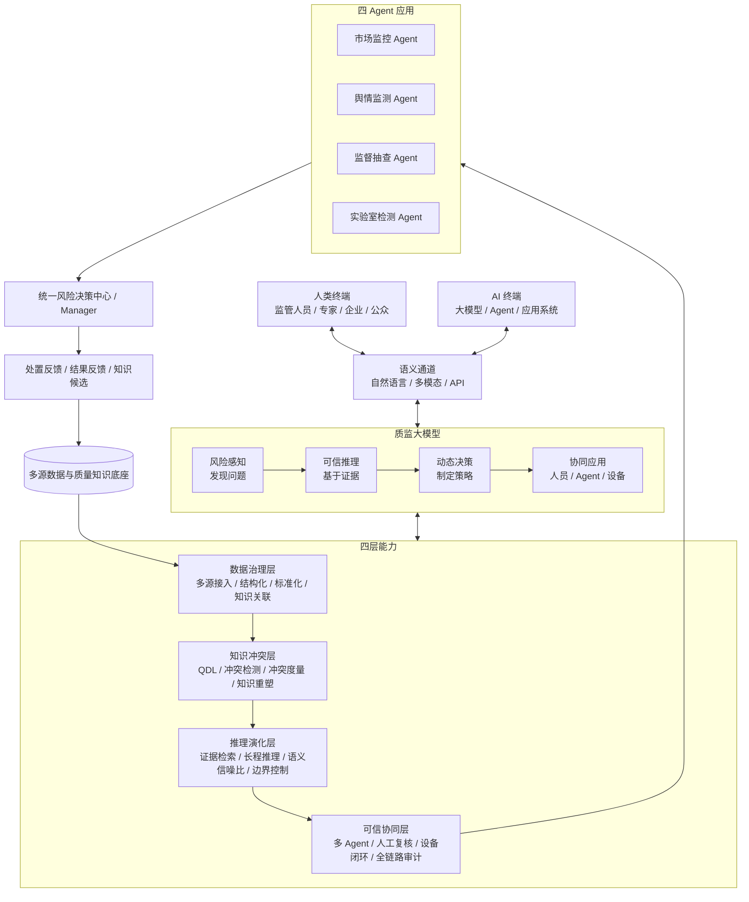
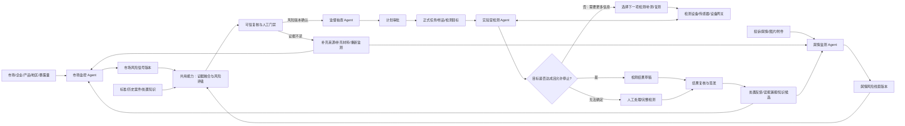
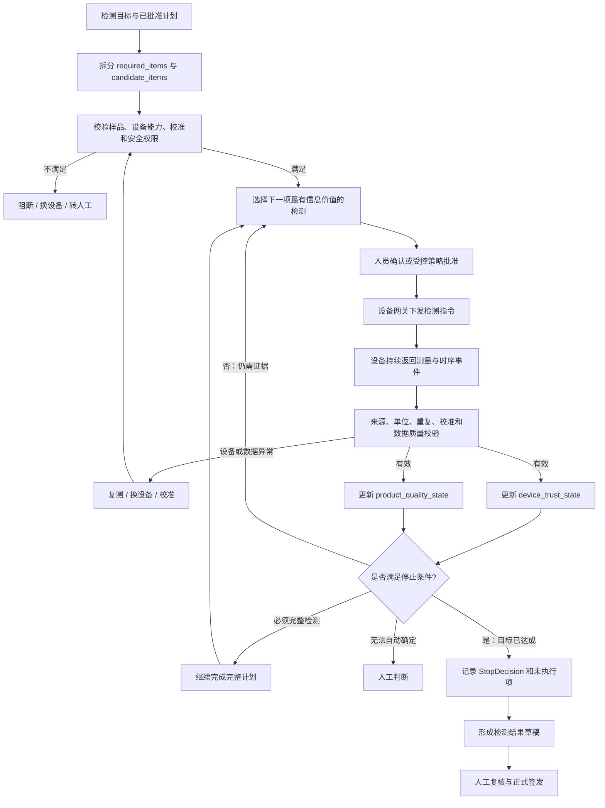

# 质监系统四 Agent 闭环架构与实施计划 v3

> 版本：v3.0  
> 日期：2026-09-22  
> 状态：当前统一设计口径；先冻结方案，再实施代码  
> 具体开发任务：[《质监系统完整项目具体实施计划 v3.1》](质监系统完整项目具体实施计划_v3.1.md)  
> 依据：项目申报书、用户提供的四类 Agent 图和业务流程图  
> 首个试点：电动自行车，后续扩展到其他工业产品  
> 本轮范围：只完成架构与实施计划修订，不据此修改或宣称已修改前端、后端、路由、数据库和测试代码

## 0. 本版纠正的核心问题

本版不再根据流程阶段自行创造 Agent 名称。四个业务 Agent 必须沿用项目图中的原名：

1. **市场监控 Agent**
2. **舆情监测 Agent**
3. **监督抽查 Agent**
4. **实验室检测 Agent**

以下名称不再作为业务 Agent：

- 风险研判 Agent
- 质监态势 Agent
- 风险趋势 Agent
- 抽查策略 Agent
- 检测过程协同 Agent

这些名称是此前根据业务步骤作出的工程解释，不是项目图中确认的四类 Agent。后续可以把“风险研判、态势分析、标准匹配、证据复核”等作为能力、工作流步骤或业务结果，但不得额外计为 Agent，也不得替换四个原名。

第三张图中的“实体识别、风险知识检索、冲突检测、标准匹配、证据可靠性评估、风险评级、抽检策略、实验室检测建议、监管处置建议”等方框表示**处理步骤或共用能力**，不表示每个方框都是一个 Agent。图中只有明确标注为 Agent 的节点才按 Agent 计数。

## 1. 申报书依据与工程解释边界

本计划的架构依据按以下优先级冻结：

1. 申报书确定研究目标、考核指标和技术边界。
2. `改1.png`、`改2.png`、`微信图片_20260729113637_169_46.png`、`微信图片_20260729113643_170_46.png` 作为最新架构解释，覆盖旧实施文档中的冲突设计。
3. 现有代码只用于调查实现差距，不能反向定义 Agent 名称、概念或职责。

四张架构图共同表达了以下约束：质监大模型以质量知识底座为基础，通过冲突感知、可信推理、动态决策和协同应用形成闭环；知识演化包含“人—模型—人”和“模型—设备”两种模式；四个业务 Agent 统一接入风险决策中心，但流程方框和底层能力不因此成为新的 Agent。

| 最新架构图 | 本计划采用的约束 |
|---|---|
| `改1.png` | “质量知识底座—冲突感知—可信推理—动态决策—多智能体应用”总体框架；数据治理、知识冲突、推理演化、可信协同四层能力 |
| `改2.png` | 四 Agent 原名、统一风险决策中心、QDL 语义空间、证据约束推理和典型投诉到监管决策流程 |
| `微信图片_20260729113637_169_46.png` | 知识空间—冲突引擎—QDL—知识隧道—可信知识服务及反馈闭环 |
| `微信图片_20260729113643_170_46.png` | 人—模型—人会议模式、模型—设备闭环、长程推理、语义信噪比和知识能力边界 |

### 1.1 申报书明确写明的内容

申报书及项目图共同给出以下事实：

- 项目图明确列出四类 Agent：市场监控、舆情监测、监督抽查、实验室检测。
- 申报书第 30、34 页描述五类应用任务：风险分级分类、态势动态推演、监督抽查策略优化、监督抽查过程优化、国内外质量竞争力对标。
- 申报书第 35 页考核表写明“智能体 4 个”。因此，五类应用任务不能被简单解释为五个 Agent。
- 申报书第 9、21–22 页描述“人—模型—设备”协同、设备响应数据、设备状态和正常/异常响应模式。
- 申报书第 25–26 页明确提出“人—模型—设备协同的检测周期压缩机制”：接入电流谐波、振动相位、温度变化、响应曲线、检测时序等设备过程数据，实时判断健康轨迹、提前触发风险提示、转向质量敏感节点的靶向校核，减少无效等待和重复查验。
- 申报书同时强调物理核实是逻辑闭环的最终验证，过程预判不能无条件替代正式检测和签发。

### 1.2 申报书没有直接写明的内容

申报书没有逐项定义四个 Agent 的完整 API、状态机、数据库表和页面边界，也没有写明“风险研判 Agent”这一第五个 Agent。以下内容属于工程设计，必须明确标注为实现方案，而不能说成申报书原文：

- 四个 Agent 的输入输出 JSON 契约。
- Manager 的调度方式和状态机。
- 设备网关、事件协议和安全控制。
- 动态检测的停止规则、证据充分度阈值和人工门禁。
- 页面菜单、任务与结果的信息架构。

### 1.3 “实验室检测 Agent”的准确定位

“实验室检测 Agent”名称来自四类 Agent 图；其具体职责可由申报书的设备协同和检测周期压缩机制解释：

- 它不是实验室组织、LIMS 或设备台账的同义词。
- 它不包含平台全部任务管理和全部检测结果。
- 它负责进入实际检测过程后的样品、检测项目、设备能力、设备状态、实时测量、证据充分度、下一项检测建议、复测/补测和停止建议。
- 它与检测设备直接相关，是“人—模型—设备”闭环在业务系统中的主要承载者。
- 它生成的是过程评估、下一步检测建议和结果草稿；正式结果仍需满足标准、必检项和人工签发要求。

## 2. 总体架构：基础模型—四层能力—协同机制—四 Agent 应用

### 2.1 质监大模型的四项核心能力

| 核心能力 | 回答的问题 | 主要产出 |
|---|---|---|
| 风险感知 | 发生了什么、哪里可能有问题 | 风险信号、对象和待验证假设 |
| 可信推理 | 当前证据能支持什么结论 | 证据链、冲突、局限和可信判断 |
| 动态决策 | 下一步最应该做什么 | 抽查、补证、检测、停止或转人工策略 |
| 协同应用 | 如何让 Agent、人员和设备共同执行 | 任务、设备交互、复核、签发和反馈闭环 |

运行时共同维护四类空间：目标空间 `G` 保存风险与业务目标，知识空间 `K` 保存知识和规则，上下文空间 `C` 保存场景、实体和程序状态，置信空间 `Q` 保存可信度、证据和边界。四类空间属于质监大模型运行状态，不是 Agent。

### 2.2 四层能力

1. **数据治理层**：多源数据接入、清洗、结构化、标准化、知识关联和来源登记，解决“模型看不懂数据”。
2. **知识冲突层**：QDL 表达、版本冲突、语义冲突、适用范围冲突、置信空间和可信度量，解决“模型不知道哪个可信”。
3. **推理演化层**：证据检索、证据融合、长程推理、语义信噪比、知识边界、能力边界和知识更新，解决“模型不会基于证据稳定推理”。
4. **可信协同层**：四 Agent 调度、人机复核、设备闭环、过程审计和结果签发，解决“模型知道但无法形成可执行决策”。

QDL、知识冲突引擎、证据引擎、可信引擎和共享记忆属于基础能力，不单独计为业务 Agent。

### 2.3 两类协同闭环

- **人—模型—人闭环**：多专家会商、观点分歧、证据互证、共享记忆和一致意见形成。适用于开放问题、复杂处置和人工门禁。
- **模型—设备闭环**：设备采集、模型分析、主动探测、动态规划下一次检测、补充证据和继续检测。适用于未知信息的主动获取和检测周期压缩。

Manager/风险决策中心负责统一调度、版本冻结、预算和恢复，但不计入四个业务 Agent。

### 2.4 总体分层架构



### 2.5 四个业务 Agent

| Agent 原名 | 核心职责 | 不负责的事项 |
|---|---|---|
| 市场监控 Agent | 持续分析市场、企业、产品、地区、抽查覆盖、销量/在用量等数据，发现聚集、变化和优先关注对象 | 不直接批准抽查计划；不把案件数量当失效率；不代替舆情事实核验 |
| 舆情监测 Agent | 解析投诉、舆情、图片和附件，识别产品/企业/批次/事件，区分事实、情绪和推测，形成可追溯风险线索 | 不直接判定产品不合格；不根据热度输出失效概率 |
| 监督抽查 Agent | 消费已复核的市场信号和舆情线索，在预算、覆盖、人员和设备约束下生成抽查方案 | 不等于市场监控 Agent；不绕过审批创建正式任务；不宣称未经证明的全局最优 |
| 实验室检测 Agent | 在检测执行阶段与人员和设备交互，按目标动态选择下一项检测，校验设备/测量有效性，累积证据并提出继续、补测、停止或转人工建议 | 不包含所有任务和结果；不绕过法定必检项；不把早期预判直接写成正式结果 |

### 2.6 共用能力，不计入四个 Agent

以下能力由 Manager 调用，可被一个或多个 Agent 复用：

- `entity.resolve`：产品、企业、型号、批次、地区和时间对齐。
- `evidence.normalize`：来源、哈希、时间、性质和可见范围归一。
- `risk.knowledge.retrieve`：历史案件、标准、处置和知识检索。
- `standard.applicability`：标准版本、生效时间、地域、产品和生产日期仲裁。
- `conflict.detect`：事实、标准、模型结论和设备响应冲突检测。
- `evidence.reliability.evaluate`：来源独立性、可定位性、完整性和支持关系评估。
- `risk.grade`：基于已确认事实形成风险等级草稿。
- `trust.review`：规则门禁、独立复核和人工复核。
- `sampling.optimize`：抽样候选、成本、覆盖和硬约束计算。
- `device.observe`：设备状态和测量事件接入。
- `inspection.next_best_test`：根据当前证据选择下一项最有信息价值的检测。
- `inspection.stop.evaluate`：判断是否达到允许停止的条件。
- `memory.publish_candidate`：签发结果生成知识候选，不自动晋升。

### 2.7 流程节点不是 Agent

第三张图应解释为：

```text
输入线索
  → Agent 受理
  → 实体识别
  → 知识检索
  → 冲突检测
  → 标准匹配
  → 证据可靠性评估
  → 风险评级
  → 抽检策略
  → 检测建议
  → 处置建议
```

其中“实体识别”到“处置建议”是能力链。Agent 是承担业务目标、维护状态并决定调用哪些能力的主体；能力本身不因为出现在图中就自动成为 Agent。

## 3. 四 Agent 协作架构

市场监控和舆情监测不是固定先后关系。它们可以并行运行、互相提供线索，并在统一风险案件中汇合。监督抽查只消费经过复核的版本；实验室检测只消费已批准计划、实际样品和有效设备数据。



### 3.1 Manager 的位置

统一 Manager 是调度器，不是第五个业务 Agent。它负责：

1. 根据对象状态选择四个 Agent 中的一个或多个。
2. 固定输入版本、标准快照和知识快照。
3. 并行运行市场监控与舆情监测，并安全汇合结果。
4. 在证据不足时只补充缺失分支，不重跑整条链。
5. 管理设备交互轮次、预算、超时、暂停、恢复和人工等待。
6. 检查业务状态，而不是把“函数执行成功”当作“业务结论成立”。

## 4. 四个 Agent 的正式定义

### 4.1 市场监控 Agent

**目标**：回答“市场上哪些产品、企业、地区和风险信号正在变化，哪些对象值得优先关注”。

**输入**：

- 企业、产品、型号、批次、地区和时间维度。
- 抽查历史、处置反馈和覆盖情况。
- 销量、在用量或其他暴露量；缺失时显式标记。
- 已确认案件和已标明状态的舆情线索。

**处理**：去重 → 固定时间窗 → 核对分母 → 计算数量/比率/覆盖 → 识别聚集与变化 → 输出局限。

**输出 `market_monitoring_report`**：市场风险信号、热点对象、变化方向、覆盖缺口、抽查提示、数据局限和所消费版本。

**边界**：

- 案件量增长不等于产品失效率。
- 无暴露量时不输出总体风险概率。
- 相关关系不自动成为因果结论。
- “质监态势”可以作为该 Agent 的页面视图或报告名称，但不能替换 Agent 原名。

### 4.2 舆情监测 Agent

**目标**：回答“投诉和舆情中发生了什么，哪些是事实线索，哪些只是情绪或推测”。

**输入**：投诉文本、公开舆情、图片、附件、购买/使用条件、企业/产品/批次资料和标准快照。

**处理**：来源登记 → 实体识别 → 同事件去重 → 事实/情绪/推测分离 → 标准与历史知识检索 → 冲突和缺证识别。

**输出 `public_opinion_monitoring_report`**：结构化事件、风险线索、证据 ID、冲突、缺失材料、建议补证和局限。

**边界**：

- 热度、负面情绪和转发量不是质量不合格证据。
- 单张外观图片不能证明不可观测的内部缺陷。
- 舆情线索可以触发调查，但不能直接生成正式处罚或不合格结论。

### 4.3 监督抽查 Agent

**目标**：将已复核的风险信号转成可批准、可解释、可执行的监督抽查计划。

**输入**：市场监控报告、舆情线索、风险评级版本、产品/企业/地区分布、预算、人员、设备能力、标准和覆盖要求。

**处理**：固定输入版本 → 生成高风险/代表性/探索性候选 → 校验硬约束 → 比较覆盖、成本和重复度 → 说明选中和未选原因。

**输出 `supervision_sampling_plan`**：抽查对象、样本数量、初始检测项目集合、必检项、候选项、地区、设备要求、成本、覆盖和批准状态。

**边界**：

- 监督抽查 Agent 与市场监控 Agent 是两个 Agent。
- 市场监控负责“发现哪里值得关注”，监督抽查负责“在约束下具体查谁、查什么、投入多少”。
- 未批准计划不得创建正式监管任务。
- 计划中的 20 项可以分为“必须完成的必检项”和“可由检测过程动态选择的候选项”，不能笼统地全部设为可跳过。

### 4.4 实验室检测 Agent

**目标**：在实际检测过程中，根据设备实时返回的数据动态补足证据，用尽可能少但足够的信息达到检测目标，并给出可审计的停止或继续建议。

**输入**：

- 已批准计划、检测目标和允许的停止策略。
- 实际样品、批次、设备能力、校准状态和检测方法。
- 必检项、候选检测项、标准阈值和正常响应基线。
- 设备持续返回的测量值、时序、质量标记和运行状态。
- 已有市场/舆情风险假设和待验证问题。

**每轮处理**：

1. 接收并校验设备事件，拒绝来源不明、单位不匹配、校准失效或重复冲突数据。
2. 更新当前证据状态：已确认、被否定、仍不确定、存在冲突。
3. 计算检测目标的证据充分度和剩余不确定性。
4. 在设备能力、成本、耗时和安全约束下选择“下一项最有信息价值的检测”。
5. 向人员/设备网关发出检测建议或受控请求。
6. 设备完成检测后实时返回新数据，进入下一轮。
7. 满足停止条件时输出停止建议；否则继续、复测、换设备或转人工。

**输出 `laboratory_detection_assessment`**：已执行项目、未执行项目及原因、设备事件、产品异常、设备异常、证据充分度、剩余不确定性、下一项建议、停止决定、结果草稿和完整审计轨迹。

## 5. 自适应检测与设备实时闭环

### 5.1 20 项计划、10 项足够的正确表达

假设初始计划包含 20 个检测项目：

- `required_items`：法规、标准、安全或业务明确要求必须完成的项目。
- `candidate_items`：用于区分风险假设、提高确信度或补充证据的可选项目。
- `completed_items`：已经由有效设备完成并通过质量校验的项目。
- `skipped_items`：经停止规则允许未执行的项目，必须记录原因。

如果前 10 项已经完成所有必检项，并且现有证据足以区分目标风险、冲突已经解决、设备状态可信、规则允许提前停止，则可以不执行剩余候选项。若剩余 10 项中包含法定必检项、关键安全项或用于解决未决冲突的项目，则不能提前停止。

因此，工程目标不是“固定把 20 项减成 10 项”，而是：

> 在不突破标准和安全边界的前提下，以最少的有效检测成本达到明确的证据目标；实际执行数量由数据和规则决定。

### 5.2 设备交互模型

设备不是 Agent。设备通过受控网关提供能力和数据。实验室检测 Agent 必须分别维护两个状态，禁止把两者合成一个无法解释的风险分：

- `device_trust_state`：设备身份、能力、在线状态、校准、漂移、数据质量和本轮测量是否可信。
- `product_quality_state`：产品风险假设、已支持/已排除结论、证据充分度、剩余不确定性和标准符合情况。

模型—设备多轮交互与动态停止状态如下：



第一版应支持“Agent 建议、人员确认、设备执行”；只有经过设备安全评估、权限设计和现场批准后，才允许特定低风险项目自动下发。

### 5.3 停止条件

允许提前停止必须同时满足：

```text
mandatory_items_complete
AND device_and_calibration_valid
AND evidence_sufficiency >= threshold
AND target_hypotheses_resolved
AND no_unresolved_critical_conflict
AND no_unresolved_safety_risk
AND policy_allows_early_stop
```

停止结果分为：

- `goal_reached`：目标证据已满足，可以结束动态检测。
- `full_plan_required`：必须继续完成完整计划。
- `retest_required`：数据质量、设备状态或冲突要求复测。
- `device_change_required`：当前设备能力不足或状态异常。
- `manual_review_required`：规则无法自动判断，需要人工决定。
- `blocked`：缺样品、缺标准、缺设备或权限不足。

“停止检测”只表示本次动态采集阶段结束，不等于结果已经正式签发。

所有未执行项目必须保存以下审计信息：

- `item_id` 和检测项目名称。
- `item_class`：`required` 或 `candidate`。
- 停止时已经取得的证据 ID 和证据充分度。
- 未执行原因和对应规则。
- `stop_rule_version`、停止时间和工作流运行 ID。
- 建议者、实际操作者和复核人；尚未复核时显式标记。

### 5.4 下一项检测选择

下一项检测不能由 LLM 随意生成。候选项必须来自已批准计划、适用标准或经授权的补测规则。选择函数至少考虑：

- 对当前未决风险假设的信息增益。
- 对证据冲突的消解能力。
- 与标准关键指标的关联。
- 设备是否具备能力且校准有效。
- 检测耗时、成本、样品损耗和安全风险。
- 历史数据中该项目对最终判断的贡献。

第一版可以使用确定性规则和专家配置；取得真实数据后再评估贝叶斯更新、主动感知、序贯试验设计或价值信息（VOI）方法。

## 6. 统一业务对象与交接协议

### 6.1 核心对象

| 对象 | 关键内容 |
|---|---|
| RiskCase | 市场信号、舆情线索、实体、时间、证据、风险评级版本和复核状态 |
| MarketMonitoringReport | 时间窗、统计口径、分母、热点、变化、覆盖缺口和局限 |
| PublicOpinionMonitoringReport | 投诉/舆情事实、情绪、推测、实体、证据、冲突和待补材料 |
| RiskAssessment | 共用能力生成的风险评级结果；它是业务对象，不是 Agent |
| SupervisionSamplingPlan | 必检项、候选项、对象、样本、成本、设备要求、批准记录 |
| InspectionGoal | 本次检测要确认或排除的问题、成功条件、安全门禁和预算 |
| InspectionSession | 样品、设备、当前轮次、已执行项、证据状态和停止策略 |
| DeviceObservation | 设备、事件、检测项、值、单位、时间、质量标记、校准版本 |
| EvidenceState | 设备可信状态、产品质量状态、证据支持/反驳关系、充分度、剩余不确定性和冲突 |
| NextTestDecision | 当前证据、候选项排序、选择理由、需要的人/设备动作 |
| StopDecision | 停止/继续决定、规则版本、证据充分度、未执行项及原因 |
| InspectionResult | 结果草稿、复核、签发、标准依据和原始设备事件链接 |

### 6.2 自适应检测目标接口

本阶段只冻结语义和最小字段，不实施代码：

| 接口 | 最小字段 |
|---|---|
| `InspectionGoal` | `goal_id`、`plan_id`、`sample_ids`、`risk_hypotheses`、`required_items`、`candidate_items`、`success_criteria`、`stop_policy_id`、`max_cost`、`max_duration` |
| `DeviceObservation` | `observation_id`、`session_id`、`device_id`、`item_id`、`measured_at`、`value`、`unit`、`method`、`quality_flag`、`calibration_version`、`source_hash` |
| `EvidenceState` | `session_id`、`round`、`device_trust_state`、`product_quality_state`、`supported_hypotheses`、`rejected_hypotheses`、`unresolved_conflicts`、`evidence_sufficiency`、`remaining_uncertainty` |
| `NextTestDecision` | `decision_id`、`session_id`、`evidence_state_version`、`selected_item_id`、`candidate_ranking`、`reason`、`expected_information_gain`、`required_device_capability`、`approval_status` |
| `StopDecision` | `decision_id`、`session_id`、`decision`、`mandatory_items_complete`、`evidence_sufficiency`、`remaining_uncertainty`、`unresolved_risks`、`skipped_items`、`stop_rule_version`、`operator_id`、`reviewer_id` |
| `InspectionResult` | `result_id`、`session_id`、`draft_version`、`verdict`、`findings`、`standard_refs`、`device_observation_ids`、`stop_decision_id`、`review_status`、`signed_version` |

上述对象必须携带组织、版本、来源运行和时间信息；设备事件与 Agent 交接物分开建模，设备不能伪装为 Agent。

### 6.3 Agent 统一信封

四个 Agent 统一使用 `BusinessAgentEnvelope`：

```json
{
  "workflow_run_id": "RUN-001",
  "source_agent": "market_monitoring",
  "business_object": {"kind": "risk_case", "id": "RC-001", "version": 3},
  "status": "awaiting_review",
  "evidence_ids": ["E-001"],
  "consumed_versions": {"standard:STD-001": 4},
  "knowledge_snapshot_id": "KS-001",
  "result": {},
  "missing_inputs": [],
  "conflicts": [],
  "next_actions": [],
  "model_versions": {},
  "rule_versions": {},
  "trace": {}
}
```

设备事件使用独立协议，不把设备伪装成 Agent。

## 7. 状态机

### 7.1 风险案件

```text
collected
  → monitoring
  → awaiting_evidence / awaiting_review
  → risk_assessed
  → sampling_candidate
  → closed / rejected / needs_reassessment
```

风险案件可以同时等待市场监控和舆情监测两个分支，只有所需分支达到版本门禁后才进入风险复核。

### 7.2 抽查计划

```text
draft
  → optimizing
  → infeasible / awaiting_approval
  → approved
  → task_created
  → cancelled / superseded
```

### 7.3 自适应检测会话

```text
planned
  → sampled
  → ready
  → requesting_measurement
  → awaiting_device
  → validating_observation
  → updating_evidence
  → selecting_next_test ─────────────┐
  → goal_reached                     │
  → awaiting_retest ─────────────────┘
  → manual_review_required
  → result_draft
  → awaiting_review
  → signed
```

每一次设备请求、设备回复、证据更新、下一项选择和停止决定都必须写入不可覆盖的事件记录。

## 8. 页面与信息架构

### 8.1 质量监督

质量监督分组沿用四个原名：

1. 质监工作台
2. 市场监控
3. 舆情监测
4. 监督抽查
5. 实验室检测

“质监工作台”是总览，不计为 Agent。“风险研判”显示为案件中的共用决策卡片，不进入 Agent 菜单。“质监态势”可以作为市场监控页中的报告页签，不作为 Agent 名称。

### 8.2 通用检测业务

平台通用“任务管理”和“检测结果”独立于实验室检测 Agent：

- 任务管理：管理图片、测量和混合任务。
- 检测结果：管理任务产生的持久化结果、复核、证据和签发状态。
- 实验室检测：只显示设备协同、动态检测轮次、下一项检测和停止决策。

### 8.3 页面不得误导

- 不把“实体识别、冲突检测、风险评级”等能力画成与四个 Agent 并列的 Agent。
- 不把早期预警显示为正式检测结果。
- 不把“完成 10/20 项”直接显示为“节省 50%”，除非满足相同任务和同口径对照。
- 不把被停止的 10 项简单隐藏，必须显示未执行原因和停止规则。

## 9. 分阶段实施计划

### P0：冻结名称与边界

**任务**：

- API、数据库、Agent 配置、菜单、文档统一使用四个原名。
- 建立“Agent / 共用能力 / 流程步骤 / 业务对象”清单。
- 将历史 `RiskAssessmentAgent`、`RiskTrendAgent` 等名称标为废弃兼容名，不再对外展示。
- 冻结实验室检测的目标、必检项、候选项和停止规则定义。

**退出条件**：任何页面和文档都不再出现第五个业务 Agent；图三流程节点不再计为 Agent。

### P1：市场监控与舆情监测并行闭环

**任务**：

- 市场监控 Agent 生成带时间窗、分母和局限的报告。
- 舆情监测 Agent 生成事实/情绪分离、可定位证据的线索报告。
- Manager 固定两个分支的输入版本并汇合到 RiskAssessment 业务对象。
- 缺证、冲突和复核失败保持独立业务状态。

**退出条件**：两个 Agent 可独立运行、并行汇合；风险评级是共享结果，不是新增 Agent。

### P2：监督抽查计划

**任务**：

- 消费已复核市场报告、舆情报告和风险评级版本。
- 生成必检项、候选项、设备要求和动态检测策略。
- 硬约束失败返回明确原因。
- 批准后幂等创建任务、样品、检测目标和会话。

**退出条件**：市场监控不直接代替抽查计划；未批准计划不能执行检测。

### P3：设备网关与自适应检测

**任务**：

- 建立设备能力、校准、状态和事件协议。
- 实现“接收数据 → 更新证据 → 选择下一项 → 设备回复”的持久循环。
- 实现必检门禁、证据充分度、冲突、安全和停止规则。
- 支持继续、复测、换设备、人工处理和目标达成。
- 服务重启后从最后确认事件恢复，不重复下发或写入。

**退出条件**：在规则允许的试点任务中，系统可从初始候选集合动态缩减实际执行项；每个未执行项均有可审计理由。

### P4：结果签发与反馈

**任务**：

- 检测草稿与正式结果分离。
- 专家复核、签发和处置形成版本化记录。
- 结果回流市场监控、舆情监测和知识候选。
- 评估误报、漏报、实际执行项数量、检测周期和设备利用率。

**退出条件**：停止动态采集不会自动签发结果；结果能回链到计划、设备事件、标准和停止决定。

### P5：真实试点与研究评估

**任务**：

- 用真实设备、真实样品、真实标准和专家结果建立基线。
- 比较固定全量检测、规则式提前停止、自适应检测三种方案。
- 统计准确性、漏检、误报、周期、成本、样品损耗和安全事件。
- 按申报口径评估查验种类和监管响应时间。

**退出条件**：只有真实同口径对照通过后，才能声称实现检测周期压缩或效率提升。

## 10. 工程工作包

| 工作包 | 重点内容 |
|---|---|
| WP-01 名称与协议治理 | 四 Agent 原名、废弃别名、统一信封、版本与业务状态 |
| WP-02 市场监控 | 时间窗、分母、市场信号、覆盖和局限 |
| WP-03 舆情监测 | 来源、实体、事实/情绪、证据、冲突和补证 |
| WP-04 风险融合与复核 | 共用 RiskAssessment 对象、证据门禁和人工复核 |
| WP-05 监督抽查 | 约束计划、必检项、候选项、设备要求和批准 |
| WP-06 设备网关 | 设备身份、能力、校准、命令授权、事件去重和状态 |
| WP-07 自适应检测 | 证据状态、下一项选择、实时循环、停止规则和恢复 |
| WP-08 结果与反馈 | 草稿、复核、签发、处置、反馈和知识候选 |
| WP-09 前端 | 四 Agent 原名、流程/能力区分、设备时间线、停止理由 |
| WP-10 评测 | 固定全量与自适应策略对照、负向门禁和真实设备试点 |

## 11. 验收矩阵

| 验收项 | 必须证明的事实 |
|---|---|
| 四 Agent 命名 | 对外只出现市场监控、舆情监测、监督抽查、实验室检测四个业务 Agent |
| 流程与 Agent 区分 | 实体识别、标准匹配、冲突检测、风险评级等显示为能力或步骤 |
| 市场与舆情边界 | 两者可独立运行，分别输出市场报告和舆情线索，再由共享能力融合 |
| 抽查边界 | 市场监控不直接创建计划；监督抽查在批准后才创建任务 |
| 设备实时反馈 | 设备事件持续进入同一会话，Agent 每轮基于新证据选择下一项 |
| 动态缩减 | 20 项候选只执行 10 项时，必检项已完成且剩余项均有停止理由 |
| 安全门禁 | 必检未完成、设备失校、关键冲突或安全风险存在时禁止提前停止 |
| 结果真实性 | 过程预判、结果草稿和正式签发结果明确区分 |
| 恢复与幂等 | 超时、重启、重复事件和重复命令不会重复写入或错误跳步 |
| 真实效果 | 周期压缩基于真实设备和同口径对照，不用模拟数据替代 |

### 11.1 “初始计划 20 项”验收场景

| 场景 | 预期决定 | 必须记录的证据 |
|---|---|---|
| 前 10 项已经完成全部必检项，设备可信、证据充分且无关键冲突 | `goal_reached`，允许停止剩余候选项 | 已完成必检项、证据充分度、停止规则和 10 个未执行候选项的逐项理由 |
| 前 10 项证据看似充分，但剩余项目中仍有法定或安全必检项 | `full_plan_required`，禁止提前停止 | 未完成必检项、适用标准条款和阻断原因 |
| 产品指标异常，但设备失校、漂移或数据质量无效 | `device_change_required` 或 `retest_required`，不得判定产品不合格 | 设备状态、校准版本、无效观测和复测/换设备决定 |
| 设备状态正常，但产品风险假设仍未确认或排除 | 继续 `selecting_next_test` | 剩余不确定性、候选项排序和下一项选择理由 |
| 当前设备无法提供解决未决问题所需的指标 | 换设备、转人工或执行完整检测 | 缺失设备能力、可选恢复路径和人工处理原因 |
| 达到动态停止条件，但尚未经过独立复核 | 只能形成结果草稿，不得生成正式签发版本 | `StopDecision`、草稿版本和待复核状态 |

## 12. Definition of Done

只有同时满足以下条件，才能称为“四 Agent 自适应质监闭环完成”：

1. 四个 Agent 使用项目图中的原名，职责和页面一致。
2. 风险研判、质监态势等不再作为新增 Agent，而是业务结果或页面视图。
3. 第三张图中的处理框已落实为能力链，而不是扩张 Agent 数量。
4. 市场监控与舆情监测可并行，版本化汇合到风险评级对象。
5. 监督抽查计划明确区分必检项和动态候选项。
6. 实验室检测 Agent 可以在设备实时反馈下多轮选择下一检测项。
7. 提前停止严格受标准、安全、设备、证据和人工门禁约束。
8. 每个设备事件、选择、补测和停止决定可审计、可恢复。
9. 任务管理和检测结果保持平台通用业务，不从属于实验室检测 Agent。
10. 真实试点证明自适应策略没有降低必要质量与安全保障，并量化周期和资源收益。

## 13. 当前最优先的下一步

本轮只修改计划和架构，不修改代码。具体阶段、迁移、API、测试、人员和发布门禁以 v3.1 为准；下一次代码实施应严格按以下顺序：

1. 统一四个 Agent 原名，清理对外的风险研判 Agent、质监态势 Agent 等错误命名。
2. 建立 Agent、能力、流程节点和业务对象的注册清单，阻止流程节点被注册成 Agent。
3. 将市场监控和舆情监测拆成两个可并行、可独立复核的输出。
4. 为监督抽查计划增加必检项、候选项、停止策略和设备要求。
5. 设计设备事件、下一项检测决定和停止决定的数据模型与 API。
6. 先用“人员确认设备指令”跑通自适应检测，再评估有限自动化。

完成上述设计评审后，再进入代码清理和迁移，避免继续在错误命名和错误边界上扩展。
