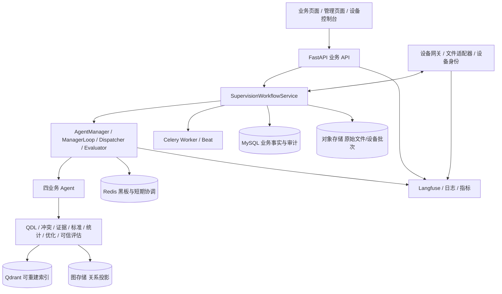

# 质监系统完整项目具体实施计划 v3.1

> 版本：v3.1  
> 日期：2026-09-22  
> 上位架构：[《质监系统四 Agent 闭环架构与实施计划 v3》](质监系统四Agent闭环架构与实施计划_v3.md)  
> 状态：可直接拆分任务实施；真实业务与科研指标受数据、设备、标准和专家资源门禁约束  
> 范围：完整软件平台、四 Agent、知识与可信底座、设备闭环、示范应用及申报验收证据

## 0. 实施就绪结论

v3 已经能够冻结概念和目标架构，但不能单独作为开发任务书。完整项目还需要明确数据库迁移、接口、事件、算法第一版、权限、故障恢复、测试数据、真实设备试点和申报证据。本文件补齐这些决策；开发团队不应再自行发明 Agent 名称、状态或停止规则。

完成本计划可以交付申报书和四张最新架构图所描述的软件、模型集成、四 Agent 应用和试点验证基础，但论文、专利、国家标准、真实数据规模、季均查验种类和响应时间压缩等成果，必须由项目负责人、业务单位和专家共同提供真实台账与正式成果，不能由软件测试替代。

## 1. 完整项目目标与需求追踪

| 编号 | 申报/架构目标 | 系统交付 | 最终验收证据 |
|---|---|---|---|
| R-01 | 质量风险动态决策模型 1 套 | 质监大模型运行配置、模型卡、提示/规则/知识版本和评测流水线 | 已发布模型版本、离线评测、校准报告和部署记录 |
| R-02 | 四个智能体 | 市场监控、舆情监测、监督抽查、实验室检测四个业务 Agent | 每个 Agent 的独立输入输出、真实运行记录和业务截图 |
| R-03 | 数据—知识—推理—可信决策一体化 | 数据治理、QDL、冲突引擎、证据引擎、可信评估和共享记忆 | 数据卡、知识版本、冲突案例、审计轨迹和恢复报告 |
| R-04 | 风险分级分类 | 市场/舆情输出汇合为版本化 `RiskAssessment` | 原始证据、标准适用记录、复核记录和风险等级版本 |
| R-05 | 态势动态推演 | 市场监控报告的时间、地区、企业、产品和覆盖视图 | 时间窗、分母、回测、局限和专家确认报告 |
| R-06 | 监督抽查策略优化 | 约束优化、必检项/候选项、计划批准和幂等任务创建 | 候选比较、约束验证、批准事件和正式任务 |
| R-07 | 监督抽查过程优化 | 模型—设备闭环、下一检测选择、动态停止和补测 | 设备事件、EvidenceState、NextTestDecision、StopDecision |
| R-08 | 国内外质量竞争力对标 | `quality.benchmark` 共用能力和独立业务入口 | 条款、方法、单位、范围可比性及专家核验 |
| R-09 | 平台软件与示范应用 | 可部署平台、组织隔离、四 Agent 页面、任务结果和设备闭环 | 版本包、部署记录、真实 HTTP/UI E2E 和试点报告 |
| R-10 | 质量知识资源目标 | 可追溯多源数据与知识资源、去重和版本治理 | 数据量、来源、许可、类别、质量和版本统计；最新图目标按不少于 50 万条准备 |
| R-11 | 季均查验工业产品种类 >20 | 类别字典、任务/样品/结果台账和季度统计 | 真实签发任务去重类别及季度原始台账 |
| R-12 | 监管响应时间压缩 >50% | 统一受理到确认时间戳、人工基线和对照报表 | 同口径中位数、P90、样本量和未完成任务 |
| R-13 | 科研与标准成果 | 论文、专利、国家标准工作包 | 正式发表、授权和标准发布证明，不以软件功能代替 |

五类应用与四 Agent 的固定对应关系如下：

| 应用任务 | 业务责任主体 | 共用能力 |
|---|---|---|
| 风险分级分类 | 市场监控 Agent + 舆情监测 Agent | `risk.grade`、`trust.review` |
| 态势动态推演 | 市场监控 Agent | `stats.trend`、回测和分母校验 |
| 监督抽查策略优化 | 监督抽查 Agent | `sampling.optimize` |
| 监督抽查过程优化 | 实验室检测 Agent | `inspection.next_best_test`、`inspection.stop.evaluate` |
| 国内外质量竞争力对标 | 市场监控与监督抽查共享 | `quality.benchmark` |

## 2. 当前基线与必须保留的资产

### 2.1 已有工程底座

- `0100_quality_supervision` 已建立 `supervision_records`、修订、运行、复核、依赖、设备连接、测量批次和测量记录等表。
- `0101_public_complaint_intake` 已建立公众投诉入口。
- 现有质监服务支持组织隔离、版本、导入预览、设备令牌、测量去重、业务复核、签发和知识候选。
- Manager 已登记 `risk_case.assess`、`risk_situation.analyze`、`sampling_plan.optimize`、`inspection_process.assess` 和 `trust.review`。
- QDL 已支持风险案件、任务、标准、设备和检测会话来源；知识隧道和记忆治理已有底座。
- 前端已有工作台、态势、案件、计划、实验室会话、任务、结果和证据页面。
- 隔离 QA 已具备电动自行车业务场景和浏览器脚本。

### 2.2 不得破坏的兼容性

- 保留现有 `supervision_records` 和修订历史，不重写旧版本。
- 保留 `/api/v1/{kind}`、现有任务、结果和测量接口；新增正式接口后设置兼容适配和弃用说明。
- 保留已签发结果和审批审计，不允许迁移脚本修改历史结论。
- 保留图片、测量和混合任务三种输入模式；实验室检测只增强测量/设备过程，不接管所有任务和结果。
- 保留组织隔离、设备独立身份、自复核拒绝和旧版本批准拒绝。

## 3. 目标部署架构



MySQL 是正式事实源；Redis 只保存可丢弃协调状态；对象存储保存原始数据；Qdrant 和图存储均可从正式事实重建。

## 4. 数据模型与迁移计划

### 4.1 迁移编号

当前迁移头为 `0101_public_complaint_intake`，因此计划新增 `0102_adaptive_quality_supervision.py`，`down_revision = "0101_public_complaint_intake"`。实际编码开始前必须重新读取 Alembic head；若期间新增迁移，则只顺延编号和 `down_revision`，本节表结构与顺序不变。迁移只增加对象和可空关联，不删除或覆盖旧数据。

### 4.2 新增表

| 表 | 关键字段 | 约束 |
|---|---|---|
| `inspection_goals` | `org_id`、`session_id`、`plan_id`、`version`、`risk_hypotheses`、`required_items`、`candidate_items`、`success_criteria`、`stop_policy`、预算、状态 | `org_id + session_id + version` 唯一 |
| `inspection_evidence_states` | `org_id`、`session_id`、`round`、`device_trust_state`、`product_quality_state`、支持/反驳假设、冲突、充分度、剩余不确定性、证据 ID | `org_id + session_id + round` 唯一，不可覆盖 |
| `inspection_decisions` | `org_id`、`session_id`、`round`、`kind`、`input_state_id`、`payload`、`rule_version`、`status`、提出/批准人员、时间 | 同一轮同一 `kind + request_key` 幂等 |
| `device_commands` | `org_id`、`session_id`、`decision_id`、`device_id`、`item_id`、`request_key`、命令、状态、申请/批准/发送/完成时间 | `org_id + request_key` 唯一；不保存明文凭据 |
| `supervision_events` | `org_id`、聚合类型/ID/版本、`event_type`、`workflow_run_id`、操作者类型/ID、原因、payload、时间 | `org_id + aggregate_id + event_key` 唯一 |

### 4.3 现有表扩展

- `measurement_records` 增加可空 `command_id`、`sequence_no`、`validation_status` 和 `calibration_version`，继续使用现有事件幂等键。
- `inspection_results` 增加可空 `inspection_session_id`、`stop_decision_id`、`result_status`、`signed_by` 和 `signed_at`；旧结果迁移为 `legacy_confirmed` 或现有复核状态，不伪造签发人。
- `supervision_dependencies` 继续记录市场报告、舆情报告、风险评估、计划、目标、会话、结果和知识候选的消费版本。

### 4.4 新增正式业务 kind

在 `DATA_SCHEMAS` 和前后端类型中增加：

- `market-monitoring-reports`
- `public-opinion-reports`
- `risk-assessments`

计划、会话、设备和样品沿用现有 kind。正式报告只追加新版本，不把分析输出直接覆盖到来源案件的 `data.analysis`。

## 5. 协议、API 与事件

### 5.1 四 Agent 统一交接

所有业务 Agent 使用 `BusinessAgentEnvelope`，必须携带：运行 ID、Agent 原名、业务对象及版本、证据 ID、消费版本、标准/知识快照、业务状态、缺失输入、冲突、下一动作、模型/规则版本和时间轨迹。

固定业务状态：

```text
queued / running / completed / insufficient_evidence /
awaiting_review / awaiting_approval / awaiting_device /
awaiting_retest / manual_review_required / goal_reached /
stale / cancelled / failed
```

### 5.2 新增 API

| 方法与路径 | 行为与门禁 |
|---|---|
| `POST /market-monitoring-reports/{id}/runs` | 消费冻结市场/案件/暴露量版本，生成报告版本 |
| `POST /public-opinion-reports/{id}/runs` | 消费投诉/舆情/附件，生成事实线索报告 |
| `POST /risk-assessments` | 指定市场报告、舆情报告和标准快照，创建融合草稿 |
| `POST /risk-assessments/{id}/reviews` | 独立专家复核；提交人与复核人不同 |
| `POST /sampling-plans/{id}/optimize` | 生成并比较受约束候选方案 |
| `POST /sampling-plans/{id}/approve` | 另一位专家批准；幂等创建任务、样品、目标和会话 |
| `POST /inspection-sessions/{id}/goals` | 冻结必检项、候选项、风险假设和停止策略 |
| `POST /inspection-sessions/{id}/next-test-decisions` | 基于最新 EvidenceState 提出下一检测；旧状态返回冲突 |
| `POST /device-commands/{id}/approve` | 人员批准后才允许网关下发；默认关闭自动下发 |
| `POST /device-ingest/observations` | 设备按命令/事件返回数据；设备身份、能力、会话和幂等校验 |
| `GET /inspection-sessions/{id}/evidence-state` | 返回最新设备可信状态和产品质量状态 |
| `POST /inspection-sessions/{id}/stop-decisions` | 运行必检、设备、证据、冲突、安全和规则门禁 |
| `POST /inspection-sessions/{id}/stop-decisions/{decision_id}/approve` | 专家批准提前停止；不自动签发结果 |
| `GET /inspection-sessions/{id}/timeline` | 返回命令、设备回复、证据更新、决策、复核和签发时间线 |
| `POST /quality-benchmarks` | 生成国内外标准/指标/方法对标报告 |

现有测量提交接口继续可用；未携带命令 ID 的数据标记为 `unsolicited`，经过人工匹配后才能进入正式 EvidenceState。

### 5.3 领域事件

必须写入 `supervision_events` 并通过 outbox/任务队列驱动下游：

```text
market.report.created
opinion.report.created
risk.assessment.created / reviewed
sampling.plan.optimized / approved
inspection.goal.created
inspection.next_test.proposed
device.command.approved / dispatched / failed
device.observation.received / validated / rejected
inspection.evidence.updated
inspection.stop.proposed / approved / rejected
inspection.result.drafted / signed
knowledge.candidate.created
```

消费者按事件键幂等；事件失败不能回滚已接收的原始设备数据，只重试对应投影或下游动作。

## 6. Agent 与共用能力实施

### 6.1 统一 Manager

- 所有四 Agent 正式运行只允许 `AgentManager → ManagerLoop → ManagerDispatcher → ManagerEvaluator`。
- 删除或封禁正式业务中的直调；测试可以直接调用纯函数节点。
- 市场监控和舆情监测使用独立状态和数据库会话并行运行，汇合时校验输入版本。
- 一次运行只推进当前目标；设备等待、人工等待和补证通过持久检查点恢复。
- 技术成功与业务状态分离；`insufficient_evidence` 和 `awaiting_review` 不得评为业务完成。

### 6.2 市场监控 Agent v1

- 输入：冻结案件版本、企业/产品/地区、抽查覆盖、销量/在用量和处置反馈。
- 算法：去重、固定时间窗、同口径数量；有分母才计算比率；输出样本量、覆盖和局限。
- 首版只做可验证统计和规则热点，不由 LLM 执行数值计算。
- 输出：版本化 `MarketMonitoringReport` 和抽查提示，不直接创建计划。
- 回测：按时间切分，与人工报表对比计数、热点和覆盖。

### 6.3 舆情监测 Agent v1

- 输入：公众投诉、内部舆情、附件、图片、产品/企业/批次和标准快照。
- 规则先完成来源登记、重复检测和 observed/inferred/synthetic 标记；模型只做结构化抽取和语义判断。
- 每个事实和风险线索必须引用允许的 evidence ID；未知引用、情绪代替事实或不可观测推断直接进入复核。
- 输出：版本化 `PublicOpinionMonitoringReport`，不直接输出不合格结论或未校准概率。

### 6.4 风险融合与可信复核

- `RiskAssessment` 是共用业务对象，不是第五个 Agent。
- 冻结市场报告、舆情报告、标准快照和知识快照后运行 `risk.grade`。
- 先执行标准适用、来源可追溯、关键缺项和冲突硬门禁，再计算证据充分度和风险等级。
- `trust.review` 使用原始证据和规则独立复核，不继承分析者自由推理；结果为接受、修改、补证或升级人工。
- 没有标签和校准集时概率保持 `unknown`。

### 6.5 监督抽查 Agent v1

- 使用 OR-Tools CP-SAT；新增后端依赖并固定求解器版本。
- 硬约束：预算、最大样本、人员工时、设备能力/容量、地区、必检类别、时间窗和标准项目。
- 目标函数按配置加权：风险覆盖、类别覆盖、代表性、探索性、重复惩罚、成本和工时。
- 输出至少一个可行方案或 `infeasible` 及冲突约束；不宣称数学全局最优，除非求解器状态和间隙支持。
- 计划项明确拆分 `required_items` 和 `candidate_items`。

### 6.6 实验室检测 Agent v1

- `device_trust_state` 与 `product_quality_state` 独立更新。
- 下一项检测只从批准计划、适用标准或授权补测规则中选择，LLM 不得自由生成设备命令。
- v1 采用可解释确定性评分：风险区分力 + 冲突消解力 + 标准关键度 + 证据缺口 − 时间/成本/样品损耗/设备风险。
- 先返回建议，由被指派业务人员确认；`device_auto_command_enabled` 默认关闭。
- 停止条件采用必检项强门禁；阈值按产品/方法配置，不设置全局万能阈值。
- 设备失校时只提高设备风险，不得提高产品不合格确信度。

### 6.7 国内外质量竞争力对标

- 输入产品类别、国内外标准版本、测试方法、单位、样本范围和市场数据。
- 执行标准适用、方法/单位转换和范围可比性校验。
- 输出逐指标差异、不可比项、短板和引用；不可用普通 RAG 摘要替代。
- 作为独立应用验收，但复用市场监控和监督抽查 Agent，不增加第五个 Agent。

## 7. QDL、知识演化与可信引擎

### 7.1 数据和知识底座

- 为每批数据保存来源、许可、哈希、类别、时间范围、真实/合成属性、清洗规则和质量报告。
- 建立“标准—指标—缺陷—成因—处置”本体；产品、企业、批次和标准实体必须经规则或人工确认。
- 最新架构图的 50 万条知识资源目标按去重后的可追溯知识单元统计，不用分块数、合成样本或重复转载充数。

### 7.2 QDL 与冲突引擎

- 沿用通用 `source_context`，覆盖风险案件、市场报告、舆情报告、标准、设备、会话和结果。
- 冲突类型固定为版本、语义、适用范围、时间、可信度、设备响应和结论冲突。
- QDL 转换必须记录映射版本、源哈希、丢失字段和边界；转换结果不能自动扩大权限。
- 知识隧道只在受约束作用域间映射，不把局部经验变成全组织权威事实。

### 7.3 可信引擎

- 模型层：模型/提示/数据版本、离线准确性、鲁棒性和校准。
- 过程层：计划、证据、检索、工具、设备命令、设备回复、规则、耗时和错误。
- 结果层：对象—证据—标准—计算/规则—结论—局限—复核。
- 长程推理、语义信噪比和知识边界先作为离线评测与规则组件；无法访问模型内部状态时不得宣称完成探针机理验证。

## 8. 权限、安全与恢复

| 主体 | 允许 | 禁止 |
|---|---|---|
| 管理员 | 组织、人员、主数据、标准、设备档案和启停 | 代替专家批准计划或签发结果 |
| 业务人员 | 登记案件、抽样、测量、申请设备命令、补证和反馈 | 处理本人提交的独立复核 |
| 专家 | 风险复核、计划批准、提前停止批准、结果复核和签发 | 批准本人创建或分析的同一版本 |
| 平台运营 | 设备在线/校准/容量、运行观测和故障处理 | 改写业务判断和正式结果 |
| 算法工程师 | 基线、授权数据集、模型评测和概率校准 | 直接读取未授权案件或下发设备命令 |
| 应用开发者 | Agent、路由、工具和设备连接配置 | 获得业务批准权限 |
| 设备身份 | 为绑定设备和会话提交观测、返回命令执行状态 | 跨设备、跨组织、任意会话写入或读取案件 |

设备命令、提前停止、计划批准和结果签发必须审计。取消、超时、重启和重复请求从持久检查点恢复；同一命令不能重复下发，同一观测不能重复计入证据。

## 9. 前端和使用流程

质量监督菜单固定为：质监工作台、市场监控、舆情监测、监督抽查、实验室检测。任务管理和检测结果维持独立通用业务分组。

- 工作台：四 Agent 状态、当前阻塞、人工待办和闭环链路。
- 市场监控：时间窗、分母、市场信号、地区/企业/产品热点、覆盖和局限。
- 舆情监测：来源、事件、事实/情绪/推测、证据、冲突和补证。
- 监督抽查：候选方案、硬约束、必检项、候选项、设备要求、成本、批准状态。
- 实验室检测：目标、设备可信状态、产品质量状态、设备事件时间线、下一项检测、补测和停止建议。
- 任务管理/检测结果：继续承载图片、测量、混合任务和持久结果；不被实验室 Agent 包含。
- 证据详情：能从任何正式结论回到原始文件、标准条款、设备事件、决策和复核记录。

所有操作按钮由状态与权限共同决定；页面不能绕过后端门禁。移动端只保留核心监控和审批操作，不压缩成无法阅读的数据表。

## 10. 分阶段实施与任务分解

以下周期按 6 人核心团队估算：2 名后端/领域、1 名前端、1 名 Agent/模型、1 名数据/设备、1 名 QA/DevOps，业务专家和项目负责人兼职参与。若真实数据或设备未到位，对应阶段在供应门禁暂停，不以模拟数据宣称完成。

### P0：口径、基线与供应门禁（第 1 周）

| 任务 | 交付 | 依赖/退出条件 |
|---|---|---|
| P0-01 冻结四 Agent 和五应用映射 | 名称、职责、能力清单 | 项目负责人签字确认 |
| P0-02 冻结首个产品场景 | 产品、标准、类别、风险问题 | 电动自行车场景和标准版本确认 |
| P0-03 供应盘点 | 数据、设备、模型、专家、基线清单 | 每项有责任人、到位时间和使用范围 |
| P0-04 建立代码/数据基线 | 分支、提交、迁移头、测试和环境报告 | 不引用历史测试替代当前结果 |

### P1：协议、迁移与统一调度（第 2–3 周）

| 任务 | 交付 | 退出条件 |
|---|---|---|
| P1-01 迁移 0102 | 新表、列、索引、升级/回退测试 | MySQL 和隔离 SQLite 均可升级回退 |
| P1-02 Pydantic/TS 契约 | 报告、目标、证据、决策和事件类型 | 前后端生成/手写类型一致 |
| P1-03 Manager 正式路径 | 四 Agent capability、依赖、业务完成条件 | 正式服务无旁路直调 |
| P1-04 事件与恢复 | 事件表、幂等消费者、检查点 | 重启不重复创建任务或命令 |

### P2：知识、冲突和可信底座（第 3–5 周，可与 P1 后半并行）

| 任务 | 交付 | 退出条件 |
|---|---|---|
| P2-01 数据卡与来源清单 | 数据批次、许可、哈希和质量报告 | 真实/合成、训练/校准/测试分离 |
| P2-02 QDL 来源扩展 | 报告、评估、命令、观测和结果来源 | 旧会议 QDL 兼容测试通过 |
| P2-03 冲突引擎 | 七类冲突、影响范围和处理状态 | 标准冲突和设备冲突可重现 |
| P2-04 可信门禁 | 规则、独立复核、人工复核 | 缺证/冲突/过期版本阻止提交 |

### P3：市场监控、舆情监测与风险融合（第 5–7 周）

| 任务 | 交付 | 退出条件 |
|---|---|---|
| P3-01 市场监控 Agent | 正式报告、分母、热点、覆盖和局限 | 时间外回测和计数公式通过 |
| P3-02 舆情监测 Agent | 事实线索、引用、冲突和补证 | 幻觉引用与情绪误判负测通过 |
| P3-03 并行汇合 | 冻结版本和 `RiskAssessment` | 两分支独立失败、补证和恢复可验证 |
| P3-04 风险复核页面 | 原始证据、标准、冲突和版本 | 另一位专家才能接受 |

### P4：监督抽查与质量对标（第 8–10 周）

| 任务 | 交付 | 退出条件 |
|---|---|---|
| P4-01 CP-SAT 约束模型 | 候选方案、目标分解和不可行解释 | 预算/设备/覆盖硬约束均有负测 |
| P4-02 计划版本与审批 | 必检项、候选项和设备要求 | 未批准计划不能建任务 |
| P4-03 幂等物化 | 任务、样品、目标和会话 | 重试不重复创建任何对象 |
| P4-04 质量竞争力对标 | 对标报告与不可比项 | 单位/方法/范围冲突不会强行比较 |

### P5：设备网关与自适应实验室检测（第 11–14 周）

| 任务 | 交付 | 退出条件 |
|---|---|---|
| P5-01 设备协议和模拟器 | 命令、观测、状态、故障和重放 | 可注入离线/失校/重复/乱序/超时 |
| P5-02 双目标 EvidenceState | 设备可信和产品质量独立状态 | 设备故障不导致产品不合格结论 |
| P5-03 下一项检测 | 可解释排序和人工确认 | 只能选择批准范围内项目 |
| P5-04 动态停止 | 必检、证据、冲突、安全和策略门禁 | 六个 20→10 场景全部通过 |
| P5-05 持久恢复 | 轮次、命令、回复和决策恢复 | 重启、取消和重试不重复动作 |

### P6：结果、反馈、页面与运维（第 15–17 周）

| 任务 | 交付 | 退出条件 |
|---|---|---|
| P6-01 结果草稿与签发 | 正式列、证据链和签发锁定 | 停止决定不能自动签发 |
| P6-02 反馈与知识候选 | 误报/漏报/新证据和候选准入 | 未签发结果不能发布知识候选 |
| P6-03 五业务页面 | 工作台及四 Agent 页面 | 名称、状态、权限和移动端一致 |
| P6-04 可观测与告警 | trace、队列、设备、错误和成本看板 | 每次正式运行可关联完整 trace |

### P7：真实试点、科研评估和验收（第 18–22 周起）

| 任务 | 交付 | 退出条件 |
|---|---|---|
| P7-01 真实环境演练 | MySQL、队列、索引、对象存储、模型和设备 | 故障注入及恢复报告通过 |
| P7-02 自适应检测对照 | 全量、规则停止、自适应三方案报告 | 不降低必检/安全前提下量化收益 |
| P7-03 业务试点 | 电动自行车真实案件闭环 | 专家签发、处置和反馈完成 |
| P7-04 指标台账 | >20 类、>50% 响应压缩和样本口径 | 真实季度台账和同口径基线 |
| P7-05 科研成果 | 论文、专利、标准和示范材料 | 由项目成果台账提供正式证明 |

关键路径为 P0 → P1 → P3 → P4 → P5 → P6 → P7；P2 可与 P1/P3 部分并行，前端原型可在契约冻结后并行，但不得绕过后端门禁。

## 11. 测试与验收计划

### 11.1 自动化测试

- 单元：统计口径、标准适用、冲突规则、约束求解、证据更新、下一检测评分和停止门禁。
- 属性/边界：NaN/Infinity、单位转换、时间带、重复/乱序设备事件、空集合、最大批次和并发。
- 契约：Pydantic、数据库 JSON、OpenAPI 和 TypeScript 类型一致。
- 权限：组织隔离、设备身份、自复核、旧版本、越权命令和未授权数据集。
- 集成：Manager 计划、并行汇合、事件、outbox、队列、对象存储、QDL、索引和结果物化。
- 故障：模型不可用、Redis 不可用、队列重启、设备离线、校准过期、命令超时和重复回调。
- 浏览器：桌面 1440、平板 768、手机 375；键盘、焦点、无横向溢出和状态门禁。
- 真实 HTTP E2E：禁止拦截后端业务接口，模拟器只能替代物理设备，不替代业务 API。

### 11.2 六个动态停止验收场景

1. 10 项完成全部必检且证据充分：允许停止剩余候选项。
2. 仍有法定/安全必检项：禁止停止。
3. 产品异常但设备失校：换设备或复测，不得判产品不合格。
4. 设备正常但产品风险未决：继续选择下一项。
5. 当前设备能力不足：换设备、转人工或完整检测。
6. 已达停止条件但未复核：只生成草稿，不得签发。

### 11.3 发布门禁

- 全量后端、前端、迁移、真实 HTTP 和浏览器测试通过。
- 零高危越权；所有高风险门禁有负向测试。
- 生产相同组件的预发布环境完成升级、回退、备份和恢复演练。
- 真实模型、Embedding、设备和专家场景结果与隔离演示分开报告。
- 未完成项、未到位供应和已知风险写入发布说明。

## 12. 运行、发布与监控

- 新功能开关：`quality_supervision_v3_enabled`、`adaptive_inspection_enabled`、`device_auto_command_enabled`；最后一项默认始终关闭。
- 先对试点组织启用，旧组织继续使用兼容读取；完成数据验证后再逐组织迁移。
- 监控：运行成功率、等待时间、补证轮次、设备事件延迟、命令超时、重复事件、停止比例、复测比例、人工升级比例、误报/漏报和签发周期。
- 告警：跨组织访问、设备身份失败、失校设备写入、重复命令、关键冲突未处理、旧版本签发和知识候选异常。
- 回滚：关闭功能开关停止新受理；保留事件和新表；不删除已经生成的正式记录，使用补偿事件恢复投影。

## 13. 供应门禁与责任

| 供应项 | 最低要求 | 未到位时允许做什么 | 禁止声称 |
|---|---|---|---|
| 真实监管数据 | 来源、许可、字段、时间和组织范围明确 | 协议、导入、脱敏和模拟流程 | 真实风险识别效果 |
| 正式标准 | 版本、条款、生效时间、地域和产品范围 | 标准模型与适用规则框架 | 正式合规结论 |
| 检测设备 | 能力、协议、校准、正常基线和安全限制 | 设备模拟器和文件适配 | 真实设备闭环和周期压缩 |
| 模型/Embedding | 可访问配置、版本、费用和数据边界 | 规则流程和 mock 分离测试 | 模型效果和知识检索验收 |
| 业务专家 | 风险、计划、停止、结果和处置责任人 | UI、待办和审计框架 | 独立复核与正式签发 |
| 人工效率基线 | 同类任务起止点、样本和复杂度 | 时间戳采集和报表框架 | 响应时间压缩 >50% |
| 科研模型内部访问 | 隐藏层、探针数据和实验权限 | 外部证据解释 | 模型内部机理或因果解释 |

项目负责人负责成果定义和申报口径；业务专家负责标准、风险和签发；设备负责人负责协议与安全；技术团队负责可追溯实现；QA 负责独立验收证据。任何供应门禁未满足时，对应工作包状态为 `blocked_by_supply`，不能标记完成。

## 14. 完整项目 Definition of Done

只有同时满足以下条件，才能称为“申报书/架构图对应的完整项目已完成”：

1. 质监大模型、四层能力、两类协同闭环和四个原名 Agent 均有可运行版本与审计记录。
2. 五类应用任务全部可独立验收，国内外质量对标不是普通检索摘要。
3. 市场和舆情输出可版本化汇合，风险评估不是第五个 Agent。
4. 抽查计划具有硬约束、必检项、候选项、批准和幂等物化。
5. 实验室检测完成设备可信/产品质量双状态、多轮主动取证和强门禁停止。
6. 过程预警、结果草稿和正式签发严格分离；所有正式结论可回到原始证据和标准。
7. QDL、冲突、知识边界、共享记忆、污染治理和恢复在真实冲突案例中通过。
8. 组织、权限、设备身份、版本、幂等、重启和故障恢复通过负向验收。
9. 至少一个真实产品场景完成受理、监控、抽查、设备检测、签发、处置和反馈闭环。
10. 数据资源、模型、平台、四 Agent、示范应用、>20 类、>50% 响应压缩以及论文/专利/标准均有对应的正式证据或明确标记尚未完成。

若第 10 项任一申报成果尚无正式证明，只能称为“技术平台完成”或“试点阶段完成”，不能称为完整项目达成申报验收。

## 15. 开发启动顺序

开发任务按以下顺序领取，不允许跳过前置门禁：

1. 完成 P0 的名称、场景、供应和基线签字确认。
2. 实施 P1 的 0102 迁移、契约、事件和正式 Manager 路径。
3. 同步启动 P2 的 QDL/冲突底座和 P3 的市场/舆情纯函数节点。
4. 风险融合门禁通过后实施 P4 抽查计划和质量对标。
5. 设备协议、模拟器和安全评审完成后实施 P5，不提前开放自动命令。
6. 业务契约稳定后完成 P6 页面、结果和运维。
7. 只有供应门禁齐备后进入 P7，并分别发布技术、真实试点和申报成果报告。
